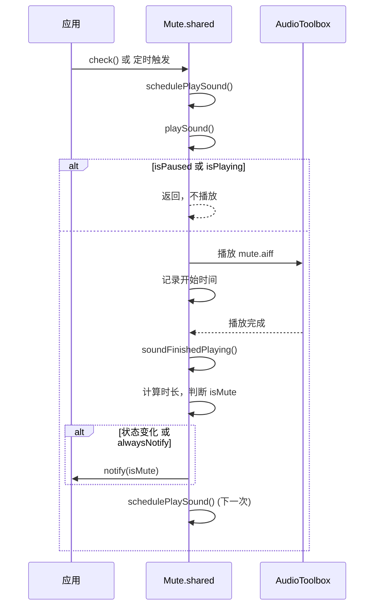

# API 参考

<cite>
**本文档中引用的文件**   
- [Mute.swift](file://Mute/Classes/Mute.swift#L1-L211)
- [README.md](file://README.md#L1-L85)
</cite>

## 目录
1. [简介](#简介)
2. [核心组件](#核心组件)
3. [详细组件分析](#详细组件分析)

## 简介
Mute 是一个用于检测 iOS 设备静音开关状态的 Swift 库。由于 iOS 系统本身未提供原生 API 来检测静音开关，该库通过播放一个短暂的静音音效并测量其播放时长来判断设备是否处于静音模式。播放时间极短（小于 0.1 秒）表示设备已静音，否则表示未静音。本 API 参考文档旨在为开发者提供 Mute 类公开接口的权威、详尽的技术细节。

## 核心组件

`Mute` 类是此库的核心，采用单例模式设计，通过 `shared` 静态属性提供全局唯一实例。它通过周期性地播放一个 0.5 秒的静音音效（`mute.aiff`）并监听其播放完成事件，根据实际播放时长来推断静音开关的状态。该类自动处理应用进入后台和前台时的暂停与恢复逻辑，并通过 `notify` 回调将状态变化通知给使用者。

**Section sources**
- [Mute.swift](file://Mute/Classes/Mute.swift#L1-L211)

## 详细组件分析

### Mute 类分析

#### 公开属性

**shared**
- **描述**: `Mute` 类的单例实例。这是访问库所有功能的入口点。
- **声明**: `public static let shared = Mute()`
- **线程安全性**: 安全。作为静态常量，在应用启动时初始化，之后不可变。
- **Section sources**
  - [Mute.swift](file://Mute/Classes/Mute.swift#L19)

**checkInterval**
- **描述**: 检测静音状态的间隔时间（以秒为单位）。库会根据此间隔自动触发检测。
- **声明**: `public var checkInterval = 1.0`
- **默认值**: `1.0` 秒。
- **取值范围**: 最小值为 `0.5` 秒。如果设置的值小于此值，库会自动将其重置为 `0.5` 并在控制台打印警告信息。
- **线程安全性**: 该属性本身不是线程安全的。虽然在 `didSet` 观察器中进行了处理，但频繁地从不同线程修改此值可能导致不可预测的行为。建议在应用初始化或主线程中设置。
- **调用时机**: 可在任何时候设置，但建议在开始监听前配置。
- **副作用**: 修改此值会立即影响下一次检测的调度时间。
- **Section sources**
  - [Mute.swift](file://Mute/Classes/Mute.swift#L51-L56)

**alwaysNotify**
- **描述**: 布尔值，控制状态通知的频率。
- **声明**: `public var alwaysNotify = true`
- **默认值**: `true`。
- **取值范围**: `true` 或 `false`。
  - `true`: 无论静音状态是否发生变化，都会在每个 `checkInterval` 间隔后通过 `notify` 回调通知当前状态。
  - `false`: 仅在静音状态发生改变时（例如从“静音”变为“非静音”），才通过 `notify` 回调通知。
- **线程安全性**: 安全。该属性仅用于条件判断，且其值的读取和写入在回调和主线程中是可控的。
- **调用时机**: 可在任何时候设置。
- **副作用**: 影响 `notify` 回调的触发频率。
- **Section sources**
  - [Mute.swift](file://Mute/Classes/Mute.swift#L26)

**notify**
- **描述**: 一个可选的闭包（回调），在静音状态需要通知时被调用。其类型别名为 `MuteNotificationCompletion`。
- **声明**: `public var notify: MuteNotificationCompletion?`
- **类型别名**: `public typealias MuteNotificationCompletion = ((_ mute: Bool) -> Void)`
- **参数**: 闭包接收一个 `Bool` 类型的参数 `mute`。
  - `true`: 表示设备当前处于静音状态。
  - `false`: 表示设备当前处于非静音状态。
- **典型处理逻辑**: 开发者通常在此回调中更新 UI（如标签、图标）或执行其他与静音状态相关的业务逻辑。由于回调在主线程中执行，可以直接操作 UI。
- **线程安全性**: 回调本身在主线程 (`DispatchQueue.main.async`) 中执行，因此是线程安全的。
- **调用时机**: 当 `alwaysNotify` 为 `true` 时，每个检测周期结束后调用；当 `alwaysNotify` 为 `false` 时，仅在状态变化时调用。
- **副作用**: 执行开发者提供的业务逻辑。
- **Section sources**
  - [Mute.swift](file://Mute/Classes/Mute.swift#L14)
  - [Mute.swift](file://Mute/Classes/Mute.swift#L30)

**isPaused**
- **描述**: 布尔值，表示检测是否已暂停。
- **声明**: `public var isPaused = false`
- **默认值**: `false`，表示检测是启用的。
- **取值范围**: `true` 或 `false`。
- **线程安全性**: 安全。该属性由库内部自动管理（应用进入后台时设为 `true`，进入前台时设为 `false`），也可由开发者手动控制。
- **调用时机**: 
  - 自动：当应用进入后台时，库会自动将其设为 `true`；当应用进入前台时，库会自动将其设为 `false`。
  - 手动：开发者可随时设置此属性来控制检测的启停。
- **副作用**: 当从 `true` 变为 `false` 时，如果之前没有声音正在播放，库会立即调度下一次检测。
- **Section sources**
  - [Mute.swift](file://Mute/Classes/Mute.swift#L42-L47)

#### 公开方法

**check()**
- **描述**: 手动触发一次静音状态检测，不受 `checkInterval` 间隔的限制。
- **声明**: `public func check()`
- **参数**: 无。
- **返回值**: 无。
- **线程安全性**: 安全。该方法内部调用 `playSound()`，而 `playSound()` 会检查 `isPaused` 和 `isPlaying` 状态，并在必要时调度播放。
- **调用时机**: 当需要立即获取当前静音状态时调用，例如响应用户点击某个“检查”按钮。
- **副作用**: 立即尝试播放静音音效以进行检测。
- **使用示例**:
  ```swift
  // 在用户点击按钮时手动触发检测
  @IBAction func checkPressed(_ sender: UIButton) {
      Mute.shared.check()
  }
  ```
- **Section sources**
  - [Mute.swift](file://Mute/Classes/Mute.swift#L160-L162)

#### 内部属性与方法（供理解原理）

虽然 `isMute` 和 `isPlaying` 是公开的（`public`），但它们是只读的（`private(set)`），意味着外部代码只能读取其值，不能修改。

- **isMute**: 当前检测到的静音状态。`true` 表示静音，`false` 表示非静音。其值由 `soundFinishedPlaying()` 方法根据音效播放时长计算得出。
- **isPlaying**: 指示当前是否有静音音效正在播放。用于防止在音效未完成时重复调度播放。
- **schedulePlaySound()**: 私有方法，负责在 `checkInterval` 时间后调度一次 `playSound()` 调用。它会检查 `isScheduled` 标志以避免重复调度。
- **playSound()**: 私有方法，负责实际播放静音音效。它会检查 `isPaused` 和 `isPlaying` 状态，记录开始时间，并通过 `AudioServicesPlaySystemSoundWithCompletion` 播放音效。
- **soundFinishedPlaying()**: 私有方法，在音效播放完成后由系统调用。它计算播放时长，判断是否静音，更新 `isMute` 状态，并根据 `alwaysNotify` 和状态变化决定是否调用 `notify` 回调，最后调度下一次检测。



**Diagram sources**
- [Mute.swift](file://Mute/Classes/Mute.swift#L160-L211)

**Section sources**
- [Mute.swift](file://Mute/Classes/Mute.swift#L160-L211)