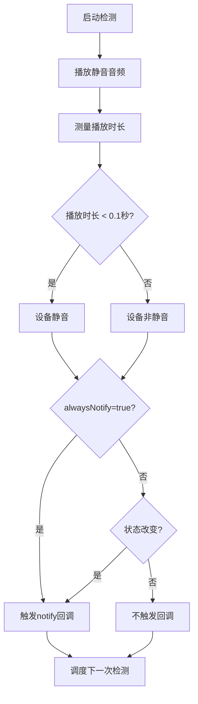
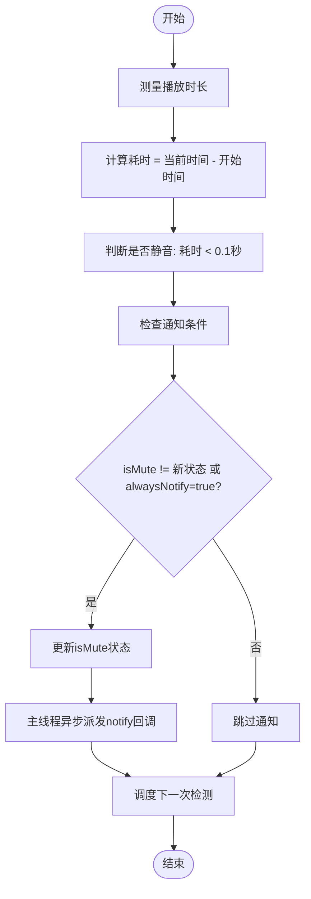
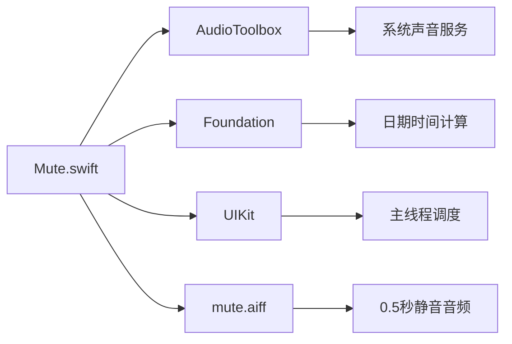

# alwaysNotify 通知策略

<cite>
**本文档中引用的文件**   
- [Mute.swift](file://Mute/Classes/Mute.swift#L26-L201)
- [README.md](file://README.md#L25-L35)
- [ViewController.swift](file://Example/Mute/ViewController.swift#L26)
- [CLAUDE.md](file://CLAUDE.md#L51-L56)
</cite>

## 目录
1. [简介](#简介)
2. [项目结构](#项目结构)
3. [核心组件](#核心组件)
4. [架构概述](#架构概述)
5. [详细组件分析](#详细组件分析)
6. [依赖分析](#依赖分析)
7. [性能考虑](#性能考虑)
8. [故障排除指南](#故障排除指南)
9. [结论](#结论)

## 简介
`alwaysNotify` 是 Mute 库中的一个布尔属性，用于控制设备静音状态变化时的通知触发策略。该库通过播放静音音频并测量播放时长来检测 iOS 设备的静音开关状态。由于 iOS 系统本身不提供直接检测静音开关的 API，此方法成为一种有效的替代方案。`alwaysNotify` 属性决定了状态检测回调的频率和条件，对应用的性能和事件处理逻辑有直接影响。本文档将深入分析该属性的作用机制、性能影响及实际应用场景，帮助开发者根据具体需求选择合适的配置策略。

## 项目结构
Mute 项目采用模块化设计，主要由核心库文件、示例应用和资源文件组成。核心功能集中在单个 Swift 文件中，示例应用展示了库的使用方法，资源文件包含静音检测所需的音频素材。

```mermaid
graph TB
subgraph "核心库"
MuteSwift[Mute/Classes/Mute.swift]
Assets[Mute/Assets/mute.aiff]
end
subgraph "示例应用"
Example[Example/Mute/ViewController.swift]
AppDelegate[Example/Mute/AppDelegate.swift]
end
subgraph "文档"
README[README.md]
CLAUDE[CLAUDE.md]
end
MuteSwift --> Assets : "使用"
Example --> MuteSwift : "依赖"
README --> MuteSwift : "说明"
CLAUDE --> MuteSwift : "开发指导"
```

**图示来源**
- [Mute.swift](file://Mute/Classes/Mute.swift)
- [ViewController.swift](file://Example/Mute/ViewController.swift)
- [README.md](file://README.md)

**章节来源**
- [Mute.swift](file://Mute/Classes/Mute.swift#L1-L50)
- [README.md](file://README.md#L1-L20)

## 核心组件
`alwaysNotify` 属性是 Mute 库的核心配置选项之一，与 `checkInterval` 和 `isPaused` 共同构成库的主要控制接口。该属性定义在 `Mute` 类中，采用布尔类型，默认值为 `true`。其主要作用是决定 `notify` 回调的触发条件：当值为 `true` 时，每次检测周期结束都会触发回调，无论静音状态是否发生变化；当值为 `false` 时，仅在静音状态发生改变时（即从静音变为非静音或反之）才触发回调。这种设计为开发者提供了灵活的事件处理策略，可以根据应用需求在实时性和性能消耗之间进行权衡。

**章节来源**
- [Mute.swift](file://Mute/Classes/Mute.swift#L26-L29)
- [CLAUDE.md](file://CLAUDE.md#L51-L56)

## 架构概述
Mute 库的架构基于单例模式，通过周期性播放静音音频来检测设备的静音状态。系统利用 AudioToolbox 框架播放一个 0.5 秒的静音音频文件（`mute.aiff`），并测量从开始播放到完成播放的时间间隔。如果播放时间小于 0.1 秒，则判定设备处于静音状态；否则判定为非静音状态。`alwaysNotify` 属性作为通知策略的控制开关，直接影响 `notify` 回调的执行频率，是整个事件通知机制的关键组成部分。



**图示来源**
- [Mute.swift](file://Mute/Classes/Mute.swift#L189-L210)
- [CLAUDE.md](file://CLAUDE.md#L0-L44)

## 详细组件分析
### alwaysNotify 属性分析
`alwaysNotify` 属性的实现逻辑主要集中在 `soundFinishedPlaying()` 方法中。该方法在每次静音音频播放完成后被调用，负责判断当前的静音状态并决定是否触发通知回调。

#### 通知逻辑流程图


**图示来源**
- [Mute.swift](file://Mute/Classes/Mute.swift#L195-L210)

#### 代码实现分析
`alwaysNotify` 属性在 `soundFinishedPlaying()` 方法中的核心判断逻辑如下：
```swift
if self.isMute != isMute || self.alwaysNotify {
    self.isMute = isMute
    DispatchQueue.main.async {
        self.notify?(isMute)
    }
}
```
该条件语句采用逻辑或（OR）操作符，确保在以下任一情况下触发回调：
1. 当前静音状态 (`self.isMute`) 与新检测到的状态 (`isMute`) 不同
2. `alwaysNotify` 属性被设置为 `true`

这种设计保证了状态变化的可靠通知，同时提供了持续监控的选项。

**章节来源**
- [Mute.swift](file://Mute/Classes/Mute.swift#L201-L208)
- [CLAUDE.md](file://CLAUDE.md#L51-L56)

### 实际使用示例分析
在示例应用中，`alwaysNotify` 属性被明确配置，展示了其在实际场景中的应用。

#### 配置示例
```swift
// 设置检测间隔为2秒
Mute.shared.checkInterval = 2.0

// 启用持续通知模式
Mute.shared.alwaysNotify = true

// 设置通知回调
Mute.shared.notify = { [weak self] m in
    self?.label.text = m ? "静音" : "非静音"
}
```

此配置将 `alwaysNotify` 设置为 `true`，意味着无论静音状态是否改变，每2秒都会更新一次 UI 标签。这种设置适用于需要实时显示设备状态的界面，如音量控制面板或媒体播放器。

**章节来源**
- [ViewController.swift](file://Example/Mute/ViewController.swift#L26)
- [README.md](file://README.md#L25-L35)

## 依赖分析
Mute 库的实现依赖于 iOS 系统的几个核心框架和资源。



**图示来源**
- [Mute.swift](file://Mute/Classes/Mute.swift#L3-L5)
- [Mute.podspec.json](file://Example/Pods/Local Podspecs/Mute.podspec.json#L30-L31)

## 性能考虑
`alwaysNotify` 属性的设置对应用性能有显著影响，开发者需要根据具体场景权衡实时性与资源消耗。

### 性能影响对比
| 配置 | CPU/内存开销 | 电池消耗 | 事件频率 | 适用场景 |
|------|------------|---------|---------|---------|
| `alwaysNotify = true` | 较高 | 较高 | 恒定 (每 checkInterval) | 需要实时状态更新的UI，如状态栏、控制面板 |
| `alwaysNotify = false` | 较低 | 较低 | 变化时触发 | 后台服务、事件驱动逻辑，如自动调整音量 |

当 `alwaysNotify` 为 `true` 时，即使静音状态未改变，系统也会频繁调用 `notify` 回调，可能导致不必要的 UI 更新和计算开销。相反，当设置为 `false` 时，只有在状态切换时才触发回调，大大减少了事件处理的频率，适合对性能敏感的应用。

### 优化建议
1. **UI 更新场景**：对于需要实时反映设备状态的用户界面，建议设置 `alwaysNotify = true`，以提供流畅的用户体验。
2. **后台服务场景**：对于后台运行的服务或事件监听器，建议设置 `alwaysNotify = false`，以降低资源消耗和电池使用。
3. **动态调整**：可以根据应用的前后台状态动态调整此属性，在前台时启用持续通知，在后台时切换到变化通知以节省电量。

**章节来源**
- [Mute.swift](file://Mute/Classes/Mute.swift#L26-L29)
- [CLAUDE.md](file://CLAUDE.md#L51-L56)

## 故障排除指南
在使用 `alwaysNotify` 属性时，可能会遇到一些常见问题，以下是相应的解决方案。

### 常见问题
1. **回调未触发**：确保 `notify` 回调已正确设置，并且 `isPaused` 属性为 `false`。
2. **频繁不必要的回调**：如果发现回调过于频繁且影响性能，尝试将 `alwaysNotify` 设置为 `false`。
3. **状态更新延迟**：调整 `checkInterval` 属性以改变检测频率，但注意最小值为 0.5 秒。

### 调试技巧
- 使用 `print` 语句在 `notify` 回调中输出状态变化，验证通知逻辑是否按预期工作。
- 在应用进入后台时，`isPaused` 会自动设为 `true`，暂停检测；返回前台时恢复，这是正常行为。

**章节来源**
- [Mute.swift](file://Mute/Classes/Mute.swift#L65-L70)
- [README.md](file://README.md#L25-L35)

## 结论
`alwaysNotify` 属性为 Mute 库提供了灵活的通知策略控制。通过深入分析其在 `soundFinishedPlaying()` 方法中的实现逻辑，我们可以看到它如何通过简单的布尔判断来控制事件流。开发者应根据应用的具体需求选择合适的配置：`true` 值适用于需要实时状态反馈的交互式界面，而 `false` 值更适合注重性能和能效的后台服务。理解这一属性的工作原理和性能影响，有助于构建既高效又响应灵敏的 iOS 应用。