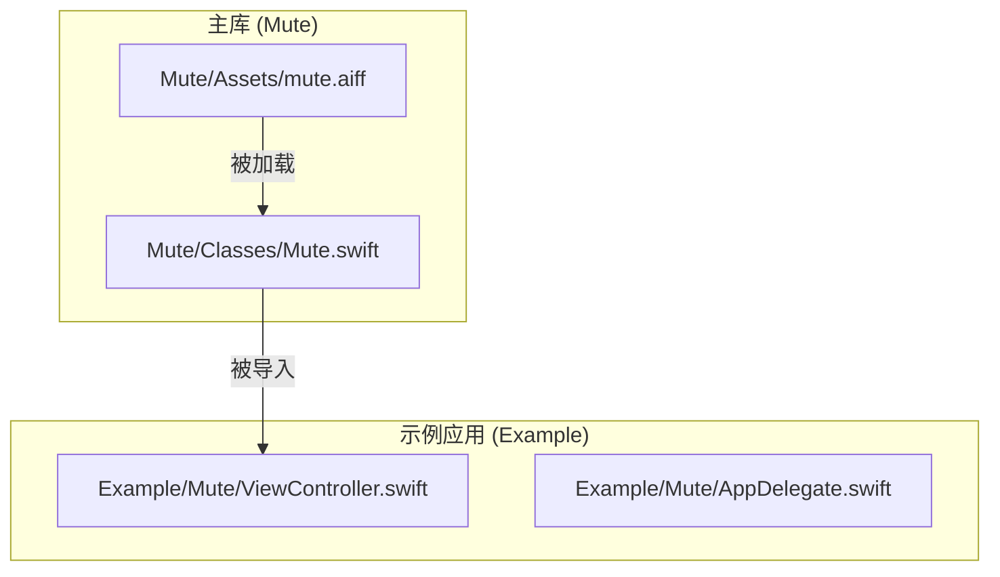
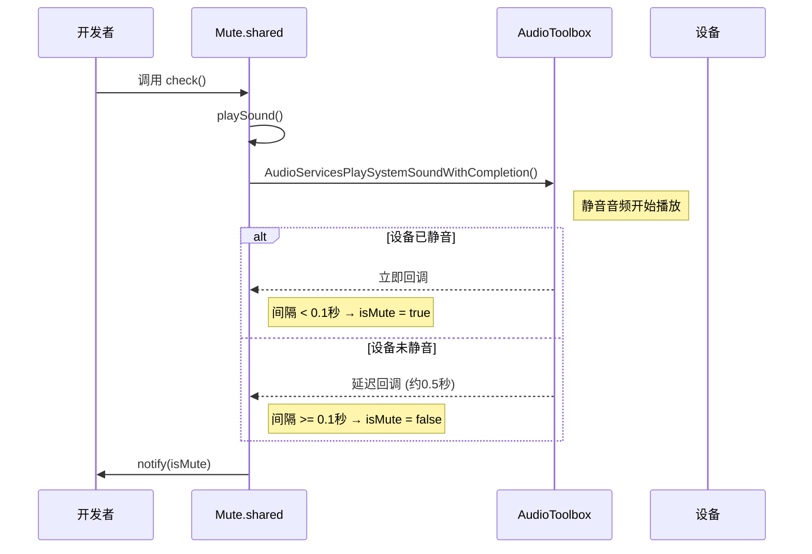
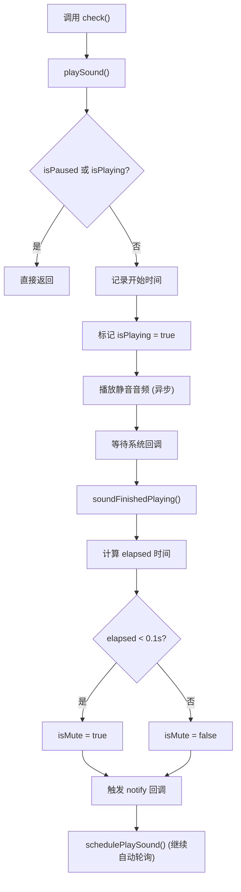
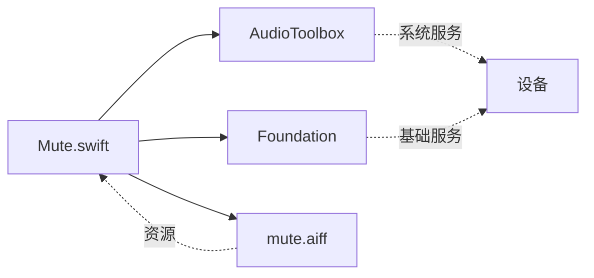

# check() 手动检测方法

<cite>
**本文档中引用的文件**  
- [Mute.swift](file://Mute/Classes/Mute.swift)
- [README.md](file://README.md)
- [ViewController.swift](file://Example/Mute/ViewController.swift)
- [mute.aiff](file://Mute/Assets/mute.aiff)
</cite>

## 目录
1. [简介](#简介)
2. [项目结构](#项目结构)
3. [核心组件](#核心组件)
4. [架构概述](#架构概述)
5. [详细组件分析](#详细组件分析)
6. [依赖分析](#依赖分析)
7. [性能考虑](#性能考虑)
8. [故障排除指南](#故障排除指南)
9. [结论](#结论)

## 简介
`check()` 方法是 Mute 库中的一个关键功能，用于手动触发一次静音状态检测。由于 iOS 系统本身没有提供原生 API 来检测设备的静音开关状态，该库采用了一种巧妙的技术：通过播放一个短暂的静音音频并测量其播放时长来判断设备是否处于静音模式。`check()` 方法允许开发者在用户交互或特定事件发生后立即获取当前的静音状态，而不必等待自动轮询机制。本文档将详细分析该方法的同步/异步行为、执行过程、与自动轮询的关系以及使用注意事项。

## 项目结构
项目采用典型的 CocoaPods 框架结构，核心逻辑与示例应用分离。主库代码位于 `Mute/Classes/` 目录下，资源文件（如音频）位于 `Mute/Assets/` 目录。示例应用位于 `Example/` 目录，用于演示库的使用方法。



**图示来源**  
- [Mute.swift](file://Mute/Classes/Mute.swift)
- [ViewController.swift](file://Example/Mute/ViewController.swift)
- [mute.aiff](file://Mute/Assets/mute.aiff)

**本节来源**  
- [Mute.swift](file://Mute/Classes/Mute.swift)
- [README.md](file://README.md)

## 核心组件
`Mute` 类是整个库的核心，采用单例模式 (`Mute.shared`) 实现，确保应用内只有一个实例管理静音状态检测。其主要职责包括：管理静音音频的播放、测量播放时长、判断静音状态以及通过回调通知状态变化。`check()` 方法作为其公共接口，为开发者提供了手动触发检测的能力。

**本节来源**  
- [Mute.swift](file://Mute/Classes/Mute.swift#L14-L210)

## 架构概述
该库的架构围绕 `Mute` 单例类构建，利用 `AudioToolbox` 框架进行底层音频操作。其核心原理是：当播放一个 0.5 秒的静音音频时，如果设备处于静音模式，系统会立即完成播放回调；如果设备未静音，系统会实际播放音频，导致回调延迟。通过测量从开始播放到回调触发的时间间隔，即可判断设备状态。



**图示来源**  
- [Mute.swift](file://Mute/Classes/Mute.swift#L180-L205)

## 详细组件分析
### check() 方法分析
`check()` 方法是 `Mute` 类中用于手动触发静音检测的公共方法。它提供了一种即时获取设备静音状态的途径，与自动轮询机制相辅相成。

#### 方法签名与同步/异步行为
```swift
public func check() {
    self.playSound()
}
```
`check()` 方法本身是**同步的**，它会立即返回。然而，其内部调用的 `playSound()` 方法是**异步的**。`playSound()` 会立即触发音频播放，但音频的播放和完成回调由系统在后台处理。因此，`check()` 的调用是非阻塞的，真正的状态检测和结果通知发生在未来的某个时间点。

#### 执行过程
1.  **触发播放**：`check()` 方法直接调用 `playSound()`。
2.  **状态检查**：`playSound()` 会检查 `isPaused` 和 `isPlaying` 状态，确保在非暂停且未播放时才继续。
3.  **开始计时**：记录当前时间戳 (`Date.timeIntervalSinceReferenceDate`) 到 `interval` 变量，并将 `isPlaying` 标记为 `true`。
4.  **播放音频**：调用 `AudioServicesPlaySystemSoundWithCompletion()` 播放位于 `mute.aiff` 的静音音频，并注册一个完成回调。
5.  **等待回调**：线程在此处不会阻塞，程序继续执行其他任务。
6.  **处理完成**：当音频播放完成（或系统立即返回），`soundFinishedPlaying()` 回调被触发。
7.  **计算时长**：计算从开始计时到回调触发的 `elapsed` 时间。
8.  **判断状态**：如果 `elapsed < 0.1` 秒，则认为设备处于静音状态 (`isMute = true`)；否则认为未静音 (`isMute = false`)。
9.  **触发通知**：如果状态发生变化或 `alwaysNotify` 为 `true`，则通过 `notify` 回调将结果通知给开发者。

#### 与自动轮询机制的互补关系
`Mute` 类内置了一个基于 `checkInterval` 的自动轮询机制，通过 `schedulePlaySound()` 方法实现，它会每隔指定时间（默认1秒）自动调用 `playSound()`。`check()` 方法与此机制是**互补而非替代**的关系：
- **自动轮询**：提供持续、定期的状态监控。
- **手动检测**：提供即时、按需的状态查询。

调用 `check()` **不会重置**自动轮询的定时器。例如，如果 `checkInterval` 设置为2秒，上一次自动检测在 T=0s，下一次计划在 T=2s。在 T=1.5s 时调用 `check()`，这次手动检测不会影响 T=2s 的自动检测。

#### 使用示例
在用户交互后立即检测静音状态是 `check()` 的典型用例。示例代码如下：
```swift
@IBAction func checkPressed(_ sender: UIButton) {
    Mute.shared.check() // 用户点击按钮后，立即手动检测
}
```
此代码来自示例应用的 `ViewController.swift`，展示了如何在按钮点击事件中触发手动检测。

#### 性能影响提醒
虽然 `check()` 方法非常有用，但开发者应注意**频繁调用可能带来的性能影响**。每次调用都会播放一个系统声音，尽管是静音的，但频繁的音频服务调用可能会消耗系统资源。建议仅在必要时（如响应用户操作）调用，避免在循环或高频事件中滥用。



**图示来源**  
- [Mute.swift](file://Mute/Classes/Mute.swift#L160-L205)

**本节来源**  
- [Mute.swift](file://Mute/Classes/Mute.swift#L160-L205)
- [ViewController.swift](file://Example/Mute/ViewController.swift#L47)

## 依赖分析
`Mute` 库的实现依赖于两个核心的 iOS 框架：
- **AudioToolbox**：用于创建和播放系统声音 (`AudioServicesCreateSystemSoundID`, `AudioServicesPlaySystemSoundWithCompletion`)，这是实现静音检测技术的基础。
- **Foundation**：提供基本的数据类型、时间测量 (`Date`) 和通知中心 (`NotificationCenter`) 功能。

此外，库通过 `Bundle` 机制正确加载了 `mute.aiff` 音频资源，确保了在 CocoaPods 和 Swift Package Manager 等不同集成方式下的资源可用性。



**图示来源**  
- [Mute.swift](file://Mute/Classes/Mute.swift#L3-L4)
- [Mute.podspec.json](file://Example/Pods/Local Podspecs/Mute.podspec.json)

**本节来源**  
- [Mute.swift](file://Mute/Classes/Mute.swift)
- [Mute.podspec.json](file://Example/Pods/Local Podspecs/Mute.podspec.json)

## 性能考虑
`check()` 方法的性能开销主要来自 `AudioToolbox` 框架的系统调用。虽然单次调用开销极小，但应避免在短时间内（如毫秒级）连续调用，因为这可能会对音频服务造成不必要的压力。库本身通过 `isPlaying` 标志防止了同一时刻的重复播放，但无法阻止短时间内多次排队。最佳实践是将 `check()` 调用与明确的用户意图（如按钮点击）关联，而不是用于实时轮询。

## 故障排除指南
- **问题：`check()` 调用后没有收到 `notify` 回调。**
  - **检查**：确保 `Mute.shared.notify` 已正确设置。
  - **检查**：确认 `isPaused` 属性为 `false`，因为暂停状态下不会进行任何检测。
  - **检查**：查看控制台是否有 `"Failed to setup sound player"` 的错误日志，这可能意味着 `mute.aiff` 文件加载失败。

- **问题：检测结果不准确。**
  - **检查**：确认 `mute.aiff` 文件存在于应用包中。该文件必须是 0.5 秒的静音 AIFF 格式音频