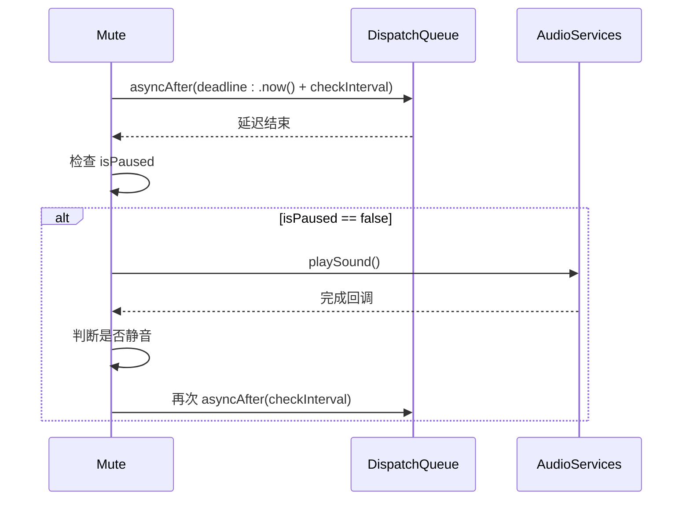

# checkInterval 检测间隔

<cite>
**本文档引用的文件**  
- [Mute.swift](file://Mute/Classes/Mute.swift#L51-L56)
- [ViewController.swift](file://Example/Mute/ViewController.swift#L23)
- [README.md](file://README.md#L10)
- [CLAUDE.md](file://CLAUDE.md#L51-L56)
</cite>

## 目录
1. [简介](#简介)
2. [属性定义与默认值](#属性定义与默认值)
3. [有效取值范围与约束](#有效取值范围与约束)
4. [对系统性能的影响](#对系统性能的影响)
5. [与isPaused状态的交互机制](#与ispaused状态的交互机制)
6. [内部Timer调度机制](#内部timer调度机制)
7. [动态修改行为表现](#动态修改行为表现)
8. [代码使用示例](#代码使用示例)
9. [精度与能耗的权衡建议](#精度与能耗的权衡建议)

## 简介
`checkInterval` 是 Mute 库中的一个关键属性，用于设置自动轮询检测设备静音开关状态的时间间隔。该属性直接影响静音状态检测的频率，开发者可以通过调整此值在检测精度和系统能耗之间进行权衡。本文档将深入解析该属性的功能特性、实现机制和最佳实践。

**Section sources**
- [Mute.swift](file://Mute/Classes/Mute.swift#L51-L56)
- [README.md](file://README.md#L10)

## 属性定义与默认值
`checkInterval` 属性在 `Mute` 类中被定义为一个公共的可变变量，其数据类型为 `TimeInterval`（即 `Double` 类型），表示以秒为单位的时间间隔。

```swift
public var checkInterval = 1.0 {
    didSet {
        if self.checkInterval < 0.5 {
            print("MUTE: checkInterval cannot be less than 0.5s, setting to 0.5")
            self.checkInterval = 0.5
        }
    }
}
```

该属性的**默认值为 1.0 秒**，这意味着库在初始化后会每隔 1 秒自动检测一次设备的静音状态。这个默认值在 `README.md` 文件中也被明确指出为“默认触发速率 1 秒”。

**Section sources**
- [Mute.swift](file://Mute/Classes/Mute.swift#L51)
- [README.md](file://README.md#L10)

## 有效取值范围与约束
`checkInterval` 属性的有效取值范围受到严格的约束：

- **最小值限制**：不能小于 0.5 秒。
- **最大值限制**：理论上没有上限，但过大的值会导致状态检测不及时。

当开发者尝试将 `checkInterval` 设置为小于 0.5 秒的值时，系统会自动将其重置为 0.5 秒，并输出一条警告日志：
```swift
if self.checkInterval < 0.5 {
    print("MUTE: checkInterval cannot be less than 0.5s, setting to 0.5")
    self.checkInterval = 0.5
}
```
此约束是为了防止过于频繁的检测操作对系统性能造成不必要的负担。

**Section sources**
- [Mute.swift](file://Mute/Classes/Mute.swift#L53-L55)

## 对系统性能的影响
`checkInterval` 的取值对系统性能有直接影响：

- **高频率检测（低值）**：当 `checkInterval` 设置为较小的值（如 0.5 秒）时，系统会更频繁地调度定时器、播放静音音效并进行状态判断。这会增加 CPU 的唤醒次数和音频子系统的负载，可能导致更高的能耗和轻微的性能开销。
- **低频率检测（高值）**：当 `checkInterval` 设置为较大的值（如 5 秒或更高）时，系统检测的频率降低，从而显著减少 CPU 和音频子系统的活动，有助于延长设备电池寿命。

因此，开发者需要根据应用的实际需求，在实时性和能耗之间做出权衡。

**Section sources**
- [Mute.swift](file://Mute/Classes/Mute.swift#L171)
- [CLAUDE.md](file://CLAUDE.md#L51-L56)

## 与isPaused状态的交互机制
`checkInterval` 的调度行为与 `isPaused` 状态紧密交互。`isPaused` 是一个控制检测是否暂停的布尔属性。

```mermaid
flowchart TD
A["设置 checkInterval"] --> B["调度下一次检测"]
B --> C{"isPaused ?"}
C --> |是| D[跳过本次检测]
C --> |否| E[执行 playSound()]
E --> F[检测静音状态]
F --> G[更新 isMute 状态]
G --> H["根据 checkInterval 调度下一次"]
```

**Diagram sources**
- [Mute.swift](file://Mute/Classes/Mute.swift#L42-L45)
- [Mute.swift](file://Mute/Classes/Mute.swift#L175)

当 `isPaused` 为 `true` 时（例如应用进入后台），即使 `checkInterval` 的时间已到，`schedulePlaySound()` 方法中的检查也会阻止 `playSound()` 的执行，从而暂停整个检测循环。当 `isPaused` 重新设置为 `false` 时，检测会立即恢复，并根据当前的 `checkInterval` 值继续调度。

**Section sources**
- [Mute.swift](file://Mute/Classes/Mute.swift#L42-L45)
- [Mute.swift](file://Mute/Classes/Mute.swift#L175)

## 内部Timer调度机制
`checkInterval` 属性直接决定了内部定时器的调度间隔。该库并未使用 `Timer` 类，而是通过 `DispatchQueue.main.asyncAfter` 实现了轻量级的延迟调度。



**Diagram sources**
- [Mute.swift](file://Mute/Classes/Mute.swift#L171)
- [Mute.swift](file://Mute/Classes/Mute.swift#L184)

具体流程如下：
1. 在 `schedulePlaySound()` 方法中，使用 `DispatchQueue.main.asyncAfter` 创建一个延迟任务。
2. 延迟时间由 `self.checkInterval` 决定。
3. 当延迟时间到达后，检查 `isPaused` 状态。
4. 如果未暂停，则调用 `playSound()` 播放静音音效进行检测。
5. 检测完成后，再次调用 `schedulePlaySound()`，形成一个基于 `checkInterval` 的循环调度。

**Section sources**
- [Mute.swift](file://Mute/Classes/Mute.swift#L164-L171)

## 动态修改行为表现
`checkInterval` 属性支持在运行时动态修改。由于其 `didSet` 观察器的存在，任何修改都会立即生效，并且会自动进行边界检查。

动态修改的行为表现如下：
- **立即生效**：新设置的值会立即用于下一次的调度。
- **边界保护**：如果新值小于 0.5 秒，会被自动修正为 0.5 秒。
- **不影响当前周期**：修改操作不会中断当前正在进行的检测周期，而是影响下一个调度周期。

例如，如果当前 `checkInterval` 为 2.0 秒，程序运行到第 1 秒时将其改为 0.5 秒，那么本次检测仍会在第 2 秒完成，但从下一次开始，检测间隔将变为 0.5 秒。

**Section sources**
- [Mute.swift](file://Mute/Classes/Mute.swift#L51-L56)

## 代码使用示例
以下是在 `ViewController` 中设置 `checkInterval` 的典型代码示例：

```swift
// 设置检测间隔为 2 秒
Mute.shared.checkInterval = 2.0

// 设置检测间隔为 0.5 秒（最小值）
Mute.shared.checkInterval = 0.5

// 尝试设置低于最小值的间隔（会被自动修正）
Mute.shared.checkInterval = 0.3 // 控制台会输出警告，并被设为 0.5
```

此示例来自 `ViewController.swift` 文件，展示了如何在应用启动时配置检测频率。

**Section sources**
- [ViewController.swift](file://Example/Mute/ViewController.swift#L23)
- [Mute.swift](file://Mute/Classes/Mute.swift#L51-L56)

## 精度与能耗的权衡建议
开发者在设置 `checkInterval` 时，应根据应用场景在精度和能耗之间进行权衡：

- **高精度场景**（如实时音频应用）：建议设置为 **0.5 - 1.0 秒**。这能确保用户几乎实时地感知到静音开关的变化，但会带来稍高的能耗。
- **平衡场景**（如普通应用的状态显示）：建议使用默认值 **1.0 秒**。这是一个在响应速度和能耗之间的良好平衡点。
- **低能耗场景**（如后台服务或电池敏感应用）：建议设置为 **3.0 - 5.0 秒或更高**。这能显著降低系统负载和能耗，但状态更新会有明显延迟。

总之，`checkInterval` 是一个灵活的配置项，合理设置可以优化应用的整体性能和用户体验。

**Section sources**
- [README.md](file://README.md#L10)
- [CLAUDE.md](file://CLAUDE.md#L51-L56)