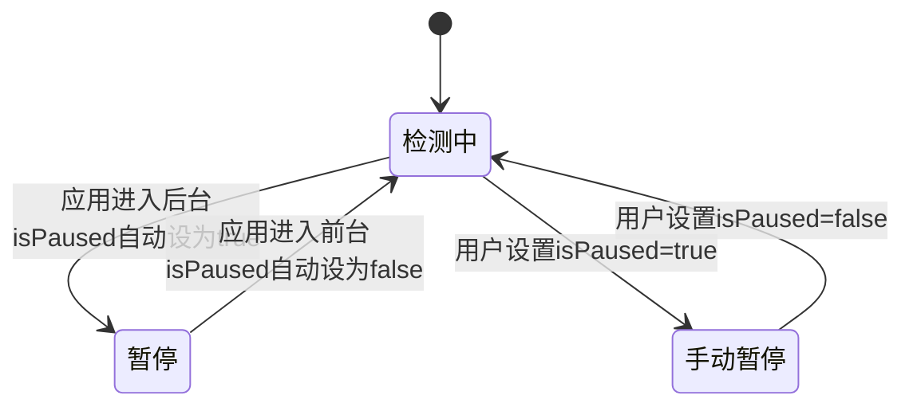
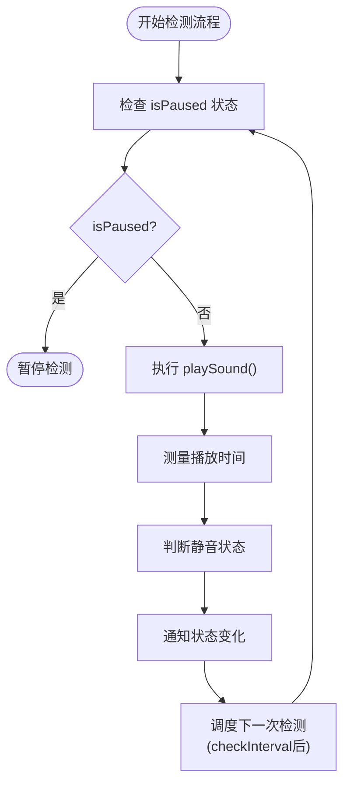

# isPaused 暂停状态

<cite>
**本文档引用的文件**   
- [Mute.swift](file://Mute/Classes/Mute.swift#L23-L210)
- [Mute.podspec.json](file://Example/Pods/Local Podspecs/Mute.podspec.json)
- [CLAUDE.md](file://CLAUDE.md)
</cite>

## 目录
1. [isPaused 属性详解](#ispaused-属性详解)
2. [默认行为与生命周期管理](#默认行为与生命周期管理)
3. [内部定时器与音频检测流程](#内部定时器与音频检测流程)
4. [手动控制与资源优化](#手动控制与资源优化)
5. [状态管理最佳实践](#状态管理最佳实践)

## isPaused 属性详解

`isPaused` 是 Mute 库中的一个布尔属性，用于手动控制静音检测功能的暂停与恢复。该属性作为库的核心配置选项之一，允许开发者根据应用的业务逻辑或用户交互需求，动态地启用或禁用静音状态检测。

该属性的实现位于 `Mute.swift` 文件中，作为 `Mute` 类的公共可变属性存在。通过设置 `isPaused = true`，可以立即暂停所有静音检测活动；设置 `isPaused = false` 则恢复检测。此属性与 `checkInterval` 和 `alwaysNotify` 共同构成了库的主要配置体系。

**Section sources**
- [Mute.swift](file://Mute/Classes/Mute.swift#L23-L210)

## 默认行为与生命周期管理

`isPaused` 属性具有智能的默认行为，能够自动响应应用的前后台状态变化。当应用进入后台时，库会自动将 `isPaused` 设置为 `true`，暂停静音检测以节省系统资源和电池电量；当应用返回前台时，会自动将 `isPaused` 设置为 `false`，恢复检测功能。

这一行为是通过监听 iOS 应用生命周期通知实现的。具体来说，库在初始化时注册了两个通知观察者：
- `UIApplication.didEnterBackgroundNotification`：当应用进入后台时触发，自动暂停检测
- `UIApplication.willEnterForegroundNotification`：当应用即将进入前台时触发，自动恢复检测

这种设计确保了在应用不活跃时不会进行不必要的音频检测，从而优化了资源使用。



**Diagram sources**
- [Mute.swift](file://Mute/Classes/Mute.swift#L128-L135)

**Section sources**
- [Mute.swift](file://Mute/Classes/Mute.swift#L128-L135)

## 内部定时器与音频检测流程

`isPaused` 属性直接影响着库内部的定时器和音频检测流程。当 `isPaused` 为 `false` 时，库会按照 `checkInterval` 指定的时间间隔（默认1秒，最小0.5秒）定期执行静音检测。

检测流程如下：
1. 调度 `schedulePlaySound()` 方法
2. 调用 `playSound()` 播放一个短暂的静音音频文件（mute.aiff）
3. 测量音频播放的实际持续时间
4. 根据播放时间判断设备是否处于静音状态
5. 通过回调通知状态变化
6. 根据 `checkInterval` 调度下一次检测

当 `isPaused` 为 `true` 时，定时器不会被调度，`playSound()` 方法不会被调用，整个检测流程完全停止，不会产生任何音频相关的系统调用。



**Diagram sources**
- [Mute.swift](file://Mute/Classes/Mute.swift#L165-L184)

**Section sources**
- [Mute.swift](file://Mute/Classes/Mute.swift#L165-L184)

## 手动控制与资源优化

开发者可以通过手动设置 `isPaused` 属性来精确控制静音检测的执行，这对于资源优化和响应特定业务逻辑至关重要。以下是一个典型的使用示例：

```swift
// 获取单例实例
let muteDetector = Mute.shared

// 配置检测间隔
muteDetector.checkInterval = 2.0

// 配置通知策略
muteDetector.alwaysNotify = true

// 手动暂停检测（例如在不需要检测的界面）
muteDetector.isPaused = true

// 在需要时恢复检测
muteDetector.isPaused = false

// 添加状态变化监听
muteDetector.muteChanged = { isMuted in
    print("设备静音状态: \(isMuted ? "已静音" : "未静音")")
}
```

手动控制的优先级高于自动生命周期管理。一旦开发者手动设置了 `isPaused` 的值，应用前后台切换不会覆盖这个手动设置，确保了开发者对检测状态的完全控制权。

**Section sources**
- [Mute.swift](file://Mute/Classes/Mute.swift#L23-L210)

## 状态管理最佳实践

在应用生命周期中合理管理 `isPaused` 状态对于性能和用户体验至关重要：

1. **尊重用户隐私**：在不需要检测静音状态的场景下，应主动暂停检测
2. **资源优化**：在后台或长时间不活跃时暂停检测，节省电池和CPU资源
3. **业务逻辑集成**：根据应用的具体功能需求，在适当的时机启用或禁用检测
4. **状态持久化**：考虑将用户的偏好设置（如是否启用静音检测）持久化
5. **错误处理**：在设置 `isPaused` 时考虑异常情况，确保应用稳定性

通过合理使用 `isPaused` 属性，开发者可以在功能完整性和资源效率之间取得良好平衡，为用户提供流畅且高效的体验。

**Section sources**
- [Mute.swift](file://Mute/Classes/Mute.swift#L23-L210)