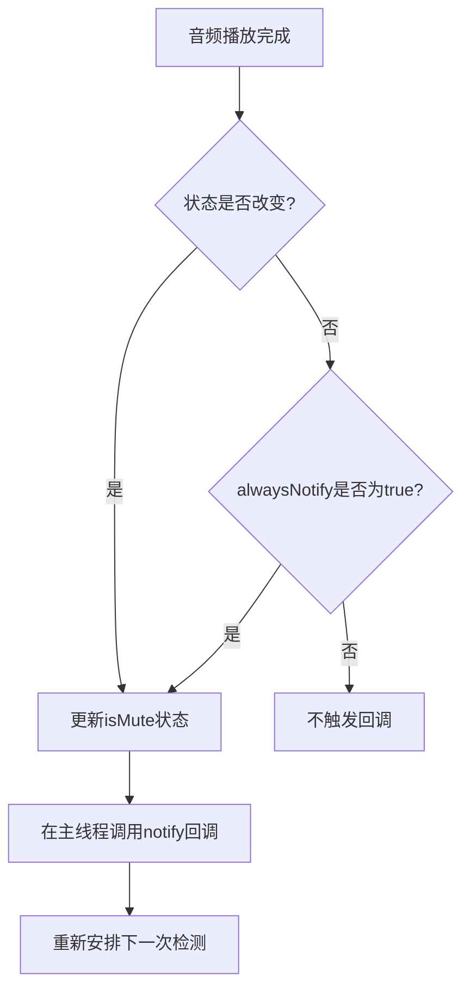

# notify 状态变化回调

<cite>
**本文档引用的文件**   
- [Mute.swift](file://Mute/Classes/Mute.swift#L14-L208)
- [ViewController.swift](file://Example/Mute/ViewController.swift#L28-L30)
- [AppDelegate.swift](file://Example/Mute/AppDelegate.swift)
</cite>

## 目录
1. [notify属性概述](#notify属性概述)
2. [函数签名与参数详解](#函数签名与参数详解)
3. [回调触发机制](#回调触发机制)
4. [线程安全性](#线程安全性)
5. [使用模式示例](#使用模式示例)
6. [完整实践指南](#完整实践指南)

## notify属性概述

`notify` 属性是 Mute 库中的核心事件通知机制，用于在设备静音状态发生变化时通知调用方。该属性定义在 `Mute` 类中，采用闭包（Closure）形式实现回调功能。

作为单例模式（`Mute.shared`）的一部分，`notify` 允许开发者注册一个回调函数，当库检测到设备静音开关状态改变时自动执行。该机制基于播放一个无声的音频文件并测量其播放时长来判断设备是否处于静音状态。

**Section sources**
- [Mute.swift](file://Mute/Classes/Mute.swift#L35-L36)

## 函数签名与参数详解

`notify` 属性的函数签名基于 `MuteNotificationCompletion` 类型别名，其定义如下：

```swift
public typealias MuteNotificationCompletion = ((_ mute: Bool) -> Void)
```

该类型别名表示一个接受单个 `Bool` 类型参数并返回 `Void` 的闭包。当 `notify` 回调被触发时，会传入一个布尔值参数，其含义如下：

- **`true`**: 表示设备当前处于静音状态（静音开关已打开）
- **`false`**: 表示设备当前处于非静音状态（静音开关已关闭）

这个参数值是通过测量无声音频文件的播放时长来确定的：如果播放时长小于 0.1 秒，则认为设备处于静音状态。

**Section sources**
- [Mute.swift](file://Mute/Classes/Mute.swift#L14)

## 回调触发机制

`notify` 回调的触发与 `alwaysNotify` 属性密切相关，其触发逻辑由 `soundFinishedPlaying()` 方法实现：



**Diagram sources**
- [Mute.swift](file://Mute/Classes/Mute.swift#L200-L208)

`notify` 回调的触发条件如下：

1. **状态变化时触发**：当设备的静音状态从静音变为非静音或从非静音变为静音时，无论 `alwaysNotify` 的值如何，都会触发回调
2. **定期触发**：当 `alwaysNotify` 属性设置为 `true` 时，即使静音状态没有变化，也会按照 `checkInterval` 设置的时间间隔定期触发回调

这种设计提供了两种使用模式：`alwaysNotify = true` 适用于需要持续监控静音状态的场景，而 `alwaysNotify = false` 适用于只关心状态变化的场景，可以减少不必要的回调调用。

**Section sources**
- [Mute.swift](file://Mute/Classes/Mute.swift#L200-L208)

## 线程安全性

`notify` 回调保证在主线程（Main Thread）中执行，这对于 UI 更新操作至关重要。在 `soundFinishedPlaying()` 方法中，通过 `DispatchQueue.main.async` 确保回调在主线程上执行：

```swift
DispatchQueue.main.async {
    self.notify?(isMute)
}
```

这种设计确保了即使静音状态检测在后台进行，状态更新和 UI 刷新也能安全地在主线程上完成，避免了多线程访问 UI 元素可能引发的问题。开发者可以直接在回调中更新界面元素，而无需额外的线程调度。

**Section sources**
- [Mute.swift](file://Mute/Classes/Mute.swift#L203-L205)

## 使用模式示例

### 闭包内联模式

最简单的使用方式是直接在 `notify` 属性赋值时使用内联闭包：

```swift
Mute.shared.notify = { [weak self] isMuted in
    self?.label.text = isMuted ? "静音" : "非静音"
}
```

此模式代码简洁，适用于简单的状态处理逻辑。

### 方法引用模式

对于复杂的处理逻辑，可以将回调指向一个独立的方法：

```swift
class ViewController: UIViewController {
    func handleMuteStateChange(isMuted: Bool) {
        updateUI(isMuted)
        logStateChange(isMuted)
    }
    
    func setupMuteNotification() {
        Mute.shared.notify = { [weak self] isMuted in
            self?.handleMuteStateChange(isMuted: isMuted)
        }
    }
}
```

### weak self安全捕获

为避免循环引用，应使用 `[weak self]` 捕获列表：

```swift
Mute.shared.notify = { [weak self] isMuted in
    guard let self = self else { return }
    // 安全地使用self
    self.updateStatusLabel(isMuted)
}
```

这种模式确保了视图控制器可以被正确释放，防止内存泄漏。

**Section sources**
- [ViewController.swift](file://Example/Mute/ViewController.swift#L29)

## 完整实践指南

在视图控制器中安全注册和响应状态变化的完整实践如下：

```swift
class ViewController: UIViewController {
    @IBOutlet weak var statusLabel: UILabel!
    
    override func viewDidLoad() {
        super.viewDidLoad()
        
        // 配置检测间隔（可选）
        Mute.shared.checkInterval = 2.0
        
        // 设置是否持续通知
        Mute.shared.alwaysNotify = true
        
        // 注册状态变化回调
        Mute.shared.notify = { [weak self] isMuted in
            // 确保self仍然存在
            guard let self = self else { return }
            
            // 在主线程更新UI
            DispatchQueue.main.async {
                self.statusLabel.text = isMuted ? "设备已静音" : "设备未静音"
                self.statusLabel.textColor = isMuted ? .red : .green
            }
        }
        
        // 示例：在特定时间暂停和恢复检测
        DispatchQueue.main.asyncAfter(deadline: .now() + 5.0) {
            Mute.shared.isPaused = true // 暂停检测
        }
        
        DispatchQueue.main.asyncAfter(deadline: .now() + 10.0) {
            Mute.shared.isPaused = false // 恢复检测
        }
    }
    
    deinit {
        // 可选：清除回调
        Mute.shared.notify = nil
    }
}
```

此实践展示了完整的生命周期管理，包括配置、注册回调、处理状态变化和资源清理。通过设置 `isPaused` 属性，可以在应用进入后台时暂停检测，在前台时恢复检测，以优化性能和电池使用。

**Section sources**
- [ViewController.swift](file://Example/Mute/ViewController.swift#L20-L45)
- [Mute.swift](file://Mute/Classes/Mute.swift#L50-L55)