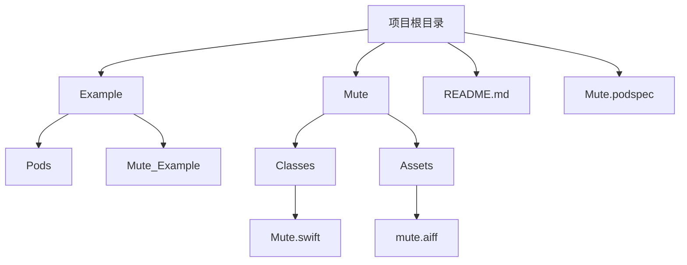
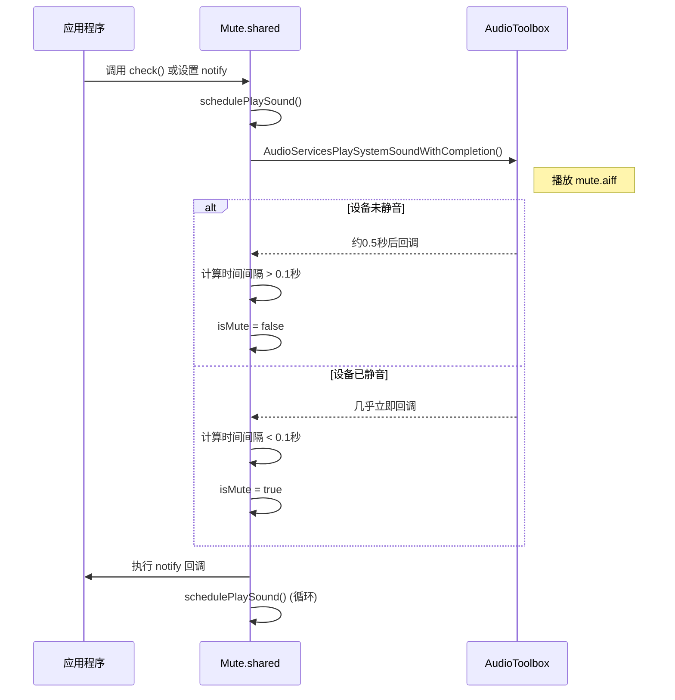
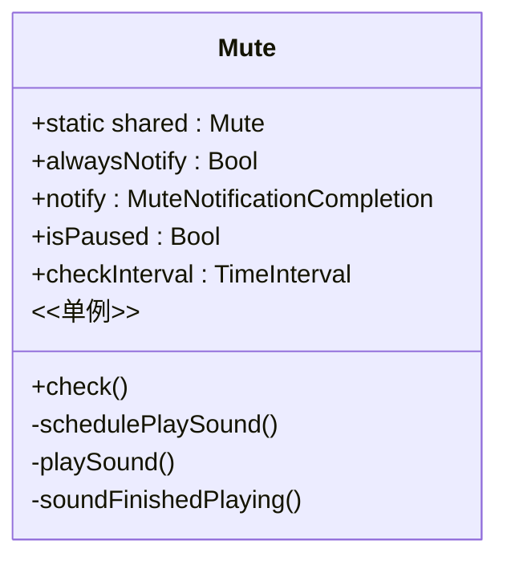
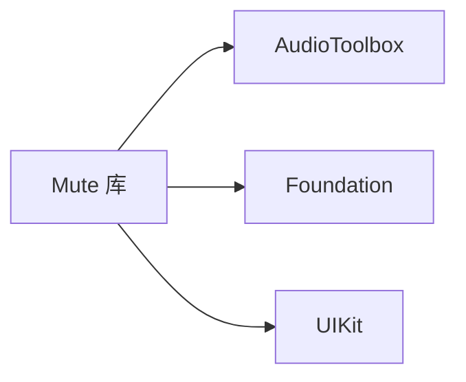

# CocoaPods 集成

<cite>
**本文档引用的文件**  
- [Mute.podspec](file://Mute.podspec)
- [Example/Podfile](file://Example/Podfile)
- [README.md](file://README.md)
- [Mute/Classes/Mute.swift](file://Mute/Classes/Mute.swift)
- [Mute/Assets/mute.aiff](file://Mute/Assets/mute.aiff)
</cite>

## 目录
1. [简介](#简介)
2. [项目结构](#项目结构)
3. [核心组件](#核心组件)
4. [架构概述](#架构概述)
5. [详细组件分析](#详细组件分析)
6. [依赖分析](#依赖分析)
7. [性能考虑](#性能考虑)
8. [故障排除指南](#故障排除指南)
9. [结论](#结论)

## 简介
本文档详细介绍了如何通过CocoaPods集成Mute库，这是一个用于检测iOS设备静音开关状态的Swift库。由于iOS系统本身不提供原生API来检测静音开关，Mute库通过播放一个短暂的音频并测量其播放时长来判断设备是否处于静音模式。本文将重点介绍Podfile配置、依赖声明、安装流程，以及Mute.podspec文件中的关键字段，并提供常见问题的解决方案。

## 项目结构
Mute库的项目结构遵循标准的CocoaPods库布局，包含源代码、资源文件、示例项目和配置文件。

**图示来源**
- [Mute.podspec](file://Mute.podspec)
- [Mute/Classes/Mute.swift](file://Mute/Classes/Mute.swift)
- [Mute/Assets/mute.aiff](file://Mute/Assets/mute.aiff)

**本节来源**
- [Mute.podspec](file://Mute.podspec)
- [Mute/Classes/Mute.swift](file://Mute/Classes/Mute.swift)

## 核心组件
Mute库的核心功能由`Mute.swift`文件中的`Mute`类实现。该类是一个单例，负责管理静音状态的检测逻辑。

**本节来源**
- [Mute/Classes/Mute.swift](file://Mute/Classes/Mute.swift)

## 架构概述
Mute库的架构相对简单，主要依赖于iOS的AudioToolbox框架。其核心原理是播放一个已知时长的静音音频文件（`mute.aiff`），然后通过测量实际播放完成的时间来判断设备是否被静音。如果设备处于静音状态，音频将不会被播放，因此播放完成的回调会立即触发，测量到的时间间隔会非常短。

**图示来源**
- [Mute/Classes/Mute.swift](file://Mute/Classes/Mute.swift)
- [Mute/Assets/mute.aiff](file://Mute/Assets/mute.aiff)

## 详细组件分析
### Mute 类分析
`Mute`类是库的入口点，提供了检测静音状态的接口。

#### 类图

**图示来源**
- [Mute/Classes/Mute.swift](file://Mute/Classes/Mute.swift)

#### 关键属性和方法
- **`shared`**: 静态单例实例，是访问Mute功能的唯一入口。
- **`checkInterval`**: 设置检测的频率（秒），默认为1秒，最小值为0.5秒。
- **`alwaysNotify`**: 布尔值，决定是仅在状态改变时通知，还是按`checkInterval`的频率持续通知。
- **`notify`**: 一个闭包，当静音状态改变或需要通知时被调用。
- **`check()`**: 手动触发一次静音状态检测。
- **`isPaused`**: 控制检测是否暂停，通常在应用进入后台时自动设置为`true`。

**本节来源**
- [Mute/Classes/Mute.swift](file://Mute/Classes/Mute.swift)

## 依赖分析
Mute库通过CocoaPods进行依赖管理，其依赖关系在`Mute.podspec`文件中明确定义。

**图示来源**
- [Mute.podspec](file://Mute.podspec)
- [Mute/Classes/Mute.swift](file://Mute/Classes/Mute.swift)

**本节来源**
- [Mute.podspec](file://Mute.podspec)

## 性能考虑
Mute库的性能开销非常低。它使用系统级的`AudioServicesPlaySystemSoundWithCompletion` API播放一个极短的音频文件，该操作对CPU和电池的影响微乎其微。检测逻辑主要依赖于时间间隔的计算，这是一个轻量级的操作。库还通过在应用进入后台时暂停检测来进一步优化性能。

## 故障排除指南
在集成Mute库时，可能会遇到以下常见问题：

1.  **`pod install` 失败或 pod repo 更新失败**:
    *   确保CocoaPods已正确安装 (`pod --version`)。
    *   尝试更新本地pod repo: `pod repo update`。
    *   清除CocoaPods缓存: `pod cache clean --all`。

2.  **版本冲突**:
    *   在Podfile中明确指定版本，例如 `pod 'Mute', '~> 0.6.0'`。
    *   运行 `pod update Mute` 来更新到指定版本范围内的最新版本。
    *   检查`Podfile.lock`以查看实际安装的版本。

3.  **资源文件未加载 (mute.aiff not found)**:
    *   这是最常见的错误，通常由`Mute.bundle`未正确复制到应用包中引起。
    *   **解决方案**: 确保在Xcode的"Build Phases"中，"Copy Bundle Resources"步骤包含了`Mute.bundle`。如果缺失，可以手动添加。CocoaPods的`Pods-Mute_Example-resources.sh`脚本负责此操作，如果脚本未正确执行，手动添加是有效的补救措施。

4.  **代码签名错误**:
    *   Mute.podspec中设置了`CODE_SIGNING_ALLOWED = 'NO'`，这是因为库本身不包含可执行代码，只是一个资源包。在开发阶段这通常不是问题。如果在归档时遇到问题，可以尝试在Podfile中为Mute pod添加`!use_frameworks`或检查项目的代码签名设置。

5.  **无法导入 Mute**:
    *   确保已运行 `pod install` 并使用生成的`.xcworkspace`文件打开项目，而不是`.xcodeproj`文件。

**本节来源**
- [Mute.podspec](file://Mute.podspec)
- [Example/Podfile](file://Example/Podfile)
- [Mute/Classes/Mute.swift](file://Mute/Classes/Mute.swift)
- [Example/Pods/Target Support Files/Pods-Mute_Example/Pods-Mute_Example-resources.sh](file://Example/Pods/Target Support Files/Pods-Mute_Example/Pods-Mute_Example-resources.sh)

## 结论
通过本文档，您应该已经掌握了如何使用CocoaPods集成Mute库的完整流程。从配置Podfile、理解podspec文件的各个字段，到解决常见的集成问题，Mute库提供了一个简单而有效的解决方案来检测iOS设备的静音开关状态。其核心原理巧妙地绕过了系统API的限制，代码实现简洁高效。遵循本文档的指导，您可以轻松地将此功能集成到您的iOS应用中。