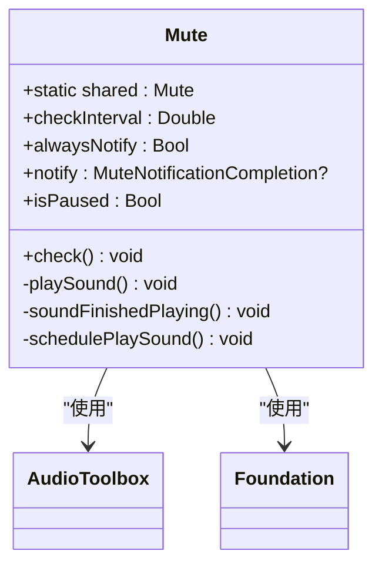

# Swift Package Manager 集成

<cite>
**本文档引用的文件**   
- [Package.swift](file://Package.swift)
- [Mute.swift](file://Mute/Classes/Mute.swift)
- [README.md](file://README.md)
- [ViewController.swift](file://Example/Mute/ViewController.swift)
- [mute.aiff](file://Mute/Assets/mute.aiff)
</cite>

## 目录
1. [集成指南](#集成指南)
2. [Package.swift 配置详解](#packageswift-配置详解)
3. [核心功能与实现原理](#核心功能与实现原理)
4. [集成验证与测试](#集成验证与测试)
5. [常见问题处理](#常见问题处理)

## 集成指南

本指南详细说明如何通过Swift Package Manager（SPM）将Mute库集成到您的iOS项目中。Mute库用于检测设备的静音开关状态，通过播放一个短暂的音频并测量其播放时长来判断设备是否处于静音模式。

### 通过Xcode图形界面集成

1. 在Xcode中打开您的项目。
2. 选择菜单栏中的 **文件 > 添加包依赖项**（File > Add Package Dependency）。
3. 在弹出的对话框中，输入Mute库的GitHub仓库地址：`https://github.com/akramhussein/Mute`。
4. 点击 **下一步**（Next）。
5. 选择版本规则。推荐选择 **最高至下一个主版本**（Up to Next Major Version），例如 `0.6.1`，这将允许自动更新到 `0.7.0` 但不会更新到 `1.0.0`，以确保兼容性。
6. 点击 **下一步**（Next），Xcode将解析并下载依赖。
7. 选择要链接Mute库的目标（Target），然后点击 **完成**（Finish）。

### 通过Package.swift文件手动配置

您也可以直接编辑项目的`Package.swift`文件来声明对Mute的依赖。

**Section sources**
- [Package.swift](file://Package.swift#L1-L11)

## Package.swift 配置详解

`Package.swift`是Swift Package Manager的核心配置文件，定义了包的元数据、产品和目标。

### 依赖声明与目标链接

在您的`Package.swift`文件中，需要在`dependencies`数组中添加Mute库的引用，并在`targets`的`dependencies`中将其链接到您的目标模块。

```swift
// swift-tools-version:5.3

import PackageDescription

let package = Package(
    name: "YourProjectName",
    platforms: [.iOS(.v9)],
    products: [
        .library(
            name: "YourLibraryName",
            targets: ["YourTargetName"])
    ],
    dependencies: [
        // 添加Mute依赖
        .package(url: "https://github.com/akramhussein/Mute.git", from: "0.6.1")
    ],
    targets: [
        .target(
            name: "YourTargetName",
            dependencies: [
                .product(name: "Mute", package: "Mute") // 将Mute链接到此目标
            ],
            path: "Sources")
    ]
)
```

### 产品类型与目标定义

- **产品类型**（`.library`）：`products`字段定义了包对外暴露的产品。`.library(name: "Mute", targets: ["Mute"])` 表示该包提供一个名为 "Mute" 的库，由 "Mute" 目标构建而成。这使得其他项目可以将此包作为依赖导入。
- **目标定义**（`target`）：`targets`字段定义了包内的构建目标。`.target(name: "Mute", path: "Mute", resources: [.copy("Assets/mute.aiff")])` 定义了一个名为 "Mute" 的目标，其源代码位于 `Mute` 目录下，并包含一个需要复制的资源文件 `mute.aiff`。

### 版本解析机制

Swift Package Manager使用基于语义化版本号（SemVer）的规则来解析依赖版本。
- **`from: "0.6.1"`**：表示使用 `0.6.1` 版本或任何更高版本，但不包括下一个主版本（即 `1.0.0`）。这遵循了 `0.x.y` 版本系列的兼容性约定。
- 其他规则包括 `exact`（精确匹配）、`.upToNextMinor(from: "x.y.z")`（最高至下一个次版本）等。

**Section sources**
- [Package.swift](file://Package.swift#L1-L11)

## 核心功能与实现原理

Mute库的核心功能是检测iOS设备的静音开关状态，其实现基于一个巧妙的原理。

### 检测原理

由于iOS系统没有提供直接查询静音开关状态的原生API，Mute库采用间接方法：
1. **播放静音音频**：库内置一个极短（0.5秒）且无声的AIFF音频文件（`mute.aiff`）。
2. **测量播放时长**：通过`AudioToolbox`框架播放此音频，并精确记录从开始播放到完成回调的时间间隔。
3. **判断状态**：如果播放完成的耗时小于0.1秒，则认为设备处于静音状态（音频被系统静音，立即完成）；否则，认为设备未静音（音频正常播放，耗时接近其实际长度）。

### 核心类分析

`Mute`类是一个遵循单例模式的公开类，通过`Mute.shared`全局访问。



**Diagram sources **
- [Mute.swift](file://Mute/Classes/Mute.swift#L15-L210)

**Section sources**
- [Mute.swift](file://Mute/Classes/Mute.swift#L15-L210)

### 关键属性与方法

- **`shared`**：静态共享实例，实现单例模式。
- **`checkInterval`**：检测频率（秒），默认1.0秒，最小值0.5秒。
- **`alwaysNotify`**：布尔值，决定是每次检测都通知（`true`）还是仅在状态改变时通知（`false`）。
- **`notify`**：闭包回调，当检测到静音状态变化或需要通知时被调用。
- **`isPaused`**：控制检测是否暂停，通常在应用进入后台时自动设置为`true`。
- **`check()`**：公共方法，用于手动触发一次即时检测。

### 资源管理

库通过`Bundle`机制正确加载资源，兼容CocoaPods和Swift Package Manager两种分发方式，确保`mute.aiff`文件能被正确找到。

**Section sources**
- [Mute.swift](file://Mute/Classes/Mute.swift#L15-L210)
- [mute.aiff](file://Mute/Assets/mute.aiff)

## 集成验证与测试

集成完成后，您需要验证Mute库是否正常工作。

### 导入与调用

在您的视图控制器（如`ViewController.swift`）中，首先导入Mute模块，然后配置并使用其功能。

```swift
import UIKit
import Mute // 导入Mute模块

class ViewController: UIViewController {
    @IBOutlet weak var statusLabel: UILabel!

    override func viewDidLoad() {
        super.viewDidLoad()

        // 配置检测间隔为2秒
        Mute.shared.checkInterval = 2.0
        
        // 设置为总是通知
        Mute.shared.alwaysNotify = true
        
        // 设置状态变化的回调
        Mute.shared.notify = { [weak self] isMuted in
            self?.statusLabel.text = isMuted ? "设备已静音" : "设备未静音"
        }
        
        // 可以通过按钮手动触发检测
        // Mute.shared.check()
    }
}
```

此代码示例展示了如何设置检测频率、通知策略，并通过`notify`闭包更新UI。

**Section sources**
- [ViewController.swift](file://Example/Mute/ViewController.swift#L1-L50)

## 常见问题处理

在集成过程中可能会遇到一些问题，以下是常见问题及其解决方案。

### 网络连接失败

**问题**：在添加包依赖时，Xcode提示无法连接到GitHub仓库。
**解决方案**：
1. 检查您的网络连接，确保可以访问 `https://github.com`。
2. 如果您在公司网络或使用代理，可能需要配置Xcode的网络代理设置。
3. 尝试使用不同的网络环境（如切换到移动热点）。

### 版本解析错误

**问题**：SPM无法解析指定的版本，或提示版本不兼容。
**解决方案**：
1. 确认您输入的版本号（如 `0.6.1`）在GitHub仓库的发布标签（Releases）中存在。
2. 检查您的项目支持的iOS平台版本是否与Mute库兼容（Mute要求iOS 9.0+）。
3. 尝试使用更宽松的版本规则，如 `from: "0.6.0"`。

### 依赖缓存清理

**问题**：修改了`Package.swift`但Xcode没有反应，或遇到奇怪的构建错误。
**解决方案**：清理SPM的缓存。
1. 在Xcode中，选择 **Xcode > 清理包缓存**（Xcode > Clean Build Folder）。
2. 或者，在终端中进入您的项目目录，执行：
   ```bash
   swift package clean
   ```
   这将删除`Package.resolved`文件和`.build`目录，强制SPM重新解析和下载所有依赖。

**Section sources**
- [README.md](file://README.md#L0-L84)
- [CLAUDE.md](file://CLAUDE.md#L0-L56)