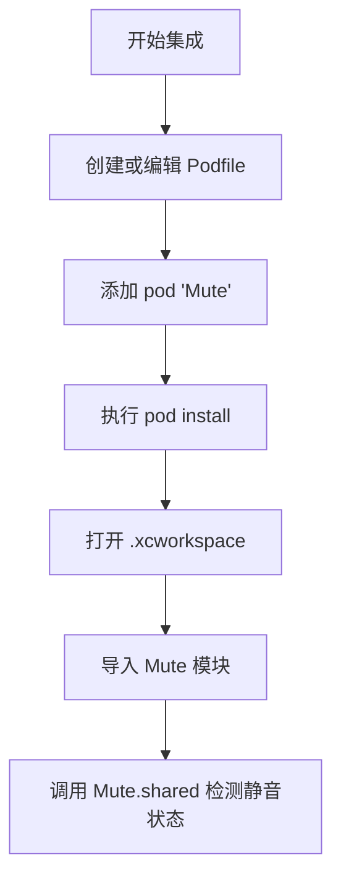
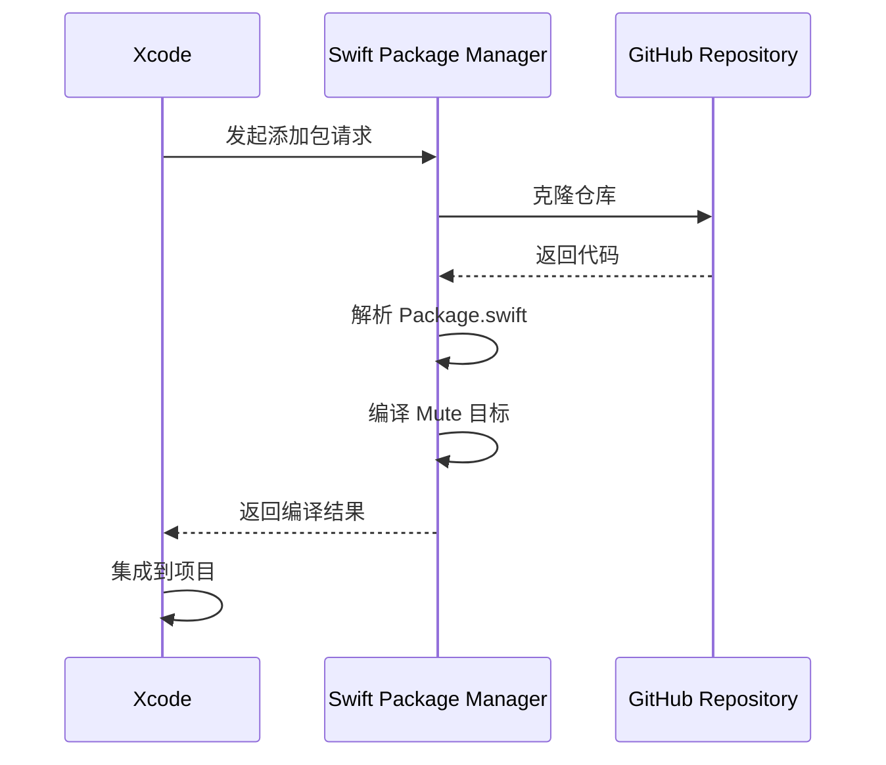
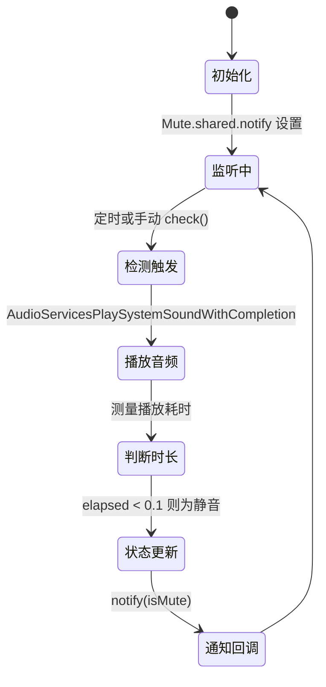

# 安装与集成

<cite>
**本文档中引用的文件**  
- [Mute.podspec](file://Mute.podspec)
- [Package.swift](file://Package.swift)
- [README.md](file://README.md)
- [Mute.swift](file://Mute/Classes/Mute.swift)
- [Podfile](file://Example/Podfile)
- [ViewController.swift](file://Example/Mute/ViewController.swift)
- [mute.aiff](file://Mute/Assets/mute.aiff)
</cite>

## 目录
1. [简介](#简介)
2. [CocoaPods 集成](#cocoapods-集成)
3. [Swift Package Manager 集成](#swift-package-manager-集成)
4. [集成验证与测试](#集成验证与测试)
5. [常见问题排查](#常见问题排查)

## 简介
Mute 是一个用于检测 iOS 设备静音开关状态的 Swift 库。由于 iOS 系统本身未提供直接检测静音开关的原生 API，该库通过播放一个短暂的音频并测量其播放时长来判断设备是否处于静音模式。本指南将详细介绍如何通过 CocoaPods 和 Swift Package Manager（SPM）两种主流方式集成 Mute 库，并提供配置说明、常见问题解决方案及验证方法，确保开发者能够顺利在项目中使用该功能。

**Section sources**
- [README.md](file://README.md#L1-L20)
- [Mute.swift](file://Mute/Classes/Mute.swift#L1-L20)

## CocoaPods 集成

### Podfile 配置
要通过 CocoaPods 集成 Mute，需在项目的 `Podfile` 中添加以下依赖声明：

```ruby
pod 'Mute'
```

在示例项目中，使用了本地路径依赖，配置如下：

```ruby
platform :ios, '9.0'
use_frameworks!

target 'Mute_Example' do
  pod 'Mute', :path => '../'
end
```

此配置指定了 iOS 部署目标为 9.0，并将 Mute 作为本地开发 pod 引入。

### Mute.podspec 配置解析
`Mute.podspec` 文件定义了库的元数据和构建配置，关键字段如下：

- **名称与版本**：`s.name = 'Mute'`，当前版本为 `0.6.1`
- **平台要求**：`s.ios.deployment_target = '9.0'`，支持 iOS 9.0 及以上系统
- **源文件路径**：`s.source_files = 'Mute/Classes/**/*'`，包含 `Classes` 目录下的所有 Swift 文件
- **资源引用**：`s.resource_bundles = { 'Mute' => ['Mute/Assets/*.aiff'] }`，打包 `mute.aiff` 音频资源
- **依赖框架**：`s.frameworks = 'Foundation', 'AudioToolbox'`，需链接 Foundation 和 AudioToolbox 框架
- **Swift 版本**：`s.swift_version = '5.0'`，使用 Swift 5.0 编译
- **代码签名**：`s.pod_target_xcconfig = { 'CODE_SIGNING_ALLOWED' => 'NO' }`，禁用代码签名以避免构建问题



**Diagram sources**
- [Podfile](file://Example/Podfile#L1-L8)
- [Mute.podspec](file://Mute.podspec#L1-L30)

**Section sources**
- [Mute.podspec](file://Mute.podspec#L1-L30)
- [Podfile](file://Example/Podfile#L1-L8)

## Swift Package Manager 集成

### Package.swift 配置解析
`Package.swift` 文件定义了 SPM 包的结构，内容如下：

```swift
// swift-tools-version:5.3
import PackageDescription

let package = Package(
    name: "Mute",
    platforms: [.iOS(.v9)],
    products: [.library(name: "Mute", targets: ["Mute"])],
    targets: [.target(name: "Mute", path: "Mute", resources: [.copy("Assets/mute.aiff")])]
)
```

关键配置说明：

- **包名**：`name: "Mute"`
- **支持平台**：`.iOS(.v9)`，即 iOS 9.0+
- **产品定义**：`.library(name: "Mute", targets: ["Mute"])`，声明一个名为 Mute 的静态库
- **目标配置**：`.target(name: "Mute", path: "Mute", resources: [.copy("Assets/mute.aiff")])`，指定源码路径和资源文件
- **资源处理**：`resources: [.copy("Assets/mute.aiff")]`，将 `mute.aiff` 文件复制到包中

### Xcode 中添加 SPM 依赖
1. 打开 Xcode 项目
2. 选择 **File > Add Packages...**
3. 在搜索框中输入 `https://github.com/akramhussein/Mute.git`
4. 选择版本（如 `0.6.1`）并添加
5. Xcode 将自动解析依赖并集成到项目中



**Diagram sources**
- [Package.swift](file://Package.swift#L1-L10)

**Section sources**
- [Package.swift](file://Package.swift#L1-L10)

## 集成验证与测试

### 功能测试代码示例
集成成功后，可通过以下代码验证 Mute 功能：

```swift
import UIKit
import Mute

class ViewController: UIViewController {
    @IBOutlet weak var label: UILabel!

    override func viewDidLoad() {
        super.viewDidLoad()

        // 设置检测间隔为 2 秒
        Mute.shared.checkInterval = 2.0

        // 启用持续通知
        Mute.shared.alwaysNotify = true

        // 监听静音状态变化
        Mute.shared.notify = { [weak self] isMuted in
            self?.label.text = isMuted ? "已静音" : "未静音"
        }

        // 模拟手动触发检测
        DispatchQueue.main.asyncAfter(deadline: .now() + 3.0) {
            Mute.shared.check()
        }
    }
}
```

### 验证步骤
1. 运行应用，观察标签初始状态为 `"-"`
2. 切换设备静音开关，等待 1-2 秒
3. 标签应更新为 `"已静音"` 或 `"未静音"`
4. 调用 `Mute.shared.check()` 可立即触发一次检测



**Diagram sources**
- [Mute.swift](file://Mute/Classes/Mute.swift#L100-L200)

**Section sources**
- [ViewController.swift](file://Example/Mute/ViewController.swift#L1-L50)
- [Mute.swift](file://Mute/Classes/Mute.swift#L50-L100)

## 常见问题排查

### 版本冲突
若出现 Swift 版本不兼容，确保项目设置与 `swift_version = '5.0'` 一致。在 Xcode 中检查 **Build Settings > Swift Language Version**。

### 资源加载失败
错误信息 `mute.aiff not found` 表示资源未正确打包。检查：
- CocoaPods：确认 `resource_bundles` 配置正确
- SPM：确认 `resources: [.copy("Assets/mute.aiff")]` 路径无误
- 手动集成：确保 `mute.aiff` 文件已添加到主 Bundle

### 后台检测失效
Mute 库通过监听 `UIApplication.didEnterBackgroundNotification` 和 `willEnterForegroundNotification` 自动暂停和恢复检测。若后台行为异常，请确认：
- 应用未被系统终止
- `isPaused` 属性未被手动设置为 `true`

### 构建错误
若出现 `CODE_SIGNING_ALLOWED` 相关错误，CocoaPods 会自动处理。若手动集成，需在 Target 的 Build Settings 中设置 `CODE_SIGNING_ALLOWED = NO`。

**Section sources**
- [Mute.swift](file://Mute/Classes/Mute.swift#L90-L120)
- [Mute.podspec](file://Mute.podspec#L15-L20)
- [Package.swift](file://Package.swift#L8)