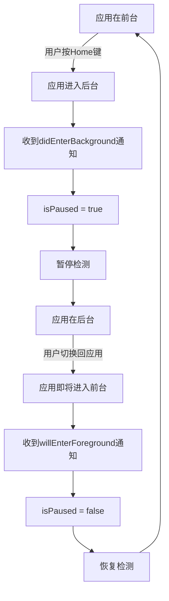

# 常见问题

<cite>
**本文档中引用的文件**  
- [README.md](file://README.md)
- [ViewController.swift](file://Example/Mute/ViewController.swift)
- [Mute.swift](file://Mute/Classes/Mute.swift)
- [Mute.podspec.json](file://Example/Pods/Local Podspecs/Mute.podspec.json)
</cite>

## 目录
1. [为什么状态检测不准确？](#为什么状态检测不准确)
2. [后台检测是否继续运行？](#后台检测是否继续运行)
3. [如何降低功耗？](#如何降低功耗)
4. [notify回调未触发怎么办？](#notify回调未触发怎么办)
5. [CocoaPods集成时报错找不到模块](#cocoapods集成时报错找不到模块)
6. [环境配置与权限问题](#环境配置与权限问题)

### 为什么状态检测不准确？

**根本原因分析：**  
Mute库通过播放一个短暂的静音音频（`mute.aiff`）并测量其播放时长来判断设备是否处于静音状态。其原理基于iOS系统在静音开关开启时会立即中断音频播放，导致播放时间极短（通常小于0.1秒）。如果播放时间较长，则认为设备未静音。

检测不准确的可能原因包括：
- **系统资源繁忙**：当设备CPU或音频系统负载过高时，音频播放的启动或完成回调可能会延迟，导致测量的时间间隔（`interval`）出现偏差。
- **音频会话冲突**：如果应用内其他组件或第三方库正在使用音频会话（Audio Session），可能会干扰Mute库的音频播放，影响检测结果。
- **极端网络或I/O延迟**：虽然音频文件很小，但在极端情况下，文件加载的延迟也可能影响计时精度。

**解决方案与调试步骤：**
1. **确认资源文件存在**：确保`mute.aiff`文件已正确打包到应用中。根据`Mute.podspec.json`，该文件位于`Mute/Assets/`目录下，应通过资源包（resource bundle）正确加载。如果文件缺失，库会抛出致命错误`"mute.aiff not found"`。
2. **避免高频率检测**：将`checkInterval`设置得过短（如低于1秒）会增加系统负担，可能导致计时不准确。建议根据实际需求设置合理的检测间隔（如2-5秒）。
3. **检查音频冲突**：确保应用内没有其他长时间占用音频会话的组件。Mute库使用`AudioToolbox`框架的`AudioServicesPlaySystemSoundWithCompletion`，该方法优先级较低，容易受其他音频操作影响。
4. **在不同设备和场景下测试**：在多台设备上进行测试，观察是否在特定型号或iOS版本上出现普遍性问题。

**Section sources**
- [README.md](file://README.md#L0-L17)
- [Mute.swift](file://Mute/Classes/Mute.swift#L98)
- [Mute.podspec.json](file://Example/Pods/Local Podspecs/Mute.podspec.json#L0-L36)

### 后台检测是否继续运行？

**根本原因分析：**  
Mute库在应用进入后台时会自动暂停检测，以遵守iOS的后台执行策略并节省电量。这是通过监听`UIApplication.didEnterBackgroundNotification`和`UIApplication.willEnterForegroundNotification`通知来实现的。

具体行为如下：
- 当应用进入后台时，`didEnterBackground(_:)`方法被调用，将`isPaused`属性设置为`true`。
- 当应用即将返回前台时，`willEnterForeground(_:)`方法被调用，将`isPaused`属性设置为`false`。
- `isPaused`属性的`didSet`观察器会检查是否需要重新调度下一次检测。

因此，**在应用完全进入后台后，状态检测会暂停，不会继续运行**。当应用返回前台时，检测会自动恢复。

**解决方案与调试步骤：**
1. **理解预期行为**：这是设计上的正常行为，而非错误。iOS限制了后台应用的资源使用，持续的音频检测会迅速耗尽电池。
2. **手动控制暂停/恢复**：如果需要在特定场景下控制检测，可以手动设置`Mute.shared.isPaused = true/false`。
3. **检查通知监听**：确保`Mute`实例的生命周期足够长，以持续监听通知。由于`Mute`使用单例模式（`shared`），通常不会过早释放。



**Diagram sources**
- [Mute.swift](file://Mute/Classes/Mute.swift#L150-L170)

**Section sources**
- [Mute.swift](file://Mute/Classes/Mute.swift#L150-L170)

### 如何降低功耗？

**根本原因分析：**  
Mute库的功耗主要来源于周期性地播放音频和执行检测逻辑。检测频率越高，功耗越大。

**解决方案与调试步骤：**
1. **增加检测间隔**：通过设置`Mute.shared.checkInterval`属性来降低检测频率。例如，将其从默认的1秒增加到5秒或更长。这是最有效的降低功耗的方法。
    ```swift
    Mute.shared.checkInterval = 5.0 // 每5秒检测一次
    ```
2. **仅在状态变化时通知**：将`alwaysNotify`属性设置为`false`。默认情况下，`alwaysNotify`为`true`，意味着即使状态没有变化，也会在每个`checkInterval`结束时调用`notify`回调。将其设为`false`后，回调仅在静音状态发生改变时触发，减少了不必要的UI更新和处理。
    ```swift
    Mute.shared.alwaysNotify = false
    ```
3. **在不需要时暂停检测**：当应用进入后台或用户长时间不活跃时，可以主动暂停检测。
    ```swift
    // 暂停检测
    Mute.shared.isPaused = true
    // 恢复检测
    Mute.shared.isPaused = false
    ```
4. **避免在后台运行**：如前所述，库本身会在后台暂停，这已经是一种功耗保护机制。

**Section sources**
- [Mute.swift](file://Mute/Classes/Mute.swift#L75-L85)
- [ViewController.swift](file://Example/Mute/ViewController.swift#L15)

### notify回调未触发怎么办？

**根本原因分析：**  
`notify`回调未触发通常由以下原因导致：
- **`notify`闭包未正确赋值**：在`Mute.shared.notify`被赋值之前，检测可能已经完成。
- **`alwaysNotify`设置问题**：如果`alwaysNotify`为`false`，且静音状态自上次检测后未发生变化，则不会触发回调。
- **`isPaused`为`true`**：如果检测被暂停，自然不会触发任何回调。
- **`weak self`引用问题**：在闭包中使用`[weak self]`是良好实践，但如果`self`已被释放，`self?.label.text = ...`等操作将不会执行，但闭包本身仍会被调用。如果怀疑是此问题，可暂时改为`[unowned self]`测试（注意：仅用于测试，避免崩溃）。

**解决方案与调试步骤：**
1. **检查赋值时机**：确保在调用`check()`或等待`checkInterval`之前，已经为`notify`属性赋值。参考`ViewController.swift`中的示例，在`viewDidLoad`中尽早设置。
    ```swift
    Mute.shared.notify = { [weak self] isMuted in
        print("静音状态: $isMuted)")
        self?.label.text = isMuted ? "静音" : "非静音"
    }
    ```
2. **启用`alwaysNotify`进行调试**：暂时将`alwaysNotify`设为`true`，以确认检测循环是否在运行。如果此时回调开始触发，则问题出在状态未变化或`alwaysNotify`设置上。
3. **检查`isPaused`状态**：确认`Mute.shared.isPaused`为`false`。如果为`true`，则检测不会进行。
4. **添加日志**：在`notify`闭包中添加`print`语句，以确认闭包是否被调用，从而区分是闭包未执行还是UI更新失败。
5. **手动触发检测**：使用`Mute.shared.check()`方法手动触发一次检测，看是否能触发回调。

**Section sources**
- [ViewController.swift](file://Example/Mute/ViewController.swift#L25)
- [Mute.swift](file://Mute/Classes/Mute.swift#L65-L70)

### CocoaPods集成时报错找不到模块

**根本原因分析：**  
此问题通常发生在CocoaPods集成流程未正确完成时。

**解决方案与调试步骤：**
1. **运行`pod install`**：确保在项目根目录（包含`.podfile`的目录）执行了`pod install`命令。这会创建`Pods`目录并生成`xcworkspace`文件。
2. **使用`.xcworkspace`而非`.xcodeproj`**：集成CocoaPods后，必须使用生成的`.xcworkspace`文件打开项目，而不是原来的`.xcodeproj`文件。`.xcworkspace`包含了主项目和Pods库项目。
3. **检查Podfile配置**：确认`Podfile`中正确添加了`pod 'Mute'`。
4. **清理和重建**：
    - 清理Xcode缓存：`Xcode -> Product -> Clean Build Folder`。
    - 删除`Pods/`目录和`Podfile.lock`文件。
    - 重新运行`pod install`。
5. **检查iOS版本兼容性**：根据`Mute.podspec.json`，该库支持的最低iOS版本为9.0。请确保项目的`Deployment Target`设置为9.0或更高。
6. **检查模块导入**：在Swift文件中，确保使用`import Mute`语句。

**Section sources**
- [Mute.podspec.json](file://Example/Pods/Local Podspecs/Mute.podspec.json#L0-L36)

### 环境配置与权限问题

#### iOS版本兼容性
- **支持的最低版本**：根据`Mute.podspec.json`中的`"platforms": { "ios": "9.0" }`，Mute库支持iOS 9.0及以上版本。
- **解决方案**：请将项目的部署目标（Deployment Target）设置为iOS 9.0或更高版本。

#### 权限问题
- **麦克风权限**：Mute库**不需要**麦克风权限。它通过播放一个静音音频文件来检测静音开关状态，不涉及录音。
- **音频会话配置**：库内部使用`AudioToolbox`框架，会自动配置一个短暂的系统声音会话。开发者无需进行额外的音频会话配置。库通过`AudioServicesSetProperty`将声音标记为UI声音，以确保其行为符合预期。

**Section sources**
- [Mute.podspec.json](file://Example/Pods/Local Podspecs/Mute.podspec.json#L0-L36)
- [Mute.swift](file://Mute/Classes/Mute.swift#L110-L120)