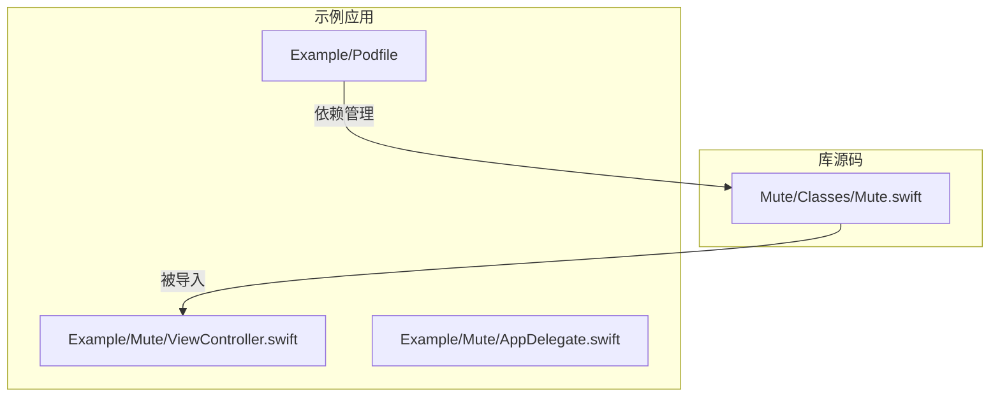
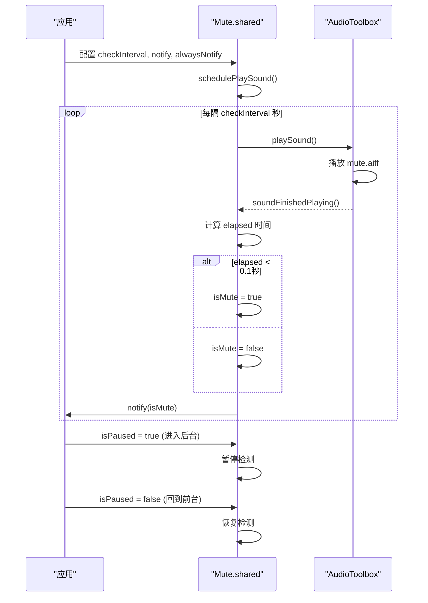
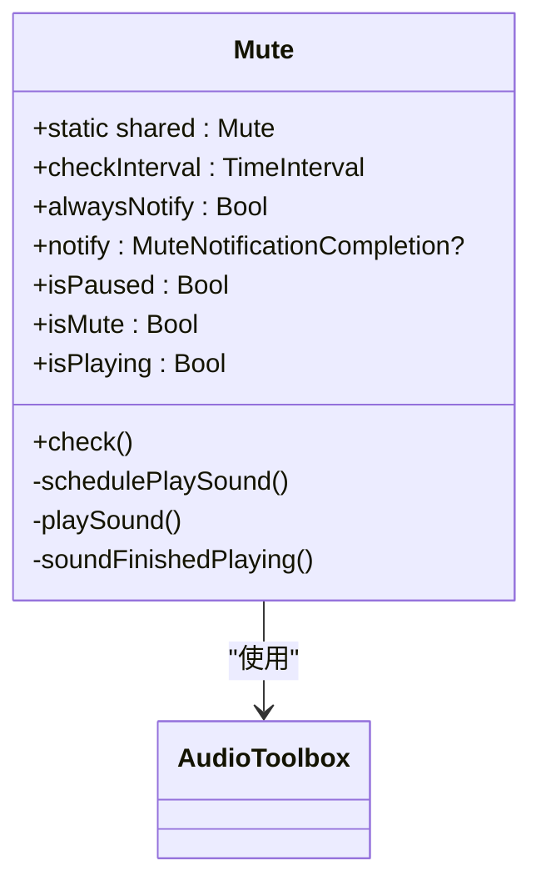
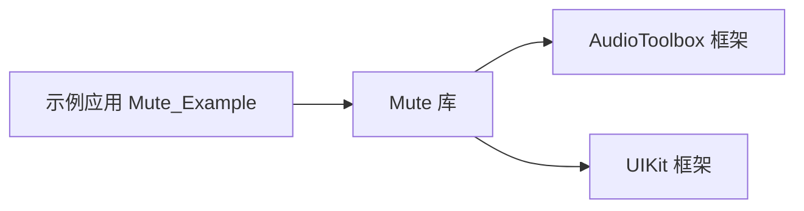

# 快速开始

<cite>
**本文档中引用的文件**   
- [ViewController.swift](file://Example/Mute/ViewController.swift)
- [Mute.swift](file://Mute/Classes/Mute.swift)
- [AppDelegate.swift](file://Example/Mute/AppDelegate.swift)
- [Podfile](file://Example/Podfile)
- [README.md](file://README.md)
</cite>

## 目录
1. [简介](#简介)
2. [项目结构](#项目结构)
3. [核心组件](#核心组件)
4. [架构概述](#架构概述)
5. [详细组件分析](#详细组件分析)
6. [依赖分析](#依赖分析)
7. [性能考虑](#性能考虑)
8. [故障排除指南](#故障排除指南)
9. [结论](#结论)

## 简介
本指南旨在帮助开发者在5分钟内快速上手Mute库，一个用于检测iOS设备静音开关状态的Swift库。由于iOS系统本身未提供原生API来检测静音开关，Mute库通过播放一个短暂的无声音频并测量其播放时长来判断设备是否处于静音状态。本指南将基于示例项目中的`ViewController.swift`代码，提供完整的代码示例和配置说明，帮助新手开发者快速集成并验证功能。

## 项目结构
Mute库的项目结构清晰，分为库源码和示例应用两部分。库的核心代码位于`Mute/Classes/`目录下，而示例应用位于`Example/`目录中，用于演示库的使用方法。



**图示来源**
- [Mute.swift](file://Mute/Classes/Mute.swift)
- [ViewController.swift](file://Example/Mute/ViewController.swift)
- [Podfile](file://Example/Podfile)

**本节来源**
- [Mute.swift](file://Mute/Classes/Mute.swift)
- [ViewController.swift](file://Example/Mute/ViewController.swift)
- [Podfile](file://Example/Podfile)

## 核心组件
Mute库的核心是一个单例类`Mute`，它负责管理静音状态的检测和通知。开发者通过配置其属性来控制检测行为，并通过回调函数接收状态变化。

**本节来源**
- [Mute.swift](file://Mute/Classes/Mute.swift#L15-L30)
- [ViewController.swift](file://Example/Mute/ViewController.swift#L20-L45)

## 架构概述
Mute库的架构基于单例模式和定时任务调度。它利用`AudioToolbox`框架播放一个无声的`.aiff`音频文件，并通过测量播放完成的时间来判断设备是否静音。当应用进入后台时，检测会自动暂停，以节省电量。



**图示来源**
- [Mute.swift](file://Mute/Classes/Mute.swift#L100-L210)
- [AppDelegate.swift](file://Example/Mute/AppDelegate.swift#L10-L20)

## 详细组件分析
### Mute类分析
`Mute`类是整个库的核心，其主要功能是通过播放无声音频来检测静音开关状态。

#### 类图


**图示来源**
- [Mute.swift](file://Mute/Classes/Mute.swift#L15-L210)

#### 关键属性与方法
- **`checkInterval`**: 检测间隔时间（秒），默认为1.0秒，最小值为0.5秒。推荐值为1.0-2.0秒，过于频繁的检测会增加CPU和电池消耗。
- **`alwaysNotify`**: 是否在每次检测后都通知。设为`true`时，无论状态是否变化，都会调用`notify`回调；设为`false`时，仅在状态切换时通知。
- **`notify`**: 状态变化回调闭包，接收一个`Bool`参数，`true`表示设备已静音，`false`表示未静音。
- **`isPaused`**: 暂停标志。当应用进入后台时，库会自动将其设为`true`以暂停检测，回到前台时设为`false`以恢复检测。
- **`check()`**: 手动触发一次静音检测，不受`checkInterval`限制。

**本节来源**
- [Mute.swift](file://Mute/Classes/Mute.swift#L30-L210)
- [ViewController.swift](file://Example/Mute/ViewController.swift#L20-L47)

### ViewController示例分析
`ViewController`展示了如何在实际应用中使用Mute库。

#### 代码示例
```swift
import UIKit
import Mute

class ViewController: UIViewController {

    @IBOutlet weak var label: UILabel! {
        didSet {
            self.label.text = "-"
        }
    }

    override func viewDidLoad() {
        super.viewDidLoad()

        // 设置检测间隔为2秒
        Mute.shared.checkInterval = 2.0

        // 启用自动通知（每次检测都通知）
        Mute.shared.alwaysNotify = true

        // 设置状态变化回调
        Mute.shared.notify = { [weak self] isMuted in
            self?.label.text = isMuted ? "已静音" : "未静音"
        }

        // 5秒后暂停检测（模拟进入后台）
        DispatchQueue.main.asyncAfter(deadline: .now() + 5.0) {
            Mute.shared.isPaused = true
        }

        // 10秒后恢复检测（模拟回到前台）
        DispatchQueue.main.asyncAfter(deadline: .now() + 10.0) {
            Mute.shared.isPaused = false
        }
    }
    
    @IBAction func forceCheckPressed(_ sender: UIButton) {
        // 手动触发检测
        Mute.shared.check()
    }
}
```

#### 预期行为
1. 应用启动后，每2秒检测一次静音状态。
2. 每次检测结果都会更新UI标签（label）。
3. 5秒后，检测暂停，不再更新UI。
4. 10秒后，检测恢复，继续每2秒更新一次UI。
5. 点击按钮会立即触发一次检测。

**本节来源**
- [ViewController.swift](file://Example/Mute/ViewController.swift#L1-L50)

## 依赖分析
Mute库通过CocoaPods进行依赖管理。示例项目通过`Podfile`文件声明了对Mute库的本地依赖。



**图示来源**
- [Podfile](file://Example/Podfile)
- [Mute.swift](file://Mute/Classes/Mute.swift#L3)

**本节来源**
- [Podfile](file://Example/Podfile)
- [Mute.swift](file://Mute/Classes/Mute.swift)

## 性能考虑
- **检测频率**: `checkInterval`不宜设置过小（低于1秒），否则会频繁唤醒CPU，影响电池续航。
- **后台行为**: 库已自动处理后台暂停，避免了不必要的资源消耗。
- **音频资源**: 使用的`mute.aiff`是一个极短的无声文件，对应用体积影响极小。

## 故障排除指南
- **无法检测到状态变化**: 确保`notify`回调已正确设置，并且`alwaysNotify`属性符合预期。
- **应用崩溃**: 检查是否正确导入了`AudioToolbox`和`UIKit`框架。
- **后台不工作**: 这是正常行为，库会在应用进入后台时自动暂停检测以节省电量。

**本节来源**
- [Mute.swift](file://Mute/Classes/Mute.swift#L150-L170)
- [AppDelegate.swift](file://Example/Mute/AppDelegate.swift#L15-L20)

## 结论
Mute库提供了一个简单有效的解决方案来检测iOS设备的静音开关状态。通过本指南，开发者可以快速理解其工作原理，并在自己的项目中集成使用。关键在于正确配置`checkInterval`、`alwaysNotify`和`notify`属性，并理解其在前台和后台的行为差异。