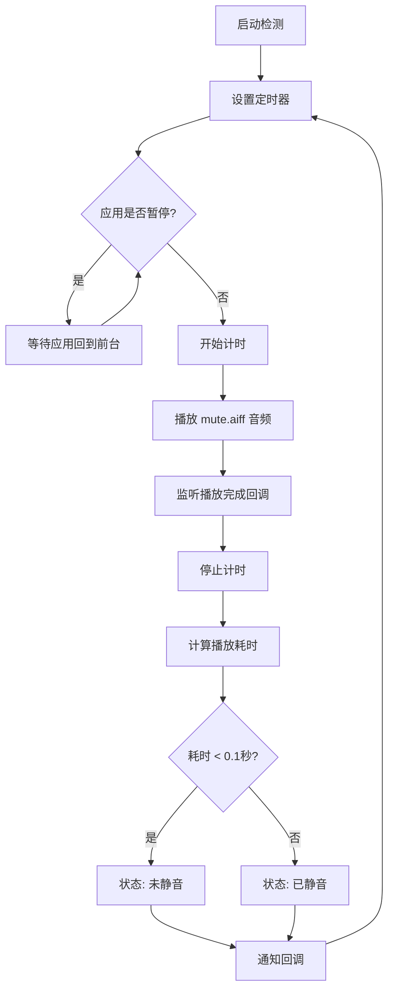

# 技术原理

<cite>
**本文档中引用的文件**  
- [Mute.swift](file://Mute/Classes/Mute.swift#L1-L211)
- [mute.aiff](file://Mute/Assets/mute.aiff)
- [README.md](file://README.md#L1-L84)
</cite>

## 目录
1. [技术原理](#技术原理)
2. [核心实现机制](#核心实现机制)
3. [音频资源与加载机制](#音频资源与加载机制)
4. [时间测量与检测精度](#时间测量与检测精度)
5. [应用状态响应与资源管理](#应用状态响应与资源管理)
6. [数据流图示](#数据流图示)

## 核心实现机制

Mute库的核心技术原理是通过播放一段极短的静音音频，并测量其播放耗时来间接判断设备的静音开关状态。由于iOS系统未提供直接检测静音开关（Ringer Switch）的原生API，此方法成为一种有效的间接检测手段。

该库选择**AudioToolbox**框架而非**AVFoundation**，主要原因在于AudioToolbox提供了更轻量级、更低延迟的系统声音服务（System Sound Services）。`AudioServicesPlaySystemSoundWithCompletion`函数允许直接播放短音频并注册完成回调，整个过程开销极小，非常适合用于这种高频、低干扰的检测任务。相比之下，AVFoundation的`AVAudioPlayer`虽然功能更强大，但其初始化和播放流程更为复杂，引入了不必要的性能开销和代码复杂性。

**Section sources**
- [Mute.swift](file://Mute/Classes/Mute.swift#L8)
- [README.md](file://README.md#L10-L17)

## 音频资源与加载机制

用于检测的音频文件`mute.aiff`具有以下关键特性：
- **内容为完全静音**：音频内容为空，播放时不会产生任何可听声音，确保检测过程对用户无感知。
- **时长极短**：根据代码注释，该音频时长为0.5秒，这保证了检测的快速性。

该音频文件被打包在名为`Mute.bundle`的资源包中。库通过`Mute.bundle`静态属性来定位资源包，其查找逻辑优先尝试从当前类（`Mute.self`）所在的Bundle中查找名为`Mute.bundle`的资源，其次尝试从主Bundle中查找。这种设计确保了库在通过CocoaPods或Swift Package Manager（SPM）集成时都能正确加载资源。

一旦资源包定位成功，`muteSoundUrl`属性会通过`bundle.url(forResource:withExtension:)`方法获取`mute.aiff`文件的URL。如果文件缺失，库会抛出致命错误（`fatalError`），确保了资源的完整性。

**Section sources**
- [Mute.swift](file://Mute/Classes/Mute.swift#L140-L156)
- [Mute.swift](file://Mute/Classes/Mute.swift#L159-L164)
- [mute.aiff](file://Mute/Assets/mute.aiff)

## 时间测量与检测精度

检测流程中的时间测量是判断静音状态的关键。其精度依赖于`Date.timeIntervalSinceReferenceDate`这一高精度时间戳。

检测流程如下：
1.  **开始计时**：在调用`AudioServicesPlaySystemSoundWithCompletion`播放音频的**同一时刻**，记录下`Date.timeIntervalSinceReferenceDate`的值，并存储在`interval`属性中。
2.  **结束计时**：当音频播放完成的回调`soundFinishedPlaying()`被触发时，再次获取`Date.timeIntervalSinceReferenceDate`的值。
3.  **计算耗时**：计算两次时间戳的差值，即为音频的实际播放耗时（`elapsed`）。

**判断逻辑**：
- **设备未静音**：当静音开关关闭时，系统会立即播放音频，但由于音频内容为空，播放过程几乎瞬间完成。因此，`elapsed`的值会非常小（远小于0.1秒）。
- **设备已静音**：当静音开关打开时，系统会跳过播放过程，但`AudioServicesPlaySystemSoundWithCompletion`的完成回调仍然会被调用，只是调用时机存在一个固定的延迟。这个延迟通常在0.2秒以上。

因此，库通过`let isMute = elapsed < 0.1`这一判断来区分状态：如果耗时小于0.1秒，则认为设备处于**未静音**状态；否则，认为设备处于**已静音**状态。

值得注意的是，该库并未使用`CADisplayLink`或`DispatchSourceTimer`等定时器来驱动检测。相反，它使用了`DispatchQueue.main.asyncAfter`来实现周期性检查。`checkInterval`属性（默认1秒）决定了两次检测之间的间隔。这种方法简单直接，且在主线程上调度，避免了复杂的多线程同步问题。

**Section sources**
- [Mute.swift](file://Mute/Classes/Mute.swift#L186)
- [Mute.swift](file://Mute/Classes/Mute.swift#L198-L199)
- [Mute.swift](file://Mute/Classes/Mute.swift#L208)

## 应用状态响应与资源管理

iOS系统对后台应用有严格的资源限制，持续的音频检测会消耗不必要的电量并可能被系统终止。Mute库通过监听应用状态变化来智能地暂停和恢复检测，以节省资源。

其实现方式是通过`NotificationCenter`注册了两个系统通知：
- `UIApplication.didEnterBackgroundNotification`：当应用进入后台时，`didEnterBackground(_:)`方法被调用，将`isPaused`属性设置为`true`，从而暂停检测循环。
- `UIApplication.willEnterForegroundNotification`：当应用将要回到前台时，`willEnterForeground(_:)`方法被调用，将`isPaused`属性设置为`false`。

`isPaused`是一个计算属性，其`didSet`观察器会在值变化时执行逻辑。当`isPaused`从`true`变为`false`（即应用回到前台），并且当前没有音频正在播放时，库会立即调用`scheduledPlaySound()`来恢复检测。

这种机制确保了检测功能只在应用处于前台时活跃，既保证了功能的可用性，又最大限度地减少了后台运行时的资源消耗。

**Section sources**
- [Mute.swift](file://Mute/Classes/Mute.swift#L128-L133)
- [Mute.swift](file://Mute/Classes/Mute.swift#L114-L118)
- [Mute.swift](file://Mute/Classes/Mute.swift#L136-L140)

## 数据流图示

以下是静音检测功能的完整数据流图示：

**Diagram sources**
- [Mute.swift](file://Mute/Classes/Mute.swift#L208)
- [Mute.swift](file://Mute/Classes/Mute.swift#L186)
- [Mute.swift](file://Mute/Classes/Mute.swift#L188)
- [Mute.swift](file://Mute/Classes/Mute.swift#L198)
- [Mute.swift](file://Mute/Classes/Mute.swift#L200)

**Section sources**
- [Mute.swift](file://Mute/Classes/Mute.swift#L208)
- [Mute.swift](file://Mute/Classes/Mute.swift#L186)
- [Mute.swift](file://Mute/Classes/Mute.swift#L188)
- [Mute.swift](file://Mute/Classes/Mute.swift#L198)
- [Mute.swift](file://Mute/Classes/Mute.swift#L200)