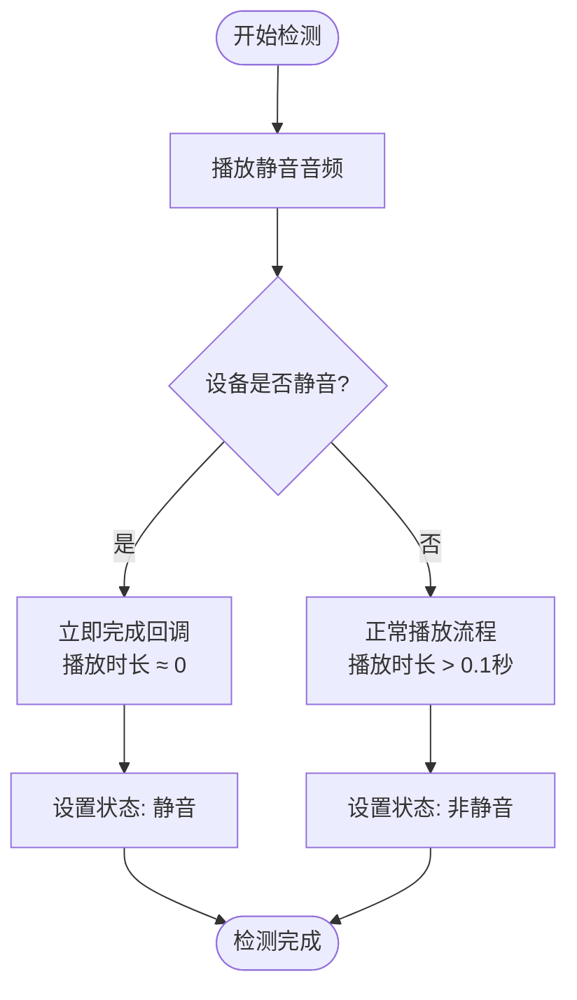
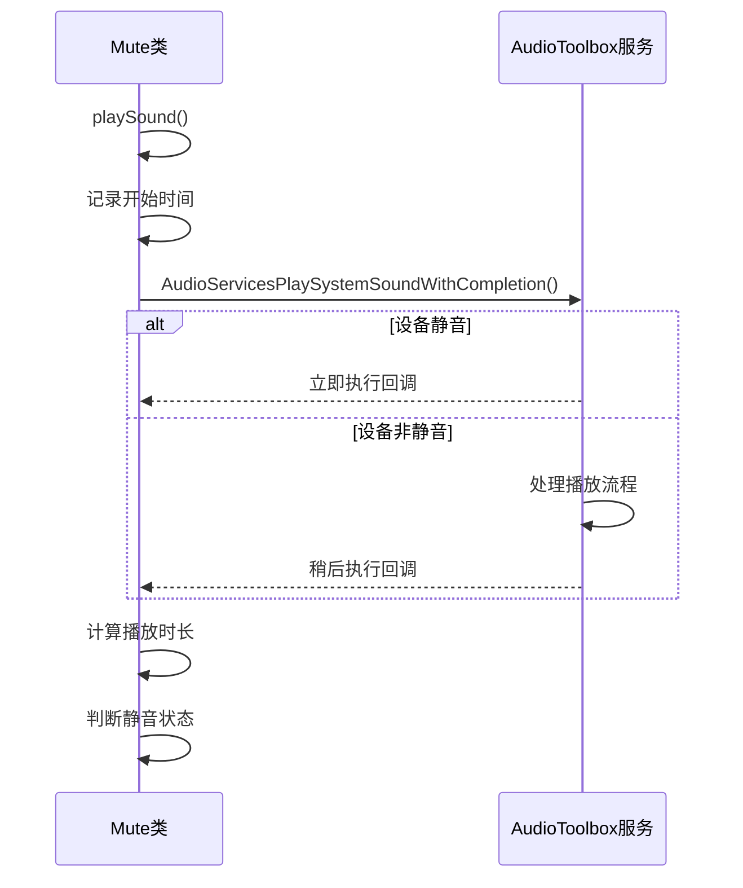
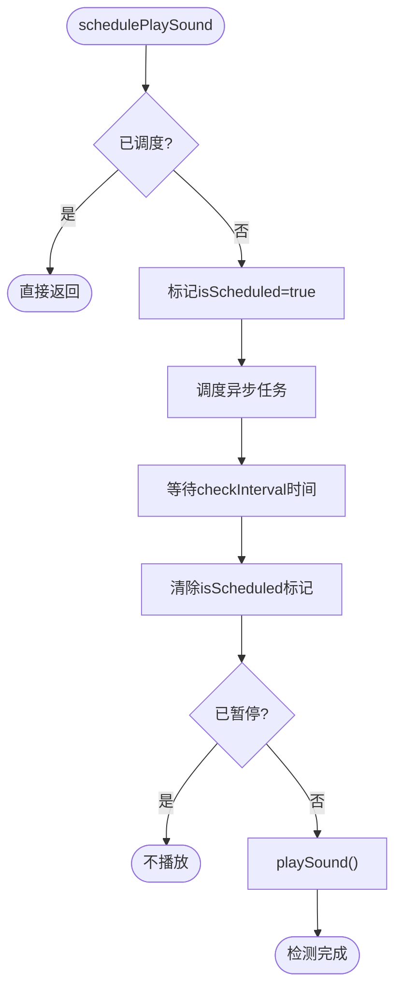
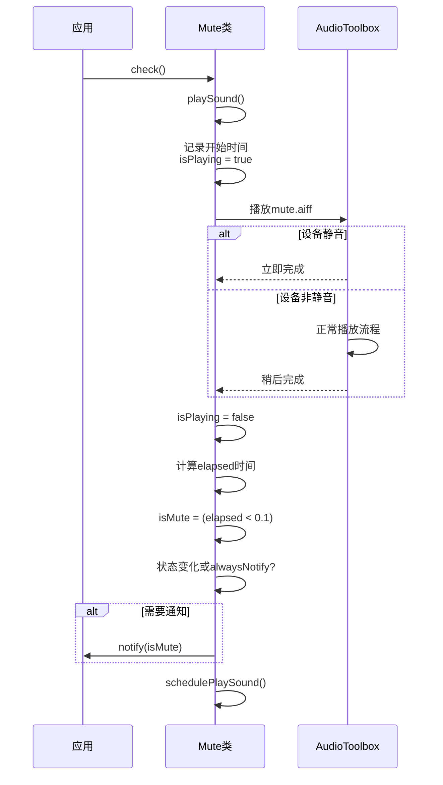

# 检测算法详解

<cite>
**本文档引用的文件**   
- [Mute.swift](file://Mute/Classes/Mute.swift#L1-L211)
- [ViewController.swift](file://Example/Mute/ViewController.swift#L1-L51)
- [mute.aiff](file://Mute/Assets/mute.aiff)
- [README.md](file://README.md#L1-L84)
</cite>

## 目录
1. [项目结构](#项目结构)
2. [核心组件](#核心组件)
3. [检测算法原理](#检测算法原理)
4. [音频播放实现](#音频播放实现)
5. [时间测量与状态判断](#时间测量与状态判断)
6. [自动轮询调度机制](#自动轮询调度机制)
7. [完整检测流程](#完整检测流程)

## 项目结构

项目采用模块化设计，核心库与示例应用分离，便于独立使用和测试。

```mermaid
graph TB
subgraph "核心库"
MuteSwift[Mute/Classes/Mute.swift]
Assets[Mute/Assets/mute.aiff]
end
subgraph "示例应用"
Example[Example/Mute/ViewController.swift]
AppDelegate[Example/Mute/AppDelegate.swift]
end
MuteSwift --> Assets : "依赖"
Example --> MuteSwift : "使用"
```

**图示来源**
- [Mute.swift](file://Mute/Classes/Mute.swift#L1-L211)
- [ViewController.swift](file://Example/Mute/ViewController.swift#L1-L51)
- [mute.aiff](file://Mute/Assets/mute.aiff)

**本节来源**
- [Mute.swift](file://Mute/Classes/Mute.swift#L1-L211)
- [README.md](file://README.md#L1-L84)

## 核心组件

`Mute`类是库的核心，采用单例模式设计，提供静音状态检测功能。其主要组件包括：

- **共享实例**：通过`Mute.shared`提供全局访问点
- **配置属性**：`checkInterval`（检测间隔）、`alwaysNotify`（通知策略）、`isPaused`（暂停状态）
- **状态属性**：`isMute`（当前静音状态）、`isPlaying`（播放状态）
- **音频资源管理**：负责加载`mute.aiff`音频文件

```swift
public class Mute: NSObject {
    public static let shared = Mute()
    
    public var checkInterval = 1.0
    public var alwaysNotify = true
    public var isPaused = false
    
    public private(set) var isMute = false
    public private(set) var isPlaying = false
}
```

**本节来源**
- [Mute.swift](file://Mute/Classes/Mute.swift#L1-L211)

## 检测算法原理

该库的检测算法基于一个核心原理：**通过测量极短静音音频的播放时长来判断设备的静音开关状态**。

由于iOS系统没有提供直接检测静音开关状态的原生API，本方案采用间接检测方法。其理论基础是：当设备处于静音模式时，系统会立即完成音频播放回调，而不会真正播放音频；而在非静音模式下，音频会正常播放，即使音频内容为空，系统也需要一定时间来处理播放流程。

### 静音检测原理图



**图示来源**
- [Mute.swift](file://Mute/Classes/Mute.swift#L1-L211)
- [README.md](file://README.md#L1-L84)

**本节来源**
- [README.md](file://README.md#L1-L84)
- [Mute.swift](file://Mute/Classes/Mute.swift#L1-L211)

## 音频播放实现

### AudioToolbox框架的优势

本库选择使用`AudioToolbox`框架而非`AVFoundation`，主要基于以下优势：

1. **低延迟**：`AudioToolbox`专为系统级音频操作设计，具有更低的启动和播放延迟
2. **轻量级**：相比`AVFoundation`，`AudioToolbox`更加轻量，资源占用更少
3. **系统级集成**：`AudioServicesPlaySystemSoundWithCompletion`函数与系统音频服务深度集成，能更准确地反映静音开关的状态

### 音频播放流程



**图示来源**
- [Mute.swift](file://Mute/Classes/Mute.swift#L1-L211)

**本节来源**
- [Mute.swift](file://Mute/Classes/Mute.swift#L1-L211)
- [README.md](file://README.md#L1-L84)

## 时间测量与状态判断

### 高精度时间测量

检测算法使用`Date.timeIntervalSinceReferenceDate`获取高精度时间戳，该方法基于绝对时间参考点，提供纳秒级精度的时间测量。

```swift
// 记录播放开始时间
self.interval = Date.timeIntervalSinceReferenceDate

// 计算实际播放时长
let elapsed = Date.timeIntervalSinceReferenceDate - self.interval
```

这种方法在不同iOS版本下具有良好的稳定性，能够准确测量极短的时间间隔。

### 状态判断逻辑

根据实测经验，播放时长的阈值设定为0.1秒：

- **播放时长 < 0.1秒**：判定为静音状态
- **播放时长 ≥ 0.1秒**：判定为非静音状态

```swift
let isMute = elapsed < 0.1
```

此阈值经过实践验证，能够有效区分静音和非静音状态，同时避免因系统性能波动导致的误判。

**本节来源**
- [Mute.swift](file://Mute/Classes/Mute.swift#L1-L211)

## 自动轮询调度机制

### 调度机制实现

库采用`DispatchQueue.main.asyncAfter`实现自动轮询检测，而非使用`DispatchSourceTimer`。这种实现方式简单高效，适合本场景的需求。

```swift
private func schedulePlaySound() {
    if self.isScheduled { return }
    
    self.isScheduled = true
    
    DispatchQueue.main.asyncAfter(deadline: .now() + self.checkInterval) {
        self.isScheduled = false
        
        if self.isPaused {
            return
        }
        
        self.playSound()
    }
}
```

### 调度流程图



### 性能平衡策略

1. **最小间隔限制**：`checkInterval`最小值为0.5秒，防止过于频繁的检测影响性能
2. **后台暂停**：通过监听`UIApplication.didEnterBackgroundNotification`和`UIApplication.willEnterForegroundNotification`，在应用进入后台时暂停检测
3. **状态去重**：通过`isScheduled`标记防止重复调度

**图示来源**
- [Mute.swift](file://Mute/Classes/Mute.swift#L1-L211)

**本节来源**
- [Mute.swift](file://Mute/Classes/Mute.swift#L1-L211)

## 完整检测流程

从调用`check()`方法开始的完整逻辑流程如下：

### 完整检测流程图



### 代码执行流程

1. **调用检查**：应用调用`Mute.shared.check()`
2. **开始播放**：执行`playSound()`方法，记录开始时间并标记`isPlaying = true`
3. **触发播放**：调用`AudioServicesPlaySystemSoundWithCompletion`播放音频
4. **等待回调**：系统根据静音状态决定回调时机
5. **处理完成**：在回调中执行`soundFinishedPlaying()`
6. **计算时长**：用当前时间减去开始时间，得到播放时长
7. **判断状态**：根据0.1秒阈值判断是否静音
8. **通知应用**：如果状态变化或`alwaysNotify`为true，则通知应用
9. **安排下次检测**：调用`schedulePlaySound()`安排下一次检测

此流程确保了检测的准确性和稳定性，同时通过合理的调度机制平衡了性能消耗。

**图示来源**
- [Mute.swift](file://Mute/Classes/Mute.swift#L1-L211)
- [ViewController.swift](file://Example/Mute/ViewController.swift#L1-L51)

**本节来源**
- [Mute.swift](file://Mute/Classes/Mute.swift#L1-L211)
- [ViewController.swift](file://Example/Mute/ViewController.swift#L1-L51)