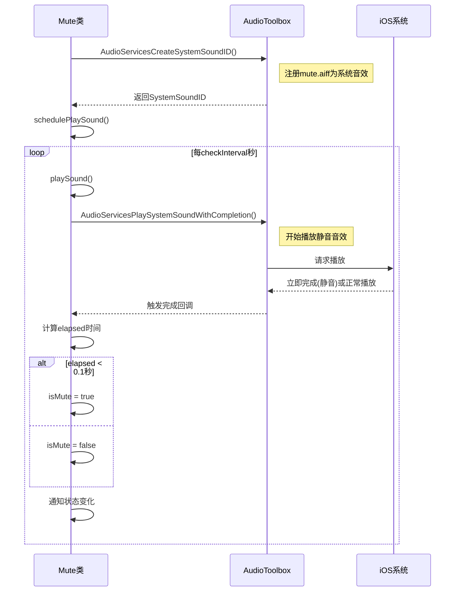

# 音频资源管理

<cite>
**本文档中引用的文件**   
- [Mute.swift](file://Mute/Classes/Mute.swift#L0-L211)
- [mute.aiff](file://Mute/Assets/mute.aiff)
- [Mute.podspec.json](file://Example/Pods/Local Podspecs/Mute.podspec.json#L0-L38)
</cite>

## 目录
1. [音频资源管理](#音频资源管理)
2. [静音音频资源设计](#静音音频资源设计)
3. [Bundle资源加载机制](#bundle资源加载机制)
4. [音频资源注册与播放](#音频资源注册与播放)
5. [资源释放与内存管理](#资源释放与内存管理)
6. [资源命名与隔离策略](#资源命名与隔离策略)
7. [错误处理与容错机制](#错误处理与容错机制)

## 静音音频资源设计

**Mute** 库中的静音测试音频资源 `mute.aiff` 是一个精心设计的音频文件，其核心特性确保了库的功能性和合规性。

该音频文件具有以下关键设计特性：
- **极短时长**：音频文件时长仅为0.5秒，这在 `Mute.swift` 文件的注释中明确指出（"Silent sound (0.5 sec)"）。这种极短的时长设计是为了最小化对用户设备的干扰，确保检测过程快速且高效。
- **完全静音内容**：音频文件的内容是完全静音的，这意味着当它被播放时，不会产生任何可听见的声音输出。这一设计至关重要，因为它确保了库在检测静音开关状态时不会意外地发出声音，从而避免了对用户的打扰。
- **符合App Store审核要求**：由于音频内容完全静音，该库在使用时不会违反App Store关于后台播放或意外声音的审核指南。开发者可以安全地集成此库，而无需担心因音频播放问题导致应用被拒。

这种设计遵循了通过播放一个短暂的静音音频来检测设备静音开关状态的通用原则。通过测量音频播放的持续时间，库可以推断出设备是否处于静音模式，而完全静音的内容则保证了这一过程对用户是无感的。

**Section sources**
- [Mute.swift](file://Mute/Classes/Mute.swift#L80-L211)

## Bundle资源加载机制

`Mute` 库通过一个健壮的 `Bundle` 机制将 `mute.aiff` 音频文件嵌入到框架中，并在运行时安全地定位和加载它。这一机制支持多种分发方式，包括 CocoaPods 和 Swift Package Manager (SPM)。

### 资源捆绑配置

在 `Mute.podspec.json` 文件中，定义了资源捆绑的配置：
```json
"resource_bundles": {
  "Mute": [
    "Mute/Assets/*.aiff"
  ]
}
```
此配置指示 CocoaPods 将 `Mute/Assets/` 目录下的所有 `.aiff` 文件打包成一个名为 `Mute` 的资源包（bundle）。这确保了音频资源与主代码分离，便于管理和避免命名冲突。

### 运行时Bundle定位

`Mute.swift` 文件中的 `bundle` 静态属性实现了复杂的运行时定位逻辑，以适应不同的集成环境：

```swift
private static var bundle: Bundle {
    // 1. 首先尝试从主Bundle中加载名为 "Mute" 的bundle
    if let path = Bundle(for: Mute.self).path(forResource: "Mute", ofType: "bundle"),
       let bundle = Bundle(path: path) {
        return bundle
    }

    // 2. 对于Swift Package Manager，使用特定的bundle名称
    let spmBundleName = "Mute_Mute"
    let candidates = [
        Bundle.main.resourceURL,
        Bundle(for: Mute.self).resourceURL
    ]

    for candidate in candidates {
        let bundlePath = candidate?.appendingPathComponent(spmBundleName + ".bundle")
        if let bundle = bundlePath.flatMap(Bundle.init(url:)) {
            return bundle
        }
    }

    // 如果所有尝试都失败，则崩溃
    fatalError("Mute.bundle not found")
}
```

该逻辑按以下顺序尝试定位资源包：
1.  **CocoaPods 环境**：首先尝试通过 `Bundle(for: Mute.self).path(forResource: "Mute", ofType: "bundle")` 在框架的主Bundle中查找名为 `Mute.bundle` 的资源包。这是 CocoaPods 的标准打包方式。
2.  **Swift Package Manager 环境**：如果第一步失败，则进入 SPM 的查找逻辑。SPM 会将资源包命名为 `Mute_Mute.bundle`（格式为 `PackageName_ModuleName.bundle`）。代码会检查 `Bundle.main` 和 `Bundle(for: Mute.self)` 的 `resourceURL`，并尝试在这些路径下附加 `Mute_Mute.bundle` 来创建Bundle实例。
3.  **失败处理**：如果所有路径都未能成功创建Bundle，代码将调用 `fatalError("Mute.bundle not found")`，强制终止程序。这确保了资源缺失的问题在开发阶段就能被立即发现。

### 音频文件URL获取

一旦成功获取了 `Bundle` 实例，库会通过 `muteSoundUrl` 静态属性来定位具体的音频文件：
```swift
private static var muteSoundUrl: URL {
    guard let muteSoundUrl = Mute.bundle.url(forResource: "mute", withExtension: "aiff") else {
        fatalError("mute.aiff not found")
    }
    return muteSoundUrl
}
```
此代码使用 `Bundle` 的 `url(forResource:withExtension:)` 方法根据文件名 `mute` 和扩展名 `.aiff` 在已定位的资源包内查找文件。如果文件不存在，同样会触发 `fatalError`。

**Section sources**
- [Mute.swift](file://Mute/Classes/Mute.swift#L80-L120)
- [Mute.podspec.json](file://Example/Pods/Local Podspecs/Mute.podspec.json#L0-L38)

## 音频资源注册与播放

`Mute` 库在初始化时，会将加载的 `mute.aiff` 音频文件注册为系统音效，这是其核心功能实现的关键步骤。

### 音频资源注册过程

在 `Mute` 类的私有初始化方法 `init()` 中，通过调用 `AudioServicesCreateSystemSoundID` 函数完成注册：
```swift
private override init() {
    super.init()

    self.soundId = 1

    if AudioServicesCreateSystemSoundID(self.soundUrl as CFURL, &self.soundId) == kAudioServicesNoError {
        // 成功注册后的配置
        var yes: UInt32 = 1
        AudioServicesSetProperty(kAudioServicesPropertyIsUISound,
                                 UInt32(MemoryLayout.size(ofValue: self.soundId)),
                                 &self.soundId,
                                 UInt32(MemoryLayout.size(ofValue: yes)),
                                 &yes)

        self.schedulePlaySound()
    } else {
        print("Failed to setup sound player")
        self.soundId = 0
    }
    // ... 其他初始化代码
}
```
- **技术实现**：`AudioServicesCreateSystemSoundID` 是 `AudioToolbox` 框架中的一个C函数。它接收两个参数：一个指向音频文件URL的 `CFURLRef`（由 `self.soundUrl as CFURL` 提供），以及一个指向 `SystemSoundID` 类型变量的指针（`&self.soundId`）。该函数会异步加载音频数据到内存中，并生成一个唯一的系统音效ID。
- **错误处理**：代码通过检查函数返回值是否等于 `kAudioServicesNoError` 来判断注册是否成功。如果失败，会打印错误日志并将 `soundId` 设为0，以防止后续使用无效的ID。
- **UI音效属性设置**：注册成功后，代码调用 `AudioServicesSetProperty` 将音效ID标记为UI音效（`kAudioServicesPropertyIsUISound`）。这确保了音效的行为符合UI反馈的预期。

### 音频播放与状态检测

注册成功后，库会通过 `schedulePlaySound()` 和 `playSound()` 方法定期播放该音效：
```swift
private func playSound() {
    if !self.isPaused && !self.isPlaying {
        self.interval = Date.timeIntervalSinceReferenceDate
        self.isPlaying = true
        AudioServicesPlaySystemSoundWithCompletion(self.soundId) { [weak self] in
            self?.soundFinishedPlaying()
        }
    }
}
```
- **播放机制**：使用 `AudioServicesPlaySystemSoundWithCompletion` 函数播放音效，并提供一个完成回调。播放开始前会记录当前时间戳。
- **状态检测**：在 `soundFinishedPlaying()` 回调中，库会计算从开始播放到回调触发的时间差（`elapsed`）。如果这个时间差小于0.1秒（`elapsed < 0.1`），则判定为设备处于静音状态。其原理是，当设备静音时，系统会立即“完成”播放静音音效，导致耗时极短。



**Diagram sources**
- [Mute.swift](file://Mute/Classes/Mute.swift#L111-L139)

**Section sources**
- [Mute.swift](file://Mute/Classes/Mute.swift#L111-L139)

## 资源释放与内存管理

`Mute` 库严格遵循了资源管理的最佳实践，确保在对象销毁时正确释放所有分配的系统资源，防止内存泄漏和系统音效ID泄露。

### deinit析构函数

资源释放的核心逻辑位于 `deinit` 析构函数中：
```swift
deinit {
    if self.soundId != 0 {
        AudioServicesRemoveSystemSoundCompletion(self.soundId)
        AudioServicesDisposeSystemSoundID(self.soundId)
    }
    NotificationCenter.default.removeObserver(self)
}
```
- **移除完成回调**：首先调用 `AudioServicesRemoveSystemSoundCompletion(self.soundId)`，确保在音效ID被销毁前，其关联的完成回调块被移除。这可以防止回调块持有 `self` 导致的循环引用和潜在的野指针调用。
- **销毁系统音效ID**：然后调用 `AudioServicesDisposeSystemSoundID(self.soundId)`。这个函数会通知 `AudioToolbox` 服务释放与该ID关联的所有内存和系统资源。这是防止系统音效ID泄露的关键步骤。
- **清理通知观察者**：最后，通过 `NotificationCenter.default.removeObserver(self)` 移除所有由该实例注册的通知观察者，避免在对象销毁后收到通知而导致崩溃。

### 最佳实践总结

该实现体现了以下最佳实践：
1.  **成对操作**：`AudioServicesCreateSystemSoundID` 的调用与 `AudioServicesDisposeSystemSoundID` 的调用严格成对出现，确保了资源的完整生命周期管理。
2.  **条件释放**：在释放前检查 `self.soundId != 0`，避免对无效ID进行操作。
3.  **全面清理**：不仅清理了音频资源，还清理了通知观察者，保证了对象的完全解构。

**Section sources**
- [Mute.swift](file://Mute/Classes/Mute.swift#L140-L145)

## 资源命名与隔离策略

为了有效规避多个库可能使用相同资源名（如 `mute.aiff`）时的冲突，`Mute` 库采用了基于 **Bundle** 的资源隔离策略。

### 隔离机制

核心的隔离机制在于将音频资源打包进一个独立的资源包（bundle）中，而不是直接放在主Bundle里。这意味着：
- **独立的命名空间**：`mute.aiff` 文件位于 `Mute.bundle` 或 `Mute_Mute.bundle` 内部。即使另一个库也包含一个名为 `mute.aiff` 的文件，只要它被打包在不同的bundle中（例如 `OtherLib.bundle`），它们就不会发生冲突。
- **精确的定位**：库的代码总是通过 `Mute.bundle` 这个特定的Bundle实例来查找资源，而不是在全局的主Bundle中搜索。这确保了它只会加载自己打包的资源，完全避免了命名冲突。

### Bundle命名策略

- **CocoaPods**：使用简单的 `Mute.bundle` 名称。
- **Swift Package Manager**：使用 `Mute_Mute.bundle` 的命名约定，其中第一个 `Mute` 是包名，第二个 `Mute` 是模块名。这种约定由 SPM 自动生成，进一步增强了唯一性。

这种基于Bundle的策略是iOS开发中处理第三方库资源冲突的标准和推荐做法。

**Section sources**
- [Mute.swift](file://Mute/Classes/Mute.swift#L80-L120)
- [Mute.podspec.json](file://Example/Pods/Local Podspecs/Mute.podspec.json#L0-L38)

## 错误处理与容错机制

`Mute` 库在资源加载和初始化阶段采用了严格的错误处理策略，优先保证程序的稳定性和可调试性。

### 资源加载失败处理

库在两个关键点使用了 `fatalError`：
1.  **Bundle未找到**：`fatalError("Mute.bundle not found")`
2.  **音频文件未找到**：`fatalError("mute.aiff not found")`

这种处理方式是**设计上的选择**，而非疏忽。其背后的逻辑是：
- **早期失败**：这两个错误通常发生在开发或构建阶段，表明集成过程出现了严重问题（如未正确安装Pod或SPM包）。让程序在此时崩溃，可以立即暴露问题，便于开发者快速修复。
- **不可恢复性**：对于 `Mute` 库而言，`mute.aiff` 是其功能实现的基石。没有这个文件，整个库将完全无法工作。因此，与其让库处于一个“残疾”状态（例如，永远返回错误的静音状态），不如在启动时就明确地失败。

### 初始化失败的降级处理

虽然对资源缺失采取了强硬措施，但对 `AudioServicesCreateSystemSoundID` 的失败则采用了更宽容的降级策略：
```swift
if AudioServicesCreateSystemSoundID(...) == kAudioServicesNoError {
    // 成功：正常启动
} else {
    print("Failed to setup sound player")
    self.soundId = 0 // 标记为无效
}
```
- **日志记录**：打印错误信息，帮助开发者诊断问题。
- **安全降级**：将 `soundId` 设为0。在后续的 `playSound()` 方法中，由于 `self.soundId != 0` 的检查，播放逻辑将被跳过，从而防止了使用无效ID调用系统API导致的崩溃。

### 建议

对于集成此库的应用，建议开发者：
1.  确保构建过程正确，避免触发 `fatalError`。
2.  在应用启动时，可以捕获 `fatalError`（例如，通过 `NSSetUncaughtExceptionHandler`）并记录日志，以便在生产环境中也能追踪到此类严重错误。

**Section sources**
- [Mute.swift](file://Mute/Classes/Mute.swift#L92-L98)
- [Mute.swift](file://Mute/Classes/Mute.swift#L111-L118)