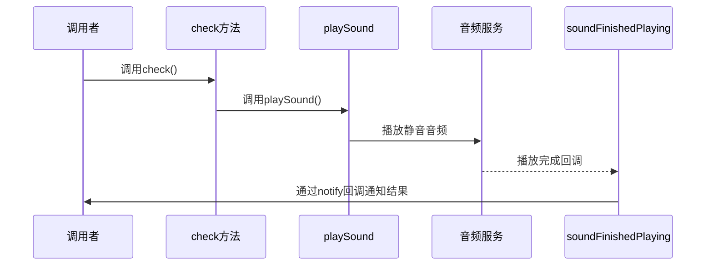

# 手动检测

<cite>
**本文档中引用的文件**   
- [Mute.swift](file://Mute/Classes/Mute.swift#L155-L210)
- [ViewController.swift](file://Example/Mute/ViewController.swift#L47)
- [README.md](file://README.md)
- [CLAUDE.md](file://CLAUDE.md)
</cite>

## 目录
1. [手动检测功能概述](#手动检测功能概述)  
2. [check方法的行为特征](#check方法的行为特征)  
3. [内部音频检测流程](#内部音频检测流程)  
4. [应用场景与价值](#应用场景与价值)  
5. [实际调用示例](#实际调用示例)  
6. [手动检测与自动轮询对比](#手动检测与自动轮询对比)  
7. [方法安全性与共存机制](#方法安全性与共存机制)

## 手动检测功能概述

Mute库提供了一种手动触发静音状态检测的机制，通过调用`check()`方法可以立即执行一次完整的静音状态检测。该功能允许开发者在特定时机主动获取设备的最新静音开关状态，而不必等待自动轮询周期的到来。

此功能特别适用于需要即时响应用户操作或进行调试的场景。`check()`方法作为公共接口暴露给开发者，其实现基于库核心的音频播放检测逻辑，确保了检测结果的准确性和一致性。

**Section sources**  
- [Mute.swift](file://Mute/Classes/Mute.swift#L155-L157)

## check方法的行为特征

`check()`方法具有明确的异步行为特征。当被调用时，它会立即触发一次音频播放检测流程，但不会阻塞当前线程等待结果返回。整个检测过程是完全异步执行的，从音频播放开始到完成回调处理都在后台完成。

该方法本身执行非常迅速，仅负责启动检测流程，真正的状态判断和结果通知会在稍后通过完成回调机制在主线程中进行。这种设计保证了UI的流畅性，避免了因音频检测可能带来的延迟影响用户体验。

值得注意的是，`check()`方法的调用是即时的，不受`checkInterval`定时器调度的影响。即使在两次自动检测之间，也可以随时调用此方法获取最新的静音状态。



**Diagram sources**  
- [Mute.swift](file://Mute/Classes/Mute.swift#L155-L184)

**Section sources**  
- [Mute.swift](file://Mute/Classes/Mute.swift#L155-L184)

## 内部音频检测流程

`check()`方法内部触发了一套完整的音频播放测试流程来确定设备的静音状态。其核心原理是利用iOS系统没有提供直接API来检测静音开关状态的限制，通过间接测量音频播放行为来推断。

检测流程如下：首先记录当前时间戳作为起始点，然后使用`AudioToolbox`框架播放一个预先准备的0.5秒静音音频文件（mute.aiff）。系统会根据静音开关的状态决定是否真正播放这个声音。

关键的判断逻辑在于测量音频播放的实际耗时。如果设备处于静音状态，系统会快速跳过音频播放过程，测量到的时间间隔将小于0.1秒；如果设备未静音，音频会正常播放，测量到的时间间隔将接近音频文件的实际长度。

```mermaid
flowchart TD
Start([调用check()]) --> Play["触发playSound()"]
Play --> CheckState["检查isPaused和isPlaying状态"]
CheckState --> |符合条件| RecordTime["记录开始时间"]
RecordTime --> PlayAudio["调用AudioServicesPlaySystemSoundWithCompletion"]
PlayAudio --> Wait["等待播放完成回调"]
Wait --> Measure["计算播放耗时"]
Measure --> Judge{"耗时<0.1秒?"}
Judge --> |是| Muted["判定为静音状态"]
Judge --> |否| NotMuted["判定为非静音状态"]
Muted --> Notify["通知状态变化"]
NotMuted --> Notify
Notify --> Schedule["重新安排下一次检测"]
Schedule --> End([流程结束])
```

**Diagram sources**  
- [Mute.swift](file://Mute/Classes/Mute.swift#L184-L210)

**Section sources**  
- [Mute.swift](file://Mute/Classes/Mute.swift#L184-L210)

## 应用场景与价值

手动检测功能在多种实际场景中具有重要应用价值。最典型的应用是在用户交互后立即获取最新的静音状态，例如当用户点击"检查静音状态"按钮时，通过调用`check()`方法可以立即反馈当前设备的静音开关状态，提供即时的用户体验。

在调试和开发过程中，该功能也极为有用。开发者可以在特定代码位置插入`check()`调用，验证静音状态检测的准确性，或者在应用状态变化时强制进行状态检查，帮助诊断与音频相关的逻辑问题。

此外，在一些对状态同步要求较高的场景中，如音视频通话应用，可以在通话建立前主动调用`check()`方法，确保应用能及时根据设备静音状态调整行为策略，提供更好的用户体验。

**Section sources**  
- [ViewController.swift](file://Example/Mute/ViewController.swift#L47)

## 实际调用示例

以下是一个典型的`check()`方法调用示例，展示了如何在用户界面交互中使用手动检测功能：

```swift
@IBAction func checkPressed(_ sender: UIButton) {
    print("手动检测触发")
    Mute.shared.check()
}
```

在视图控制器中，可以将此方法绑定到一个按钮的点击事件。当用户点击按钮时，会立即触发一次静音状态检测。配合`notify`回调，可以实时更新UI显示：

```swift
// 设置状态通知回调
Mute.shared.notify = { [weak self] isMuted in
    self?.statusLabel.text = isMuted ? "设备已静音" : "设备未静音"
}

// 用户点击按钮时手动检测
@IBAction func forceCheckPressed(_ sender: UIButton) {
    Mute.shared.check()
}
```

此示例展示了手动检测与状态通知机制的完整配合使用方式。

**Section sources**  
- [ViewController.swift](file://Example/Mute/ViewController.swift#L47)
- [README.md](file://README.md#L35-L45)

## 手动检测与自动轮询对比

手动检测与自动轮询是Mute库提供的两种互补的检测机制，各有适用场景：

| 特性 | 手动检测 | 自动轮询 |
|------|----------|----------|
| **触发方式** | 程序主动调用`check()` | 定时器周期性触发 |
| **执行时机** | 任意时刻，按需触发 | 固定间隔（checkInterval） |
| **资源消耗** | 按需执行，资源利用率高 | 持续运行，有一定资源开销 |
| **响应速度** | 即时响应，延迟最低 | 受间隔限制，可能有延迟 |
| **适用场景** | 用户交互、调试、关键节点检查 | 持续监控、后台状态跟踪 |

自动轮询适合需要持续监控静音状态的场景，而手动检测更适合在特定事件发生时获取即时状态。两者可以结合使用，形成完整的状态监测方案。

**Section sources**  
- [Mute.swift](file://Mute/Classes/Mute.swift#L155-L160)
- [README.md](file://README.md#L30-L45)

## 方法安全性与共存机制

`check()`方法的设计确保了其可以安全地与自动检测机制共存，不会干扰定时器的正常调度。该方法通过检查`isPaused`和`isPlaying`状态来避免重复执行，保证了检测流程的稳定性。

即使在自动轮询的间隙中多次调用`check()`，系统也会正确处理每次请求，不会导致状态混乱或资源竞争。检测完成后，`soundFinishedPlaying()`方法会自动重新安排下一次定时检测，保持自动轮询的连续性。

这种设计使得开发者可以自由地在需要时调用`check()`方法，而不必担心会影响库的正常运作。无论手动检测如何频繁调用，都不会改变`checkInterval`设定的自动检测频率，实现了两种机制的完美隔离与协同。

**Section sources**  
- [Mute.swift](file://Mute/Classes/Mute.swift#L155-L210)