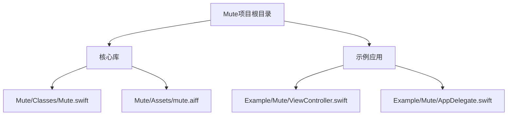
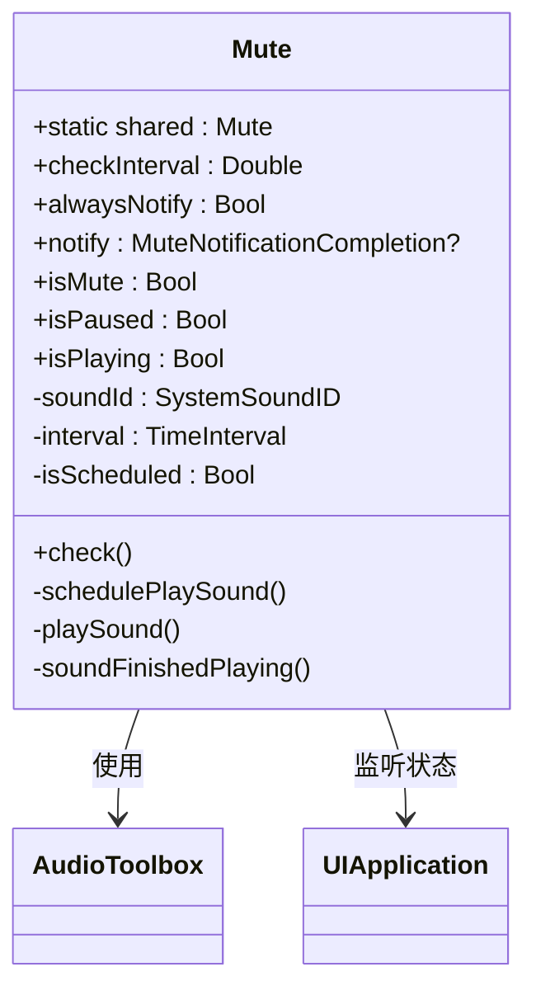
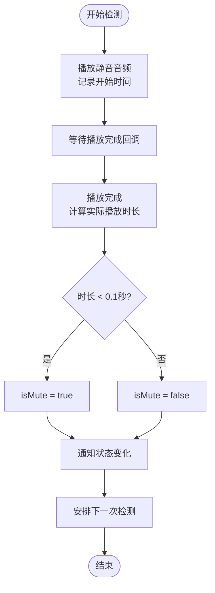
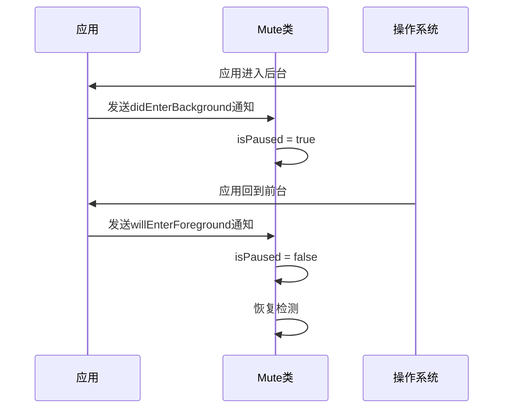
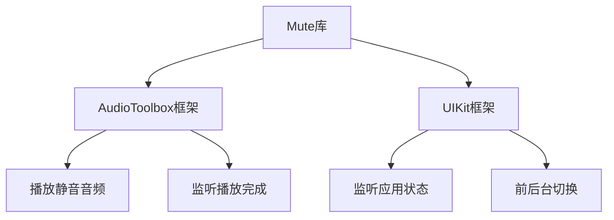

# 核心功能

<cite>
**本文档引用的文件**   
- [Mute.swift](file://Mute/Classes/Mute.swift)
- [ViewController.swift](file://Example/Mute/ViewController.swift)
- [mute.aiff](file://Mute/Assets/mute.aiff)
- [README.md](file://README.md)
</cite>

## 目录
1. [项目结构](#项目结构)
2. [核心组件](#核心组件)
3. [架构概述](#架构概述)
4. [详细组件分析](#详细组件分析)
5. [依赖分析](#依赖分析)

## 项目结构

Mute库的项目结构清晰，分为核心库代码和示例应用两大部分。核心功能实现位于`Mute/Classes/Mute.swift`，资源文件`mute.aiff`位于`Mute/Assets/`目录下。示例应用位于`Example/`目录中，用于演示库的使用方法。



**图源**
- [Mute.swift](file://Mute/Classes/Mute.swift)
- [ViewController.swift](file://Example/Mute/ViewController.swift)

**节源**
- [Mute.swift](file://Mute/Classes/Mute.swift)
- [ViewController.swift](file://Example/Mute/ViewController.swift)

## 核心组件

Mute库的核心组件是`Mute`类，它是一个单例对象，负责管理静音状态的检测和通知。该类通过播放一个静音音频文件并测量其播放时长来判断设备是否处于静音模式。核心属性包括`isMute`（当前静音状态）、`checkInterval`（检测间隔）、`notify`（状态变化通知回调）和`isPaused`（暂停状态）。

**节源**
- [Mute.swift](file://Mute/Classes/Mute.swift#L30-L50)

## 架构概述

Mute库的架构基于单例模式和定时器调度，通过AudioToolbox框架播放静音音频并监听播放完成事件。当应用进入后台时，检测会自动暂停；当应用回到前台时，检测会自动恢复。这种设计确保了在应用生命周期变化时的正确行为。



**图源**
- [Mute.swift](file://Mute/Classes/Mute.swift#L1-L210)

## 详细组件分析

### Mute类分析

`Mute`类是整个库的核心，采用单例模式设计，确保全局只有一个实例来管理静音状态检测。这种设计避免了多个实例同时运行导致的资源浪费和状态冲突。

#### 静音检测机制

静音检测的核心算法基于播放一个0.5秒的静音音频文件（`mute.aiff`），并测量其实际播放时长。如果设备处于静音模式，音频会立即播放完成（时长接近0秒）；如果设备未静音，音频会正常播放0.5秒。



**图源**
- [Mute.swift](file://Mute/Classes/Mute.swift#L184-L195)

**节源**
- [Mute.swift](file://Mute/Classes/Mute.swift#L184-L195)

#### 自动轮询与手动触发

库支持两种检测模式：自动轮询和手动触发。自动轮询由`checkInterval`属性控制，默认每秒检测一次。手动触发通过`check()`方法实现，允许开发者在需要时立即进行检测。

```swift
// 设置检测间隔为2秒
Mute.shared.checkInterval = 2.0

// 手动触发检测
Mute.shared.check()
```

**节源**
- [Mute.swift](file://Mute/Classes/Mute.swift#L60-L70)
- [ViewController.swift](file://Example/Mute/ViewController.swift#L20-L21)

#### 状态通知机制

状态变化通知通过`notify`闭包实现。开发者可以设置一个回调函数，当静音状态发生变化时（或根据`alwaysNotify`设置定期通知），该函数会被调用。

```swift
// 设置通知回调
Mute.shared.notify = { [weak self] isMuted in
    self?.label.text = isMuted ? "已静音" : "未静音"
}
```

**节源**
- [Mute.swift](file://Mute/Classes/Mute.swift#L30-L35)
- [ViewController.swift](file://Example/Mute/ViewController.swift#L25-L28)

#### 生命周期管理

库通过监听`UIApplication`的`didEnterBackgroundNotification`和`willEnterForegroundNotification`通知来管理应用前后台切换时的行为。当应用进入后台时，检测暂停；当应用回到前台时，检测恢复。



**图源**
- [Mute.swift](file://Mute/Classes/Mute.swift#L127-L155)

**节源**
- [Mute.swift](file://Mute/Classes/Mute.swift#L127-L155)

## 依赖分析

Mute库依赖于iOS系统的两个核心框架：`AudioToolbox`和`UIKit`。`AudioToolbox`用于播放静音音频和监听播放完成事件，`UIKit`用于监听应用的前后台状态变化。



**图源**
- [Mute.swift](file://Mute/Classes/Mute.swift#L3-L4)
- [Mute.podspec.json](file://Example/Pods/Local Podspecs/Mute.podspec.json#L28-L29)

**节源**
- [Mute.swift](file://Mute/Classes/Mute.swift#L3-L4)
- [Mute.podspec.json](file://Example/Pods/Local Podspecs/Mute.podspec.json#L28-L29)