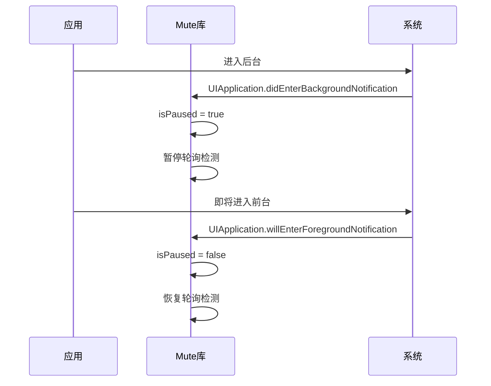
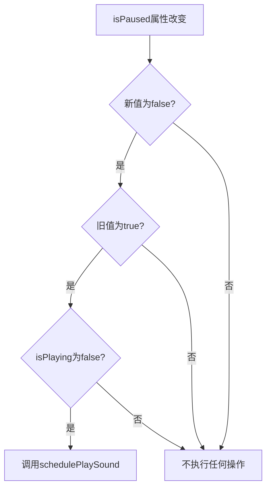

# 生命周期管理

<cite>
**本文档中引用的文件**   
- [Mute.swift](file://Mute/Classes/Mute.swift#L1-L211)
- [ViewController.swift](file://Example/Mute/ViewController.swift#L1-L51)
- [README.md](file://README.md#L1-L85)
- [mute.aiff](file://Mute/Assets/mute.aiff)
</cite>

## 目录
1. [生命周期管理概述](#生命周期管理概述)
2. [自动暂停与恢复机制](#自动暂停与恢复机制)
3. [isPaused属性的内部状态同步](#ispaused属性的内部状态同步)
4. [开发者手动控制接口](#开发者手动控制接口)
5. [设计优势与最佳实践](#设计优势与最佳实践)

## 生命周期管理概述

Mute库通过监听iOS应用的生命周期通知，实现了对静音状态检测任务的智能管理。该库利用`UIApplication.didEnterBackgroundNotification`和`UIApplication.willEnterForegroundNotification`两个系统通知，自动控制检测轮询的暂停与恢复，从而在应用进入后台时节省系统资源，在返回前台时无缝恢复检测功能。

这种设计遵循了iOS平台的资源管理最佳实践，确保应用在后台运行时不会进行不必要的音频操作，同时在用户返回应用时能立即提供准确的静音状态信息。Mute库的核心实现位于`Mute/Classes/Mute.swift`文件中，采用单例模式（`Mute.shared`）确保全局状态的一致性。

**Section sources**
- [Mute.swift](file://Mute/Classes/Mute.swift#L1-L211)
- [README.md](file://README.md#L1-L85)

## 自动暂停与恢复机制

Mute库通过在初始化时注册应用生命周期通知来实现自动管理功能。当应用进入后台或即将进入前台时，库会自动响应相应的系统通知，智能地暂停或恢复静音状态检测。



**Diagram sources**
- [Mute.swift](file://Mute/Classes/Mute.swift#L140-L155)

**Section sources**
- [Mute.swift](file://Mute/Classes/Mute.swift#L140-L155)

### 通知注册与处理

在`Mute`类的初始化方法中，库通过`NotificationCenter.default.addObserver`注册了两个关键的生命周期通知：

1. **应用进入后台通知**：当应用从活动状态转为后台状态时触发
2. **应用即将进入前台通知**：当应用从后台状态准备恢复到前台时触发

```swift
// 在初始化方法中注册通知
private override init() {
    // ... 其他初始化代码
    
    // 注册应用进入后台通知
    NotificationCenter.default.addObserver(self,
                                           selector: #selector(Mute.didEnterBackground(_:)),
                                           name: UIApplication.didEnterBackgroundNotification,
                                           object: nil)

    // 注册应用即将进入前台通知
    NotificationCenter.default.addObserver(self,
                                           selector: #selector(Mute.willEnterForeground(_:)),
                                           name: UIApplication.willEnterForegroundNotification,
                                           object: nil)
}
```

当收到`UIApplication.didEnterBackgroundNotification`通知时，`didEnterBackground`方法被调用，将`isPaused`属性设置为`true`，从而暂停检测轮询。同样，当收到`UIApplication.willEnterForegroundNotification`通知时，`willEnterForeground`方法被调用，将`isPaused`属性设置为`false`，恢复检测轮询。

这种机制确保了在应用进入后台时立即停止音频检测，避免了不必要的资源消耗和潜在的后台执行限制问题。当应用返回前台时，检测功能会自动恢复，为用户提供无缝的体验。

## isPaused属性的内部状态同步

`isPaused`属性是Mute库生命周期管理的核心，它不仅是一个简单的布尔标志，更是一个具有复杂状态同步逻辑的关键控制点。该属性通过`didSet`观察器实现了智能的状态管理，确保了暂停和恢复操作的正确性和一致性。



**Diagram sources**
- [Mute.swift](file://Mute/Classes/Mute.swift#L42-L45)

**Section sources**
- [Mute.swift](file://Mute/Classes/Mute.swift#L42-L45)

### 属性定义与状态同步

`isPaused`属性的定义包含了精巧的状态同步逻辑：

```swift
/// 检测状态 - 在后台时暂停
public var isPaused = false {
    didSet {
        if !self.isPaused && oldValue && !self.isPlaying {
            self.schedulePlaySound()
        }
    }
}
```

这个`didSet`观察器的条件判断逻辑非常关键：
- `!self.isPaused`：新值为`false`，表示从暂停状态恢复
- `oldValue`：旧值为`true`，表示之前处于暂停状态
- `!self.isPlaying`：当前没有音频正在播放

只有当这三个条件同时满足时，才会调用`schedulePlaySound()`方法重新启动检测轮询。这种设计避免了在应用快速切换前后台时可能出现的重复调度问题，确保了状态转换的平滑性和资源使用的高效性。

### 检测流程中的暂停检查

在检测流程的各个阶段，`isPaused`属性都被用来控制执行流程：

```swift
// 在调度播放时检查暂停状态
private func schedulePlaySound() {
    if self.isScheduled { return }
    
    self.isScheduled = true
    
    DispatchQueue.main.asyncAfter(deadline: .now() + self.checkInterval) {
        self.isScheduled = false
        
        // 关键检查：如果已暂停则不执行
        if self.isPaused {
            return
        }
        
        self.playSound()
    }
}

// 在播放音频时检查暂停状态
private func playSound() {
    // 双重检查：既检查暂停状态也检查是否正在播放
    if !self.isPaused && !self.isPlaying {
        // 执行音频播放
    }
}
```

这种多层次的检查机制确保了即使在复杂的异步操作环境中，暂停状态也能被正确地识别和处理，防止了在暂停状态下意外执行音频检测。

## 开发者手动控制接口

尽管Mute库提供了自动的生命周期管理功能，但它也向开发者暴露了`isPaused`属性作为手动控制接口，允许在特殊情况下进行完全的控制。这种设计既保证了默认行为的智能化，又保留了足够的灵活性以应对特殊需求。

### 使用场景

开发者手动控制的主要使用场景包括：
- **特定功能期间的暂停**：在应用执行某些敏感操作时，临时暂停静音检测
- **性能优化**：在资源紧张时主动暂停检测以节省CPU和电池
- **调试和测试**：在开发和测试阶段精确控制检测行为
- **用户偏好设置**：根据用户设置的偏好手动开启或关闭检测

### 代码示例

以下是在`ViewController.swift`中展示的手动控制示例：

```swift
override func viewDidLoad() {
    super.viewDidLoad()
    
    // 配置检测间隔
    Mute.shared.checkInterval = 2.0
    
    // 设置通知回调
    Mute.shared.notify = { [weak self] m in
        self?.label.text = m ? "静音" : "非静音"
    }
    
    // 5秒后暂停检测
    DispatchQueue.main.asyncAfter(deadline: .now() + 5.0) {
        Mute.shared.isPaused = true
    }
    
    // 10秒后恢复检测
    DispatchQueue.main.asyncAfter(deadline: .now() + 10.0) {
        Mute.shared.isPaused = false
    }
}
```

在这个示例中，开发者通过`Mute.shared.isPaused = true`和`Mute.shared.isPaused = false`来手动控制检测的暂停与恢复。这种控制是即时生效的，并且会与自动生命周期管理协同工作。

### 手动控制与自动管理的协同

手动控制与自动生命周期管理之间存在明确的优先级关系：
1. 当应用进入后台时，自动管理会将`isPaused`设置为`true`
2. 开发者可以在任何时候通过代码修改`isPaused`的值
3. 当应用返回前台时，如果`isPaused`被手动设置为`true`，则不会自动恢复检测
4. 只有当`isPaused`为`false`时，检测才会真正恢复

这种设计确保了开发者的手动控制具有最高优先级，同时保持了自动管理的基本功能。

**Section sources**
- [ViewController.swift](file://Example/Mute/ViewController.swift#L35-L40)
- [Mute.swift](file://Mute/Classes/Mute.swift#L42-L45)

## 设计优势与最佳实践

Mute库的生命周期管理设计体现了iOS开发中的多项最佳实践，不仅提升了用户体验，也优化了应用的资源使用效率。

### 提升用户体验

通过智能的暂停与恢复机制，Mute库为用户提供了无缝的体验：
- **后台节能**：在应用进入后台时自动暂停检测，减少电池消耗
- **快速响应**：当用户返回应用时，检测功能立即恢复，确保状态信息的实时性
- **无感知切换**：用户不会察觉到检测功能的暂停与恢复过程

### 符合iOS平台最佳实践

该设计严格遵循了iOS平台的开发规范：
- **遵守后台执行限制**：避免在后台进行不必要的音频操作
- **合理使用系统通知**：通过标准的生命周期通知进行状态管理
- **资源高效利用**：只在必要时执行检测，减少CPU和电池消耗

### 架构优势

Mute库的生命周期管理架构具有以下优势：
- **单一责任原则**：`isPaused`属性专门负责控制检测状态
- **松耦合设计**：通知处理与检测逻辑分离，便于维护和扩展
- **可预测的行为**：明确的状态转换规则确保了行为的一致性
- **灵活性与控制力**：既提供自动化管理，又保留手动控制接口

这种设计模式可以作为其他需要后台资源管理的iOS库的参考范例，展示了如何在自动化和手动控制之间取得平衡，既简化了常规使用，又保留了应对特殊情况的能力。

**Section sources**
- [Mute.swift](file://Mute/Classes/Mute.swift#L1-L211)
- [README.md](file://README.md#L1-L85)