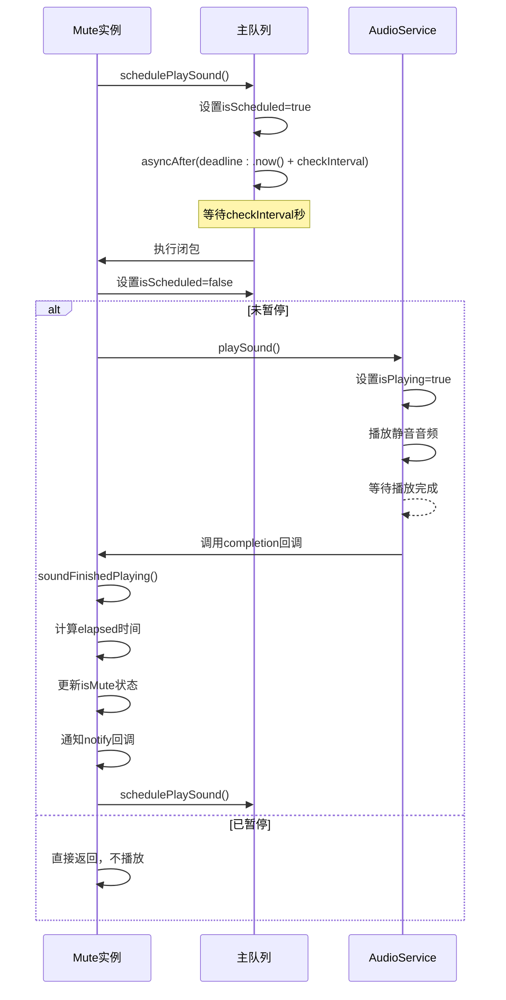

# 自动轮询机制

<cite>
**本文档中引用的文件**   
- [Mute.swift](file://Mute/Classes/Mute.swift#L1-L211)
- [README.md](file://README.md#L1-L84)
- [CLAUDE.md](file://CLAUDE.md#L1-L56)
- [ViewController.swift](file://Example/Mute/ViewController.swift#L1-L45)
</cite>

## 目录
1. [自动轮询机制](#自动轮询机制)
2. [核心组件](#核心组件)
3. [详细组件分析](#详细组件分析)
4. [性能考虑](#性能考虑)
5. [生命周期协同处理](#生命周期协同处理)

## 核心组件

Mute库的核心自动轮询检测机制通过`Mute.swift`文件中的`checkInterval`属性和`schedulePlaySound`方法实现。该机制利用`DispatchQueue.main.asyncAfter`创建一个非阻塞的定时调度器，周期性地触发静音状态检测。`checkInterval`属性（默认值为1.0秒）定义了检测的频率，其值被限制在最小0.5秒以防止过于频繁的调用。当应用启动时，`Mute`类的单例`shared`实例在初始化过程中会立即调用`scheduledPlaySound`，从而启动后台的轮询循环。

**Section sources**
- [Mute.swift](file://Mute/Classes/Mute.swift#L1-L211)

## 详细组件分析

### 轮询机制的启动、停止与重复调度

自动轮询机制的生命周期由`isScheduled`标志位和`schedulePlaySound`方法精确控制。每次`soundFinishedPlaying`回调执行完毕后，会再次调用`scheduledPlaySound`，从而形成一个持续的循环。该方法首先检查`isScheduled`标志，确保同一时间不会存在多个待执行的调度任务，有效避免了定时器的重叠和资源浪费。调度通过`DispatchQueue.main.asyncAfter`实现，它将下一个检测任务安排在`checkInterval`秒后执行。当任务执行时，`isScheduled`被重置为`false`，然后立即调用`playSound`方法进行检测，从而完成一次循环。

**Diagram sources**
- [Mute.swift](file://Mute/Classes/Mute.swift#L164-L207)

**Section sources**
- [Mute.swift](file://Mute/Classes/Mute.swift#L164-L207)

### 避免重入问题与状态管理

该机制通过多个状态标志位巧妙地解决了重入问题。`isPlaying`标志位用于跟踪音频播放状态。在`playSound`方法中，会同时检查`!isPaused`和`!isPlaying`两个条件，只有当应用未暂停且没有正在进行的播放时，才会启动新的播放。这确保了即使在极端情况下（如`checkInterval`设置得非常短），也不会出现多个音频播放任务同时进行。`isScheduled`标志位则防止了在`asyncAfter`的延迟期间，因外部调用`check()`方法而导致的重复调度。`soundFinishedPlaying`方法在播放完成后负责重置`isPlaying`并再次调度下一次检测，形成了一个稳定的状态机。

### 后台运行与系统状态响应

该机制通过监听`UIApplication.didEnterBackgroundNotification`和`UIApplication.willEnterForegroundNotification`两个系统通知，实现了与应用生命周期的协同。当应用进入后台时，`didEnterBackground`方法会被调用，将`isPaused`属性设置为`true`。这会导致`scheduledPlaySound`中的检查和`playSound`方法中的检查都失败，从而暂停所有检测任务。当应用返回前台时，`willEnterForeground`方法会将`isPaused`设置为`false`。此时，由于`isPaused`的`didSet`观察者会检查`oldValue`（即之前是`true`）和`!isPlaying`，如果条件满足，它会立即调用`scheduledPlaySound`，重新启动轮询。这种设计确保了应用在后台时不会消耗不必要的电量和资源，同时在返回前台时能迅速恢复检测。

**Section sources**
- [Mute.swift](file://Mute/Classes/Mute.swift#L147-L155)

## 性能考虑

轮询频率`checkInterval`对性能和准确性有直接的权衡。较高的频率（如0.5秒）能提供近乎实时的状态更新，但会增加CPU唤醒次数和电量消耗。较低的频率（如2-5秒）则能显著降低功耗，但会引入状态检测的延迟。根据`README.md`中的示例，一个合理的实践是将`checkInterval`设置为2.0秒，并结合`alwaysNotify = true`来持续获取状态。对于需要即时响应的应用，可以使用`check()`方法手动触发一次检测，而不是将`checkInterval`设得过低。最佳实践配置值建议为1.0到2.0秒，这在响应速度和电池续航之间取得了良好的平衡。

**Section sources**
- [README.md](file://README.md#L23-L24)
- [Mute.swift](file://Mute/Classes/Mute.swift#L51-L55)

## 生命周期协同处理

如前所述，`isPaused`属性是连接自动轮询机制与应用生命周期的关键。开发者也可以手动控制此属性，例如在应用的某个特定界面关闭时暂停检测，以节省资源。`CLAUDE.md`文件明确指出了`isPaused`是一个可配置的状态控制选项。这种设计模式使得库既能在默认情况下智能地管理后台行为，又为高级用例提供了手动干预的灵活性。通过将`isPaused`与系统通知绑定，Mute库实现了无缝的后台行为管理，无需开发者进行额外的复杂处理。

**Section sources**
- [CLAUDE.md](file://CLAUDE.md#L51-L56)
- [ViewController.swift](file://Example/Mute/ViewController.swift#L35-L40)