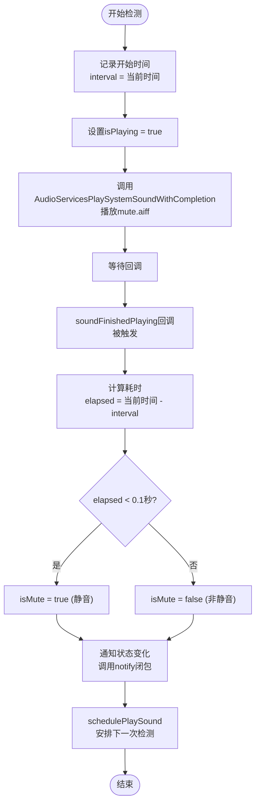

# 静音检测原理

<cite>
**本文档中引用的文件**   
- [Mute.swift](file://Mute/Classes/Mute.swift)
- [mute.aiff](file://Mute/Assets/mute.aiff)
- [README.md](file://README.md)
- [ViewController.swift](file://Example/Mute/ViewController.swift)
</cite>

## 目录
1. [简介](#简介)
2. [项目结构](#项目结构)
3. [核心组件](#核心组件)
4. [架构概述](#架构概述)
5. [详细组件分析](#详细组件分析)
6. [依赖分析](#依赖分析)
7. [性能考虑](#性能考虑)
8. [故障排除指南](#故障排除指南)
9. [结论](#结论)

## 简介
在iOS系统中，没有原生API可以直接检测设备的静音开关（Mute Switch）是否开启。Mute库通过一种巧妙的间接方法解决了这一问题：播放一个极短的静音音频文件，并通过测量其播放时长来推断设备的静音状态。其核心原理是利用了iOS系统在静音模式下会跳过音频播放回调的特性。当设备处于静音状态时，音频播放会被系统立即中断，导致播放完成回调函数被迅速调用；而在非静音状态下，音频会正常播放完毕，回调函数会在一个可预期的时长后被调用。通过比较实际播放时长与预期时长，即可准确判断设备的静音状态。本文档将深入剖析Mute库的实现细节，包括其核心算法、音频会话配置策略以及关键的代码实现逻辑。

## 项目结构
Mute库的项目结构清晰，遵循了标准的iOS库组织方式。核心功能代码位于`Mute/Classes`目录下，资源文件（如音频文件）位于`Mute/Assets`目录下。示例项目位于`Example`目录中，用于演示库的使用方法。`README.md`文件提供了项目的整体介绍、安装方法和使用示例。


**图示来源**
- [Mute.swift](file://Mute/Classes/Mute.swift)
- [mute.aiff](file://Mute/Assets/mute.aiff)
- [ViewController.swift](file://Example/Mute/ViewController.swift)

**节来源**
- [Mute.swift](file://Mute/Classes/Mute.swift)
- [README.md](file://README.md)

## 核心组件
Mute库的核心组件是一个名为`Mute`的单例类，它封装了静音检测的所有逻辑。该类通过`AudioToolbox`框架与系统音频服务进行交互，利用一个0.5秒的静音音频文件`mute.aiff`作为检测工具。其主要功能包括：初始化音频系统声音ID、配置音频会话属性、定时播放检测音频、记录播放时间间隔，并根据时间差判断静音状态。此外，该类还处理了应用生命周期事件，确保在应用进入后台时暂停检测，回到前台时恢复检测，以保证检测的准确性和资源的合理使用。

**节来源**
- [Mute.swift](file://Mute/Classes/Mute.swift#L1-L210)

## 架构概述
Mute库的架构设计简洁而高效，主要围绕`Mute`单例类展开。该类通过`AudioToolbox`框架创建一个系统声音ID，并将其配置为UI声音。检测过程由一个定时器驱动，按照设定的`checkInterval`（默认1秒）周期性地调用`playSound`方法。该方法在播放音频前记录开始时间戳，音频播放完成后通过回调函数`soundFinishedPlaying`计算实际播放时长。根据播放时长与阈值（0.1秒）的比较，最终确定设备的静音状态，并通过`notify`闭包将结果通知给调用者。


**图示来源**
- [Mute.swift](file://Mute/Classes/Mute.swift#L1-L210)

## 详细组件分析

### 静音检测算法分析
静音检测的核心算法基于对音频播放行为的观察。其技术依据是：当iOS设备的静音开关开启时，系统会阻止所有非关键的音频播放，即使是极短的静音音频也会被立即中断。这导致音频播放的完成回调函数会在极短的时间内（远小于音频文件的实际时长）被调用。

#### 算法流程图


**图示来源**
- [Mute.swift](file://Mute/Classes/Mute.swift#L180-L210)

**节来源**
- [Mute.swift](file://Mute/Classes/Mute.swift#L180-L210)

### 音频会话配置分析
为了确保检测音频能够被系统正确处理，Mute库在初始化时对音频会话进行了特定的配置。

#### 配置关键代码
```swift
// 在Mute.swift的init方法中
if AudioServicesCreateSystemSoundID(self.soundUrl as CFURL, &self.soundId) == kAudioServicesNoError {
    var yes: UInt32 = 1
    AudioServicesSetProperty(kAudioServicesPropertyIsUISound,
                             UInt32(MemoryLayout.size(ofValue: self.soundId)),
                             &self.soundId,
                             UInt32(MemoryLayout.size(ofValue: yes)),
                             &yes)
    // ... 其他初始化代码
}
```

#### 配置说明
*   **`kAudioServicesPropertyIsUISound`**: 此属性将创建的系统声音标记为“用户界面声音”。这是非常关键的一步，因为它确保了该声音会受到静音开关的影响。如果未设置此属性，某些系统声音可能会忽略静音开关。
*   **`kAudioServicesNoError`**: 在创建系统声音ID时检查返回值，确保资源加载和ID创建成功，避免后续操作出现错误。
*   **`AudioServicesDisposeSystemSoundID` 和 `AudioServicesRemoveSystemSoundCompletion`**: 在`deinit`中调用，用于释放系统声音ID和移除回调，防止内存泄漏。

**节来源**
- [Mute.swift](file://Mute/Classes/Mute.swift#L100-L140)

## 依赖分析
Mute库的依赖关系简单明了，主要依赖于苹果官方的两个框架。


**图示来源**
- [Mute.swift](file://Mute/Classes/Mute.swift#L1-L20)
- [Mute.podspec.json](file://Example/Pods/Local Podspecs/Mute.podspec.json)

**节来源**
- [Mute.swift](file://Mute/Classes/Mute.swift)
- [Mute.podspec.json](file://Example/Pods/Local Podspecs/Mute.podspec.json)

## 性能考虑
Mute库在性能方面表现良好。它使用轻量级的`AudioToolbox`框架和极短的音频文件（0.5秒静音），对系统资源的消耗极小。定时检测的频率（`checkInterval`）可配置，默认为1秒，用户可以根据需要调整。库还通过`isScheduled`标志位避免了重复调度，优化了定时器的使用。在应用进入后台时暂停检测，也避免了不必要的后台活动，符合iOS的节能规范。

## 故障排除指南
*   **问题：`mute.aiff`文件未找到。**
    *   **原因**: 资源文件未正确打包或路径错误。
    *   **解决方案**: 确保`mute.aiff`文件已正确添加到资源包中，并且`Mute.bundle`能够被正确加载。检查`podspec`文件中的`resource_bundles`配置。

*   **问题：检测结果不准确。**
    *   **原因**: `checkInterval`设置过短（小于0.5秒），或系统存在其他音频冲突。
    *   **解决方案**: 确保`checkInterval`大于或等于0.5秒。库内部有检查，会自动修正过短的间隔。

*   **问题：应用在后台时检测仍在运行。**
    *   **原因**: 应用生命周期通知未正确注册或处理。
    *   **解决方案**: 检查`didEnterBackground`和`willEnterForeground`通知的注册和处理逻辑，确保`isPaused`属性能正确反映应用状态。

**节来源**
- [Mute.swift](file://Mute/Classes/Mute.swift#L145-L165)
- [Mute.swift](file://Mute/Classes/Mute.swift#L65-L75)

## 结论
Mute库通过一个精巧的“时间差”算法，成功绕过了iOS系统缺乏直接静音状态API的限制。其核心思想是利用静音模式下音频播放被立即中断的特性，通过测量一个极短静音音频的播放时长来反推设备状态。该实现简洁、高效且可靠，充分展示了利用系统行为差异进行功能开发的智慧。通过对`AudioToolbox`框架的熟练运用和对应用生命周期的妥善管理，Mute库为开发者提供了一个稳定、低开销的静音状态检测解决方案。