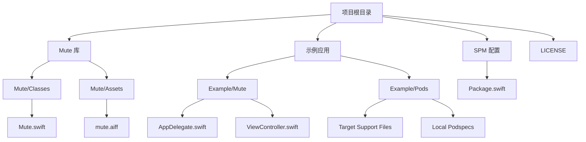
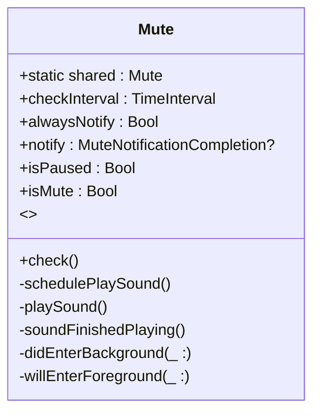
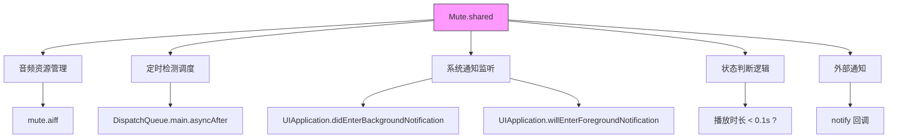
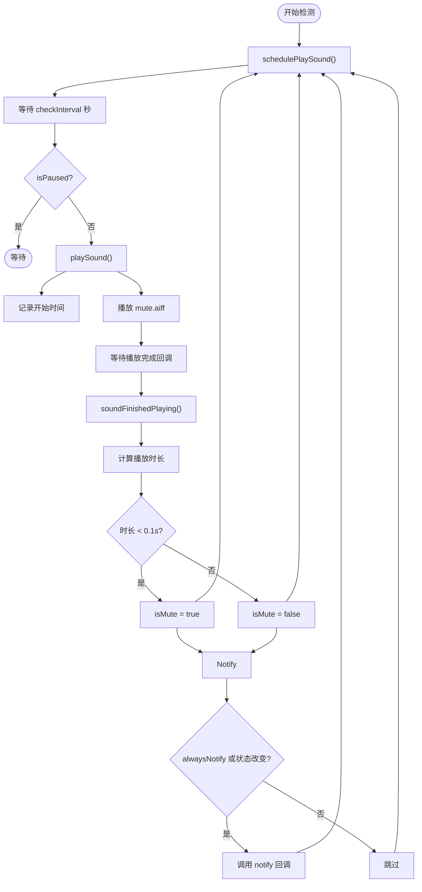

# 项目概述

<cite>
**本文档引用的文件**   
- [README.md](file://README.md)
- [Mute.swift](file://Mute/Classes/Mute.swift)
- [Package.swift](file://Package.swift)
- [LICENSE](file://LICENSE)
- [ViewController.swift](file://Example/Mute/ViewController.swift)
- [AppDelegate.swift](file://Example/Mute/AppDelegate.swift)
- [mute.aiff](file://Mute/Assets/mute.aiff)
</cite>

## 目录
1. [简介](#简介)
2. [项目结构](#项目结构)
3. [核心功能与设计原理](#核心功能与设计原理)
4. [核心组件分析](#核心组件分析)
5. [架构概览](#架构概览)
6. [详细组件分析](#详细组件分析)
7. [集成方式](#集成方式)
8. [生命周期管理](#生命周期管理)
9. [性能与最佳实践](#性能与最佳实践)
10. [故障排除指南](#故障排除指南)
11. [结论](#结论)

## 简介
Mute 是一个专为 iOS 平台设计的开源 Swift 库，旨在解决一个长期存在的平台限制：**iOS 系统本身并未提供原生 API 来检测设备的静音开关（静音/响铃切换开关）状态**。该库通过一种巧妙的间接方法，实现了对静音状态的可靠检测，为需要根据设备声音状态调整行为的应用（如媒体播放器、游戏、通知系统）提供了关键功能。

其核心设计思想是：播放一个极短的音频片段，并精确测量其播放时长。当设备处于静音模式时，系统会跳过该音频的播放，导致测量到的播放时长远小于音频的实际时长。通过分析这个时间差，库能够准确判断出静音开关的当前状态。Mute 库是 Objective-C 项目 [SoundSwitch](https://github.com/moshegottlieb/SoundSwitch) 的 Swift 语言实现版本，具有简洁的 API 和自动化的后台管理能力。

## 项目结构
项目采用典型的 CocoaPods 和 Swift Package Manager (SPM) 兼容的库项目结构，清晰地分离了库代码、示例应用和资源文件。



**Diagram sources**
- [Mute.swift](file://Mute/Classes/Mute.swift)
- [ViewController.swift](file://Example/Mute/ViewController.swift)
- [Package.swift](file://Package.swift)

**Section sources**
- [README.md](file://README.md)

## 核心功能与设计原理
Mute 库的核心功能是提供一个简单、可靠的接口，让开发者能够查询或监听 iOS 设备的静音开关状态。

### 设计目的
由于 iOS 的隐私和系统安全策略，应用无法直接访问硬件开关的状态。Mute 库通过模拟用户可感知的音频行为，利用系统对静音模式的处理逻辑，间接推断出开关状态，填补了这一功能空白。

### 主要使用场景
- **媒体应用**：在用户将设备调至静音后，自动暂停或降低视频播放的音量。
- **游戏应用**：根据设备状态调整游戏音效的播放策略。
- **通知系统**：为用户提供更智能的通知提示方式（例如，静音时仅显示视觉提示）。
- **用户体验优化**：避免在静音模式下意外发出声音，提升应用的专业性。

### 静音检测基本原理
检测过程遵循以下步骤：
1.  **准备音频**：库内置一个时长为 0.5 秒的无声 AIFF 音频文件 (`mute.aiff`)。
2.  **播放并计时**：使用 `AudioToolbox` 框架播放此音频，并记录播放开始的时间戳。
3.  **测量时长**：通过 `AudioServicesPlaySystemSoundWithCompletion` 回调函数获取播放结束的时间戳。
4.  **状态判断**：计算播放的“实际”时长。
    -   如果**设备未静音**，系统会完整播放 0.5 秒的音频，测量到的时长接近 0.5 秒。
    -   如果**设备已静音**，系统会立即跳过播放，回调函数会几乎立刻被调用，测量到的时长会远小于 0.1 秒。
5.  **得出结论**：库根据测量到的时长与预设阈值（代码中为 `0.1` 秒）的比较，判断并更新当前的静音状态。

**Section sources**
- [README.md](file://README.md)
- [Mute.swift](file://Mute/Classes/Mute.swift)

## 核心组件分析
Mute 库的核心是一个名为 `Mute` 的单例 Swift 类，它封装了所有静音检测的逻辑。



**Diagram sources**
- [Mute.swift](file://Mute/Classes/Mute.swift#L15-L210)

**Section sources**
- [Mute.swift](file://Mute/Classes/Mute.swift#L15-L210)

## 架构概览
整个库的架构围绕 `Mute` 单例类构建，它负责管理音频资源、调度检测任务、处理系统通知并对外提供状态。



**Diagram sources**
- [Mute.swift](file://Mute/Classes/Mute.swift#L15-L210)

## 详细组件分析
### Mute 类分析
`Mute` 类是整个库的中枢，其主要职责和实现细节如下：

#### 初始化与资源加载
在 `init()` 方法中，库完成了关键的初始化工作：
1.  **创建系统声音ID**：使用 `AudioServicesCreateSystemSoundID` 将 `mute.aiff` 文件的 URL 转换为一个 `SystemSoundID`。这是与 `AudioToolbox` 框架交互的基础。
2.  **标记为UI声音**：通过 `AudioServicesSetProperty` 将此声音标记为 `kAudioServicesPropertyIsUISound`，确保它受静音开关控制。
3.  **注册通知**：添加了对 `UIApplication.didEnterBackgroundNotification` 和 `UIApplication.willEnterForegroundNotification` 的监听，以实现生命周期管理。

```swift
// 伪代码表示初始化流程
private override init() {
    // 1. 创建声音ID
    AudioServicesCreateSystemSoundID(soundUrl, &soundId)
    // 2. 设置属性
    AudioServicesSetProperty(kAudioServicesPropertyIsUISound, ...)
    // 3. 注册通知
    NotificationCenter.default.addObserver(self, selector: #selector(didEnterBackground), name: .didEnterBackground, ...)
    // 4. 开始首次检测
    schedulePlaySound()
}
```

**Diagram sources**
- [Mute.swift](file://Mute/Classes/Mute.swift#L108-L145)

#### 定时检测与播放逻辑
库通过 `checkInterval` 属性（默认 1 秒）来定期检查静音状态。
-   `schedulePlaySound()` 方法使用 `DispatchQueue.main.asyncAfter` 在指定间隔后调用 `playSound()`。
-   `playSound()` 方法在非暂停状态下，记录当前时间戳，并调用 `AudioServicesPlaySystemSoundWithCompletion` 播放声音。
-   播放完成后，`soundFinishedPlaying()` 回调被触发，计算播放时长并判断状态。



**Diagram sources**
- [Mute.swift](file://Mute/Classes/Mute.swift#L150-L209)

**Section sources**
- [Mute.swift](file://Mute/Classes/Mute.swift#L150-L209)

### 示例应用分析
示例应用 (`ViewController.swift`) 展示了库的典型用法：
1.  **配置检测频率**：`Mute.shared.checkInterval = 2.0` 将检测间隔设为 2 秒。
2.  **设置通知模式**：`Mute.shared.alwaysNotify = true` 确保即使状态未变，也会在每次检测后收到通知。
3.  **注册回调**：通过 `Mute.shared.notify` 设置一个闭包，用于接收状态更新并更新 UI 标签。
4.  **演示生命周期控制**：使用 `DispatchQueue` 在 5 秒后暂停检测 (`isPaused = true`)，并在 10 秒后重新启动。

这清晰地说明了如何将库集成到实际应用中。

**Section sources**
- [ViewController.swift](file://Example/Mute/ViewController.swift)

## 集成方式
Mute 库支持两种主流的 iOS 依赖管理方式，方便开发者集成。

### CocoaPods
在项目的 `Podfile` 中添加以下行：
```ruby
pod 'Mute'
```
然后运行 `pod install`。

### Swift Package Manager (SPM)
在 Xcode 中，通过 `File > Add Packages...`，输入项目仓库地址 `https://github.com/akramhussein/Mute` 即可添加。

库的 `Package.swift` 文件明确声明了其产品和资源：
```swift
let package = Package(
    name: "Mute",
    platforms: [.iOS(.v9)],
    products: [.library(name: "Mute", targets: ["Mute"])],
    targets: [.target(name: "Mute", path: "Mute", resources: [.copy("Assets/mute.aiff")])]
)
```

**Section sources**
- [README.md](file://README.md)
- [Package.swift](file://Package.swift)
- [Mute.podspec.json](file://Example/Pods/Local Podspecs/Mute.podspec.json)

## 生命周期管理
Mute 库具备智能的生命周期管理特性，能够自动响应应用的前后台切换，避免在后台执行不必要的操作。

-   **进入后台**：当收到 `UIApplication.didEnterBackgroundNotification` 通知时，`didEnterBackground(_:)` 方法会被调用，将 `isPaused` 属性设置为 `true`，从而暂停定时检测。
-   **返回前台**：当收到 `UIApplication.willEnterForegroundNotification` 通知时，`willEnterForeground(_:)` 方法会被调用，将 `isPaused` 设置为 `false`。
-   **自动恢复**：`isPaused` 的 `didSet` 观察器会检查应用是否从后台恢复且当前没有播放任务，如果是，则自动调用 `schedulePlaySound()` 恢复检测。

这种设计确保了应用在后台时不会消耗不必要的资源，同时在返回前台时能无缝恢复功能。

**Section sources**
- [Mute.swift](file://Mute/Classes/Mute.swift#L147-L158)
- [Mute.swift](file://Mute/Classes/Mute.swift#L75-L81)

## 性能与最佳实践
-   **检测频率**：`checkInterval` 的最小值被限制为 0.5 秒，以防止过于频繁的检测造成性能开销。开发者应根据应用需求合理设置此值。
-   **资源使用**：库使用的是一个非常短的无声音频文件，对存储和内存的占用极小。
-   **线程安全**：状态判断和回调均在主线程 (`DispatchQueue.main.async`) 中执行，确保了 UI 更新的安全性。
-   **内存管理**：在 `deinit` 中正确释放了 `SystemSoundID` 并移除了通知观察者，防止了内存泄漏。

## 故障排除指南
-   **问题：无法找到 `mute.aiff` 或 `Mute.bundle`**
    -   **原因**：资源文件未正确打包或路径错误。
    -   **解决方案**：确保使用官方支持的集成方式（CocoaPods 或 SPM），它们会自动处理资源打包。手动集成时需确保资源被正确复制到应用 Bundle 中。
-   **问题：状态检测不准确**
    -   **原因**：系统在极端情况下（如设备负载过高）可能影响计时精度。
    -   **解决方案**：目前的阈值（0.1秒）在绝大多数情况下是可靠的。如果遇到问题，可尝试微调代码中的阈值，但需谨慎测试。
-   **问题：回调未被调用**
    -   **原因**：`notify` 闭包的持有者（如 `ViewController`）可能已被释放，导致闭包被销毁。
    -   **解决方案**：在设置 `notify` 时使用 `[weak self]` 捕获列表，避免强引用循环，并确保持有 `Mute.shared` 的对象生命周期足够长。

**Section sources**
- [Mute.swift](file://Mute/Classes/Mute.swift#L55-L60)
- [Mute.swift](file://Mute/Classes/Mute.swift#L170-L175)

## 结论
Mute 库是一个设计精巧、实现高效的解决方案，成功地绕过了 iOS 平台的限制，为开发者提供了检测设备静音开关状态的能力。其核心原理——通过测量短音频的播放时长来推断静音状态——简单而有效。项目结构清晰，API 设计简洁易用，并通过自动的生命周期管理提升了用户体验。无论是通过 CocoaPods 还是 Swift Package Manager 集成，都非常方便。对于任何需要感知设备声音模式的 iOS 应用，Mute 都是一个值得信赖的工具。该项目采用 MIT 许可证，允许自由使用和修改。