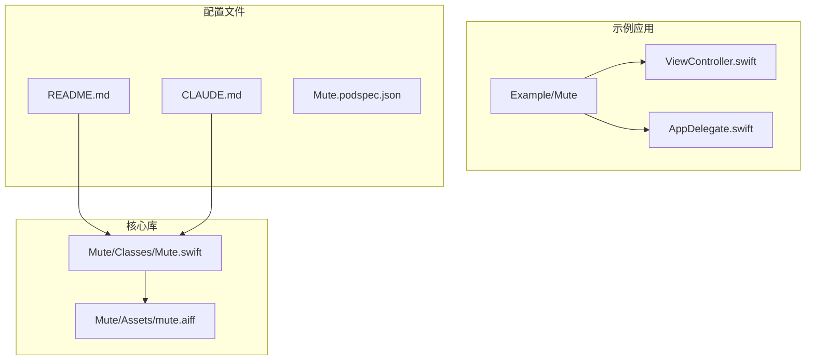
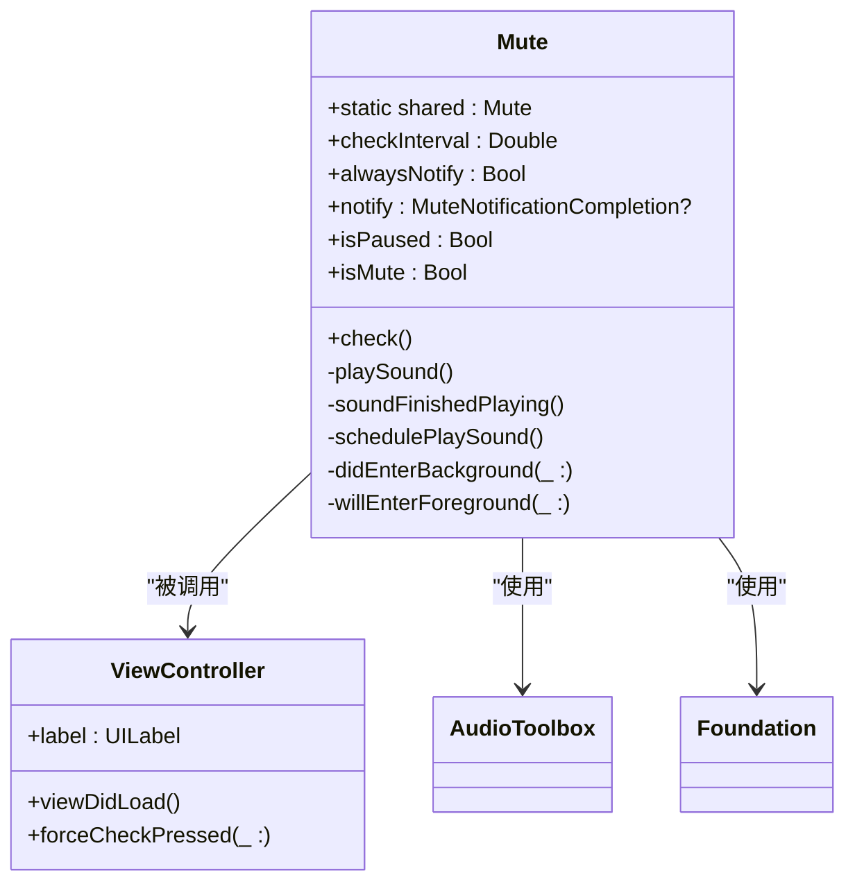
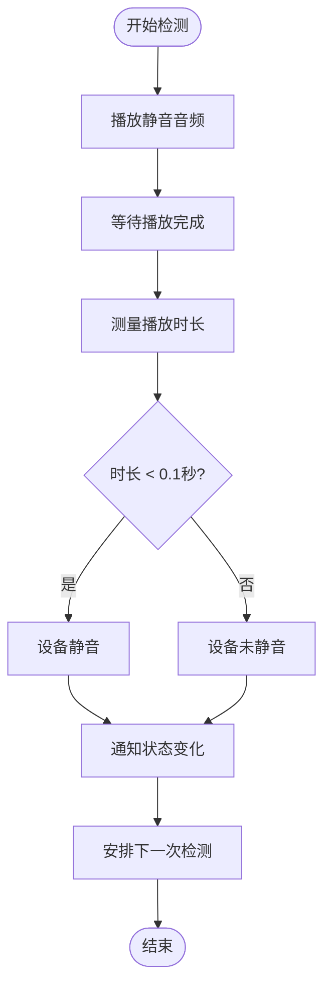
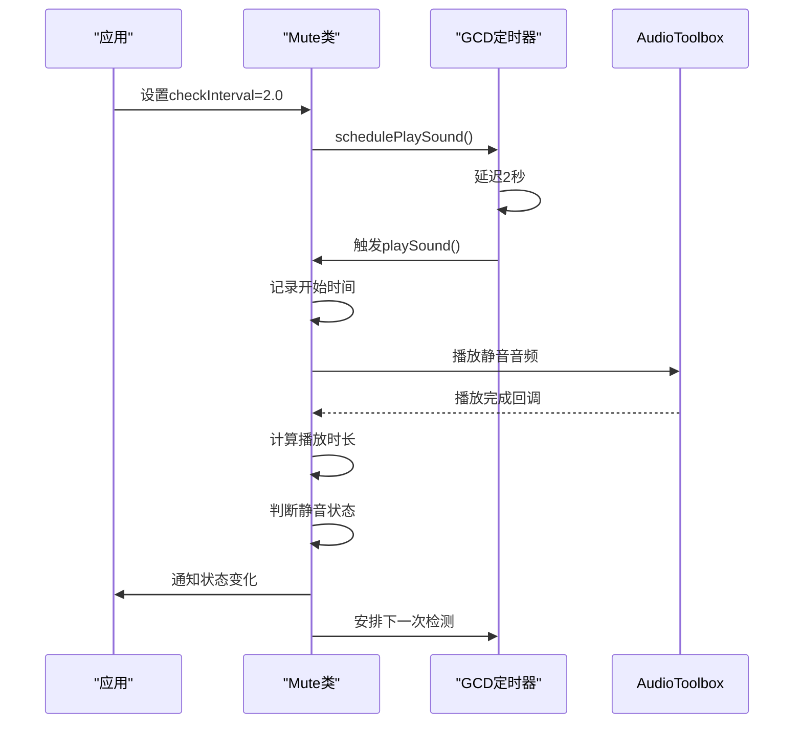
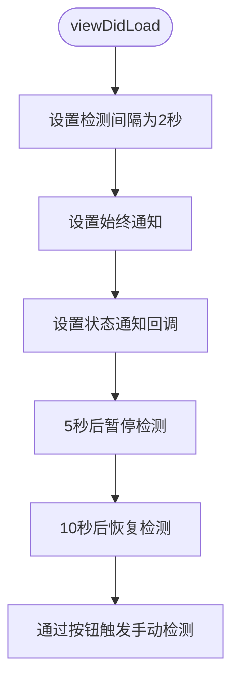
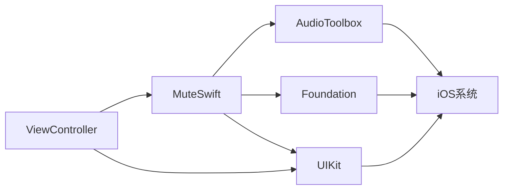
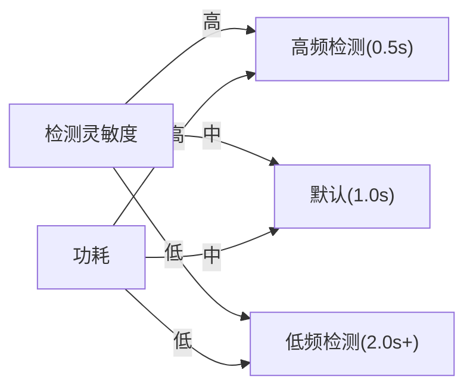

# 性能优化

<cite>
**本文档中引用的文件**   
- [Mute.swift](file://Mute/Classes/Mute.swift#L1-L211)
- [ViewController.swift](file://Example/Mute/ViewController.swift#L1-L51)
- [README.md](file://README.md#L1-L85)
- [CLAUDE.md](file://CLAUDE.md#L1-L57)
- [mute.aiff](file://Mute/Assets/mute.aiff)
</cite>

## 目录
1. [简介](#简介)
2. [项目结构](#项目结构)
3. [核心组件](#核心组件)
4. [架构概述](#架构概述)
5. [详细组件分析](#详细组件分析)
6. [依赖分析](#依赖分析)
7. [性能考虑](#性能考虑)
8. [故障排除指南](#故障排除指南)
9. [结论](#结论)

## 简介
本指南详细阐述了如何通过合理配置 `checkInterval` 属性来平衡静音检测的灵敏度与设备能耗。文档深入分析了频繁调用音频检测对CPU和电池的影响，结合 `Mute.swift` 中的定时器实现机制，说明了默认值0.1秒的权衡考量。同时提供了不同场景下的推荐配置，指导开发者根据应用使用模式动态调整检测频率，并结合 `ViewController.swift` 中的实际代码展示运行时修改间隔的实现方式。

## 项目结构
项目采用模块化结构，核心功能集中在单个Swift文件中，示例应用展示了库的使用方法。



**图示来源**
- [Mute.swift](file://Mute/Classes/Mute.swift#L1-L211)
- [ViewController.swift](file://Example/Mute/ViewController.swift#L1-L51)
- [README.md](file://README.md#L1-L85)

## 核心组件
`Mute` 库的核心是 `Mute.swift` 文件，它实现了通过播放静音音频检测设备静音状态的功能。该库使用单例模式 (`Mute.shared`) 提供全局访问点，通过测量静音音频的播放时长来判断设备是否处于静音状态。

**组件来源**
- [Mute.swift](file://Mute/Classes/Mute.swift#L1-L211)
- [README.md](file://README.md#L1-L85)

## 架构概述
系统架构采用单例模式，通过定时器周期性地播放静音音频并测量播放时长来检测静音状态。



**图示来源**
- [Mute.swift](file://Mute/Classes/Mute.swift#L1-L211)
- [ViewController.swift](file://Example/Mute/ViewController.swift#L1-L51)

## 详细组件分析

### Mute类分析
`Mute` 类是静音检测功能的核心实现，通过播放静音音频并测量播放时长来判断设备状态。

#### 静音检测机制


**图示来源**
- [Mute.swift](file://Mute/Classes/Mute.swift#L1-L211)

#### 定时器实现流程


**图示来源**
- [Mute.swift](file://Mute/Classes/Mute.swift#L1-L211)
- [ViewController.swift](file://Example/Mute/ViewController.swift#L1-L51)

**组件来源**
- [Mute.swift](file://Mute/Classes/Mute.swift#L1-L211)
- [ViewController.swift](file://Example/Mute/ViewController.swift#L1-L51)

### ViewController分析
`ViewController` 展示了如何在实际应用中使用 `Mute` 库，并演示了动态调整检测频率的方法。



**图示来源**
- [ViewController.swift](file://Example/Mute/ViewController.swift#L1-L51)

**组件来源**
- [ViewController.swift](file://Example/Mute/ViewController.swift#L1-L51)

## 依赖分析
系统依赖关系清晰，核心功能依赖于iOS系统框架。



**图示来源**
- [Mute.swift](file://Mute/Classes/Mute.swift#L1-L211)
- [ViewController.swift](file://Example/Mute/ViewController.swift#L1-L51)
- [CLAUDE.md](file://CLAUDE.md#L1-L57)

## 性能考虑
### 检测频率与能耗平衡
`checkInterval` 属性是平衡检测灵敏度与设备能耗的关键配置。该属性的最小值为0.5秒，确保了系统稳定性。

**检测频率配置建议：**
- **高实时性场景**：设置为0.5秒（最小值），适用于需要快速响应静音状态变化的应用
- **常规使用场景**：使用默认值1.0秒，平衡灵敏度与能耗
- **后台低功耗运行**：延长至2.0秒以上，显著降低能耗
- **极端省电模式**：可设置为5.0秒或更长，适用于后台服务

### 音频检测对系统资源的影响
频繁调用音频检测会对CPU和电池产生显著影响：

**CPU影响：**
- 每次检测需要创建和调度GCD定时器
- 音频服务调用涉及系统级资源分配
- 回调处理需要主线程执行

**电池影响：**
- 频繁的音频服务调用增加CPU唤醒次数
- 定时器维持系统部分唤醒状态
- 内存频繁分配和释放增加功耗

### checkInterval的权衡考量
默认值1.0秒是经过深思熟虑的权衡结果：



**权衡因素：**
- **用户体验**：1秒的延迟在大多数场景下可接受
- **系统资源**：避免过度占用音频服务
- **电池寿命**：平衡功能需求与续航
- **准确性**：足够的时间窗口确保检测可靠

### 动态调整检测频率
开发者应根据应用使用模式动态调整检测频率：

```swift
// 在ViewController.swift中实现动态调整
override func viewDidLoad() {
    super.viewDidLoad()
    
    // 根据应用状态动态设置检测间隔
    if UIApplication.shared.applicationState == .active {
        // 前台运行时使用较高频率
        Mute.shared.checkInterval = 0.5
    } else {
        // 后台运行时降低频率
        Mute.shared.checkInterval = 2.0
    }
    
    // 根据用户交互调整
    NotificationCenter.default.addObserver(
        self, 
        selector: #selector(appDidEnterBackground), 
        name: UIApplication.didEnterBackgroundNotification, 
        object: nil
    )
}

@objc func appDidEnterBackground() {
    // 进入后台时降低检测频率
    Mute.shared.checkInterval = 5.0
}
```

**运行时修改示例：**
```swift
// 手动触发检测频率调整
func adjustCheckInterval(forMode mode: AppMode) {
    switch mode {
    case .highPrecision:
        Mute.shared.checkInterval = 0.5
    case .balanced:
        Mute.shared.checkInterval = 1.0
    case .powerSaving:
        Mute.shared.checkInterval = 3.0
    }
}
```

### 性能监控建议
使用Xcode Instruments工具测量音频播放开销：

**监控指标：**
- **CPU使用率**：观察音频检测对主线程的影响
- **能耗等级**：评估不同检测频率下的电池消耗
- **内存分配**：监控定时器和音频服务的内存使用
- **线程活动**：分析GCD调度的频率和模式

**优化策略：**
1. **按需检测**：仅在需要时启用静音检测
2. **智能调度**：根据应用状态调整检测频率
3. **批量处理**：合并多个状态检查请求
4. **后台优化**：在后台模式下显著降低检测频率

**组件来源**
- [Mute.swift](file://Mute/Classes/Mute.swift#L1-L211)
- [ViewController.swift](file://Example/Mute/ViewController.swift#L1-L51)
- [CLAUDE.md](file://CLAUDE.md#L1-L57)

## 故障排除指南
### 常见问题及解决方案
**问题1：检测频率无法设置低于0.5秒**
- **原因**：库内置了最小值保护机制
- **解决方案**：接受0.5秒为最低检测频率，这是系统稳定性的要求

**问题2：后台检测导致应用被终止**
- **原因**：频繁的音频检测消耗过多资源
- **解决方案**：实现应用前后台状态监听，后台运行时将 `checkInterval` 设置为5秒以上

**问题3：状态通知不准确**
- **原因**：检测间隔过长或系统资源紧张
- **解决方案**：适当缩短 `checkInterval`，但不要低于0.5秒

### 调试技巧
```swift
// 启用调试日志
extension Mute {
    private func soundFinishedPlaying() {
        let elapsed = Date.timeIntervalSinceReferenceDate - self.interval
        let isMute = elapsed < 0.1
        
        print("静音检测: 播放时长=\(elapsed), 状态=\(isMute ? "静音" : "未静音")")
        
        if self.isMute != isMute || self.alwaysNotify {
            self.isMute = isMute
            DispatchQueue.main.async {
                self.notify?(isMute)
            }
        }
        self.schedulePlaySound()
    }
}
```

**组件来源**
- [Mute.swift](file://Mute/Classes/Mute.swift#L1-L211)

## 结论
通过合理配置 `checkInterval` 属性，开发者可以在静音检测的灵敏度与设备能耗之间找到最佳平衡点。默认的1.0秒间隔是经过权衡的合理选择，但在不同应用场景下应灵活调整。高实时性需求可设置为0.5秒，后台低功耗运行时可延长至5秒以上。结合应用状态动态调整检测频率是最佳实践，既能保证功能可用性，又能最大限度地节省设备资源。使用Instruments工具进行性能监控，可以帮助开发者优化音频检测的实现，确保应用的流畅性和电池续航。