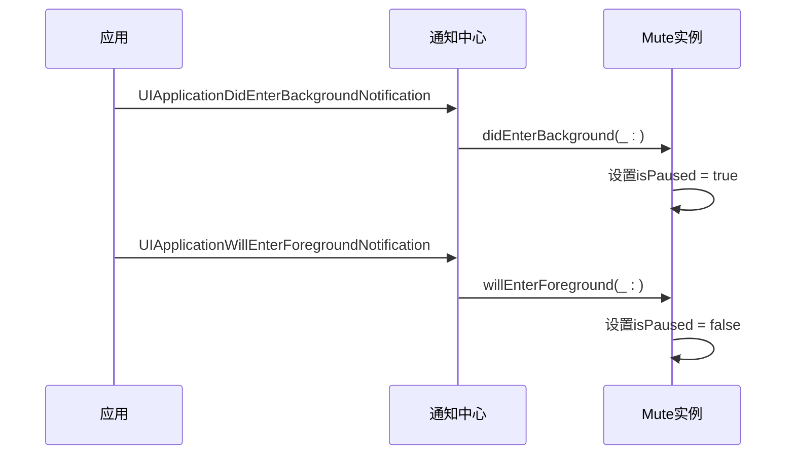
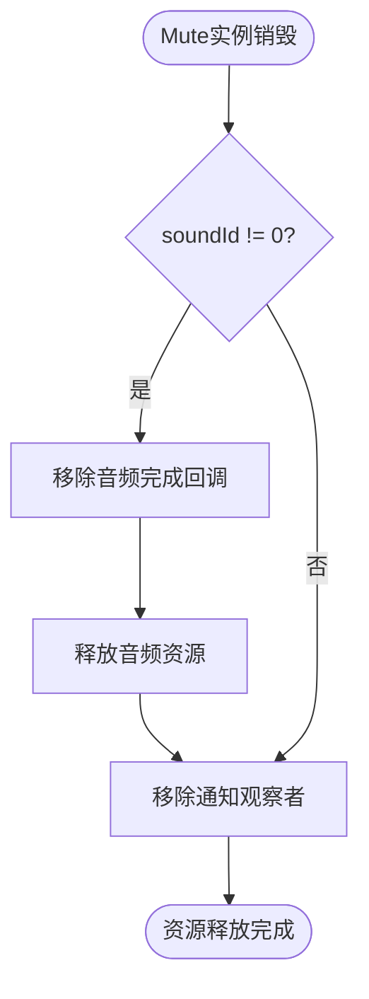
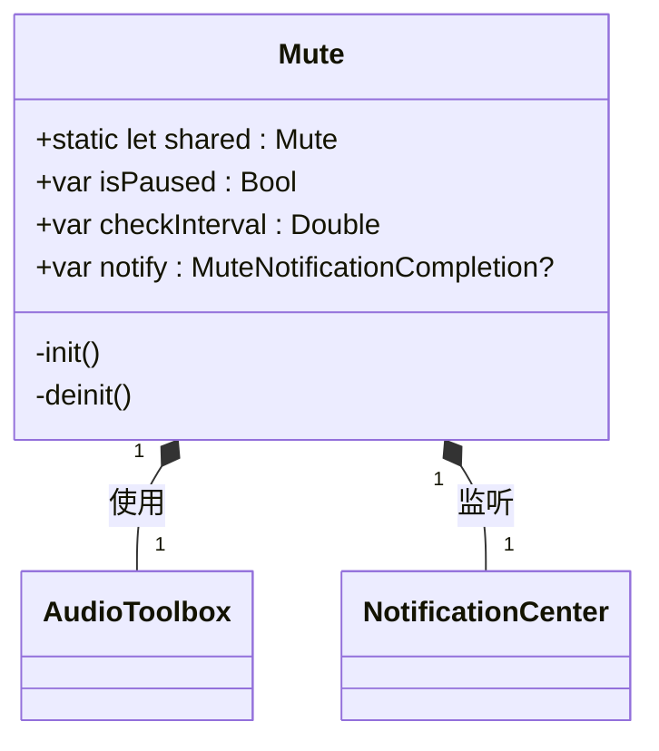
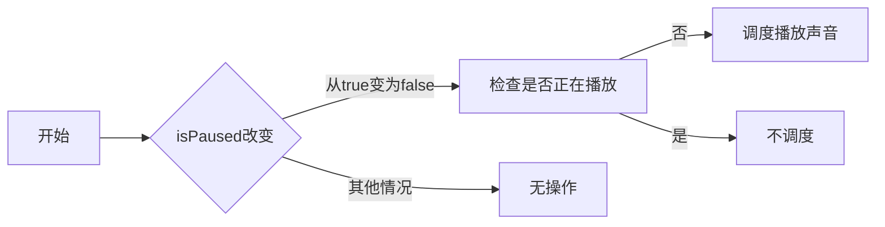
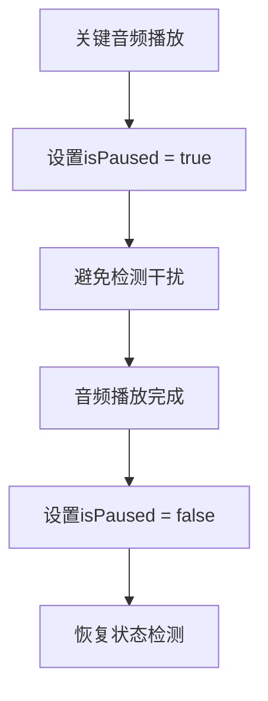

# 生命周期与状态管理

<cite>
**本文档中引用的文件**   
- [Mute.swift](file://Mute/Classes/Mute.swift)
- [ViewController.swift](file://Example/Mute/ViewController.swift)
</cite>

## 目录
1. [生命周期与状态管理](#生命周期与状态管理)
2. [Mute库的生命周期管理机制](#mute库的生命周期管理机制)
3. [前后台状态监听实现](#前后台状态监听实现)
4. [资源释放与内存管理](#资源释放与内存管理)
5. [单例模式与生命周期](#单例模式与生命周期)
6. [isPaused属性的使用模式](#ispaused属性的使用模式)
7. [适用场景与最佳实践](#适用场景与最佳实践)

## Mute库的生命周期管理机制

Mute库通过NSNotificationCenter监听UIApplication的前后台状态变化，实现自动暂停与恢复检测功能。该机制确保在应用进入后台时暂停音频检测，避免不必要的资源消耗；在应用返回前台时自动恢复检测，保证功能的连续性。

核心实现位于Mute.swift文件中，通过单例模式提供全局唯一的实例，确保在整个应用生命周期内状态检测的一致性。库使用AudioToolbox框架播放静音音频文件，通过测量播放时长来判断设备的静音开关状态。

**Section sources**
- [Mute.swift](file://Mute/Classes/Mute.swift#L19)

## 前后台状态监听实现

Mute类在初始化时注册了两个重要的通知观察者，用于监听应用的前后台状态变化：



**Diagram sources**
- [Mute.swift](file://Mute/Classes/Mute.swift#L126-L136)

**Section sources**
- [Mute.swift](file://Mute/Classes/Mute.swift#L126-L136)

在`init()`方法中，Mute类通过以下代码注册通知观察者：

```swift
// 注册应用进入后台的通知
NotificationCenter.default.addObserver(self,
                                       selector: #selector(Mute.didEnterBackground(_:)),
                                       name: UIApplication.didEnterBackgroundNotification,
                                       object: nil)

// 注册应用将要进入前台的通知
NotificationCenter.default.addObserver(self,
                                       selector: #selector(Mute.willEnterForeground(_:)),
                                       name: UIApplication.willEnterForegroundNotification,
                                       object: nil)
```

当应用进入后台时，`didEnterBackground(_:)`方法被调用，将`isPaused`属性设置为`true`，暂停静音状态检测。当应用即将进入前台时，`willEnterForeground(_:)`方法被调用，将`isPaused`属性设置为`false`，恢复静音状态检测。

## 资源释放与内存管理

Mute类在析构函数中实现了完整的资源释放逻辑，确保在实例销毁时正确清理所有分配的资源，避免内存泄漏。



**Diagram sources**
- [Mute.swift](file://Mute/Classes/Mute.swift#L138-L143)

**Section sources**
- [Mute.swift](file://Mute/Classes/Mute.swift#L138-L143)

析构函数的具体实现如下：

```swift
deinit {
    if self.soundId != 0 {
        AudioServicesRemoveSystemSoundCompletion(self.soundId)
        AudioServicesDisposeSystemSoundID(self.soundId)
    }
    NotificationCenter.default.removeObserver(self)
}
```

该实现确保了：
1. 移除音频播放完成的回调函数
2. 释放系统音频ID占用的资源
3. 从通知中心移除自身作为观察者

这些步骤对于防止内存泄漏至关重要，特别是在单例模式下，确保即使应用长时间运行也不会积累内存占用。

## 单例模式与生命周期

Mute类采用单例模式设计，通过静态属性`shared`提供全局唯一的实例访问点。



**Diagram sources**
- [Mute.swift](file://Mute/Classes/Mute.swift#L19)

**Section sources**
- [Mute.swift](file://Mute/Classes/Mute.swift#L19)

单例模式的实现确保了：
- 全局状态的一致性：所有模块访问的是同一个实例，状态同步
- 资源的高效利用：避免重复创建和销毁实例
- 生命周期的可控性：实例的创建和销毁有明确的时机

在复杂应用架构中，正确管理单例生命周期至关重要。开发者应注意：
1. 避免在单例中持有视图控制器等UI组件的强引用
2. 在适当的时候清理闭包引用，防止循环引用
3. 确保资源的正确释放，特别是在应用终止时

## isPaused属性的使用模式

`isPaused`属性不仅用于前后台状态管理，还可以在特定场景下由开发者手动控制，临时禁用检测功能。



**Diagram sources**
- [Mute.swift](file://Mute/Classes/Mute.swift#L42-L46)

**Section sources**
- [Mute.swift](file://Mute/Classes/Mute.swift#L42-L46)

在ViewController.swift中展示了`isPaused`属性的使用模式：

```swift
// 5秒后暂停检测
DispatchQueue.main.asyncAfter(deadline: .now() + 5.0) {
    Mute.shared.isPaused = true
}

// 10秒后恢复检测
DispatchQueue.main.asyncAfter(deadline: .now() + 10.0) {
    Mute.shared.isPaused = false
}
```

`isPaused`属性的`didSet`观察器实现了智能恢复逻辑：
```swift
public var isPaused = false {
    didSet {
        if !self.isPaused && oldValue && !self.isPlaying {
            self.schedulePlaySound()
        }
    }
}
```

这种设计确保了：
- 当从暂停状态恢复时，自动重新调度声音播放
- 避免在声音正在播放时重复调度
- 保持状态检测的连续性

## 适用场景与最佳实践

`isPaused`属性在特定ViewController中通过设置`isPaused = true`来临时禁用检测，适用于以下场景：



**Diagram sources**
- [ViewController.swift](file://Example/Mute/ViewController.swift#L35-L40)

**Section sources**
- [ViewController.swift](file://Example/Mute/ViewController.swift#L35-L40)

### 适用场景

1. **播放关键音频时**：当应用正在播放重要音频内容（如语音消息、音乐播放等）时，临时禁用静音检测可以避免检测过程中的音频播放干扰用户体验。

2. **性能敏感操作**：在执行性能密集型任务时，暂停不必要的后台检测可以释放系统资源，提高应用响应速度。

3. **用户交互期间**：在用户进行重要操作时，暂停后台检测可以确保系统资源优先服务于用户交互。

### 最佳实践

1. **及时恢复**：在暂停检测后，务必在适当的时候恢复检测，避免长时间无法获取静音状态。

2. **避免嵌套暂停**：多个组件同时管理`isPaused`状态可能导致逻辑混乱，建议集中管理。

3. **考虑用户体验**：暂停检测可能影响功能完整性，需权衡用户体验和功能需求。

4. **错误处理**：在设置`isPaused`时考虑异常情况，确保应用的稳定性。

通过合理使用`isPaused`属性，开发者可以在保证核心功能的同时，优化应用性能和用户体验。