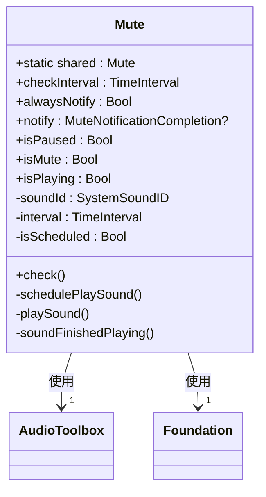
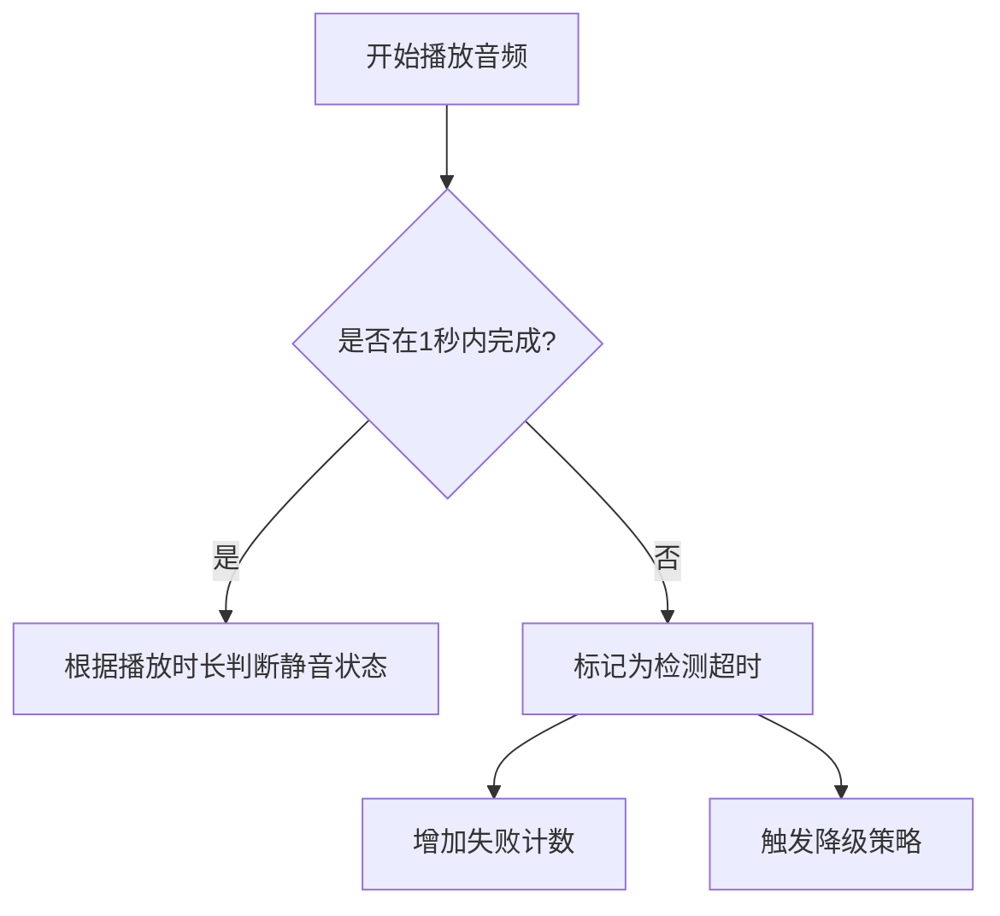

# 错误处理与健壮性设计

<cite>
**本文档中引用的文件**   
- [Mute.swift](file://Mute/Classes/Mute.swift)
- [ViewController.swift](file://Example/Mute/ViewController.swift)
- [README.md](file://README.md)
</cite>

## 目录
1. [项目概述](#项目概述)
2. [核心组件分析](#核心组件分析)
3. [错误处理机制](#错误处理机制)
4. [音频会话冲突与配置](#音频会话冲突与配置)
5. [降级策略与重试机制](#降级策略与重试机制)
6. [边缘情况与超时处理](#边缘情况与超时处理)
7. [生产环境最佳实践](#生产环境最佳实践)

## 项目概述
Mute库是一个iOS库，用于检测设备的静音开关是否启用。其核心原理是通过播放一个短暂的静音音频文件（mute.aiff），并测量其播放时长来判断静音状态。如果音频被立即播放完成（时长小于0.1秒），则认为设备处于静音状态；否则认为设备未静音。

该库采用单例模式（`Mute.shared`）实现，主要依赖于AudioToolbox框架进行系统声音播放。库的设计简洁，核心逻辑集中在单个Swift文件中，支持通过CocoaPods和Swift Package Manager集成。

**Section sources**
- [README.md](file://README.md#L0-L17)
- [CLAUDE.md](file://CLAUDE.md#L0-L44)

## 核心组件分析
Mute库的核心功能由`Mute.swift`文件中的`Mute`类实现。该类通过定期播放一个0.5秒的静音音频，并监听其播放完成回调，来检测设备的静音状态。



**Diagram sources**
- [Mute.swift](file://Mute/Classes/Mute.swift#L1-L211)

**Section sources**
- [Mute.swift](file://Mute/Classes/Mute.swift#L1-L211)

## 错误处理机制
通过对代码的分析，Mute库在错误处理方面采用了多种策略，包括参数验证、资源加载保护和运行时错误日志记录。

### 参数验证与边界检查
库在初始化时对`checkInterval`属性进行了严格的边界检查，确保其值不低于0.5秒的最小值。如果用户设置的值过小，库会自动将其修正并输出警告日志。

```swift
public var checkInterval = 1.0 {
    didSet {
        if self.checkInterval < 0.5 {
            print("MUTE: checkInterval cannot be less than 0.5s, setting to 0.5")
            self.checkInterval = 0.5
        }
    }
}
```

### 资源加载保护
库在加载必需的音频资源时使用了`guard`语句进行保护。如果`Mute.bundle`或`mute.aiff`文件未找到，程序将调用`fatalError`终止运行。这确保了库在缺少关键资源时不会进入不可预测的状态。

```swift
private static var bundle: Bundle {
    // ... bundle查找逻辑 ...
    fatalError("Mute.bundle not found")
}

private static var muteSoundUrl: URL {
    guard let muteSoundUrl = Mute.bundle.url(forResource: "mute", withExtension: "aiff") else {
        fatalError("mute.aiff not found")
    }
    return muteSoundUrl
}
```

### 运行时错误处理
在初始化音频播放器时，库检查了`AudioServicesCreateSystemSoundID`的返回值。如果创建失败，它会打印错误信息并将`soundId`设置为0，从而禁用音频播放功能，防止后续操作导致崩溃。

```swift
if AudioServicesCreateSystemSoundID(self.soundUrl as CFURL, &self.soundId) == kAudioServicesNoError {
    // 成功设置
} else {
    print("Failed to setup sound player")
    self.soundId = 0
}
```

**Section sources**
- [Mute.swift](file://Mute/Classes/Mute.swift#L54-L58)
- [Mute.swift](file://Mute/Classes/Mute.swift#L87-L98)
- [Mute.swift](file://Mute/Classes/Mute.swift#L111-L118)

## 音频会话冲突与配置
Mute库直接使用AudioToolbox框架的`AudioServicesPlaySystemSoundWithCompletion` API播放音频，该API会自动处理与系统音频会话的交互。然而，这可能导致与其他使用AVAudioSession的应用程序发生音频冲突。

### 潜在的音频会话冲突
当应用程序使用`AVAudioSession`并设置了特定的音频会话类别（如`.playback`或`.playAndRecord`）时，Mute库播放的系统声音可能会被中断或静音，导致错误的检测结果。例如，如果应用正在播放音乐或进行录音，系统可能会阻止Mute库的音频播放。

### 集成时的音频会话配置建议
为了确保Mute库的稳定运行，建议在集成时配置合适的音频会话类别和模式。以下是一些推荐的配置：

1. **使用`.ambient`类别**：此类别允许应用的音频与其他应用的音频混合播放，适合不需要独占音频通道的场景。
2. **使用`.soloAmbient`类别**：这是默认类别，会中断其他应用的音频播放。如果应用需要精确的静音检测，可以使用此类别，但需注意会中断用户正在收听的音乐。
3. **设置适当的模式**：可以使用`.measurement`模式来优化短音频播放的性能。

示例配置代码：
```swift
do {
    try AVAudioSession.sharedInstance().setCategory(.soloAmbient, mode: .measurement)
    try AVAudioSession.sharedInstance().setActive(true)
} catch {
    print("Failed to set audio session: \(error)")
}
```

**Section sources**
- [Mute.swift](file://Mute/Classes/Mute.swift#L188)
- [README.md](file://README.md#L0-L17)

## 降级策略与重试机制
Mute库本身未实现复杂的降级或重试机制，但其设计为集成方提供了实现这些策略的基础。

### 连续检测失败的降级方案
在极端情况下，如系统资源紧张或音频服务不可用，Mute库的检测可能会连续失败。建议的降级方案包括：

1. **自动暂停与延迟重试**：当检测到连续多次检测失败时，可以暂停检测一段时间（例如30秒），然后重新启动。这可以防止在问题持续存在时不断消耗系统资源。

```swift
class MuteManager {
    private var failureCount = 0
    private let maxFailures = 5
    private let retryDelay: TimeInterval = 30.0
    
    func handleDetectionFailure() {
        failureCount += 1
        if failureCount >= maxFailures {
            Mute.shared.isPaused = true
            DispatchQueue.main.asyncAfter(deadline: .now() + retryDelay) {
                self.failureCount = 0
                Mute.shared.isPaused = false
            }
        }
    }
}
```

2. **回退到上次已知状态**：在检测失败期间，可以暂时使用最后一次成功的检测结果，并向用户显示“状态未知”的提示。

### 检测频率调整
在资源紧张的设备上，可以动态调整`checkInterval`参数，降低检测频率以减少系统负载。

**Section sources**
- [Mute.swift](file://Mute/Classes/Mute.swift#L50-L58)
- [ViewController.swift](file://Example/Mute/ViewController.swift#L20-L21)

## 边缘情况与超时处理
Mute库在设计时考虑了一些边缘情况，但仍存在需要集成方处理的潜在问题。

### 系统资源紧张导致的延迟
在系统资源紧张（如CPU占用率高或内存不足）的情况下，音频播放可能会被延迟，导致`soundFinishedPlaying`回调延迟触发。这可能使库误判设备处于非静音状态。

### 超时机制识别异常状态
为了识别此类异常状态，建议集成方实现超时机制。如果音频播放的完成回调在预期时间（例如1秒）内未触发，应视为检测失败。



**Diagram sources**
- [Mute.swift](file://Mute/Classes/Mute.swift#L188-L190)

**Section sources**
- [Mute.swift](file://Mute/Classes/Mute.swift#L188-L190)

## 生产环境最佳实践
为了确保Mute库在生产环境中的稳定性和健壮性，建议遵循以下最佳实践。

### 封装异常捕获机制
尽管Mute库本身未显式抛出异常，但在`notify`回调中仍可能发生崩溃（例如，由于弱引用对象已释放）。因此，强烈建议在回调中添加guard语句进行保护。

```swift
Mute.shared.notify = { [weak self] isMuted in
    guard let self = self else { return }
    // 安全地更新UI
    DispatchQueue.main.async {
        self.updateMuteStatus(isMuted)
    }
}
```

### 异常捕获包装器
创建一个通用的包装器来捕获和处理回调中的异常：

```swift
extension Mute {
    func safeNotify(_ completion: @escaping MuteNotificationCompletion) {
        self.notify = { muted in
            do {
                try completion(muted)
            } catch {
                print("Mute notification error: \(error)")
            }
        }
    }
}
```

### 内存管理与生命周期
确保在适当的时机（如视图控制器销毁时）清理通知观察者，防止内存泄漏。虽然Mute库在`deinit`中移除了通知观察者，但仍需确保`Mute`实例本身能被正确释放。

```swift
deinit {
    NotificationCenter.default.removeObserver(self)
}
```

**Section sources**
- [Mute.swift](file://Mute/Classes/Mute.swift#L155-L157)
- [ViewController.swift](file://Example/Mute/ViewController.swift#L25-L28)