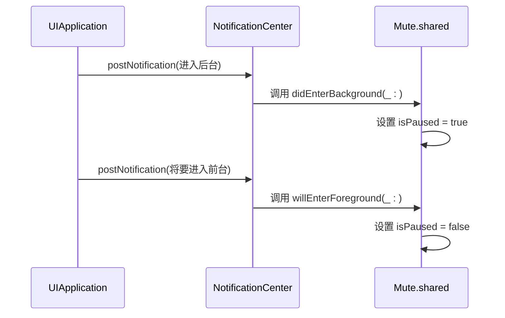

# 高级用法

<cite>
**本文档中引用的文件**   
- [Mute.swift](file://Mute/Classes/Mute.swift)
- [ViewController.swift](file://Example/Mute/ViewController.swift)
- [README.md](file://README.md)
</cite>

## 目录
1. [高级用法](#高级用法)
2. [性能考量](#性能考量)
3. [错误处理策略](#错误处理策略)
4. [跨组件通信机制](#跨组件通信机制)
5. [Mute实例生命周期管理](#mute实例生命周期管理)
6. [手动控制isPaused的使用场景](#手动控制ispaused的使用场景)
7. [高级配置模式与最佳实践](#高级配置模式与最佳实践)

## 性能考量

`Mute` 库通过周期性播放静音音频文件并测量播放耗时来检测设备的静音开关状态。其核心性能参数为 `checkInterval`，该值决定了检测的频率。

### 合理设置checkInterval

`checkInterval` 属性控制检测的间隔时间（单位：秒），默认值为1.0秒。开发者应根据应用的具体需求和性能要求进行调整。

```swift
// 将检测间隔设置为2秒
Mute.shared.checkInterval = 2.0
```

**平衡检测精度与电池消耗**：
- **高精度（低间隔）**：将 `checkInterval` 设置为接近最小值0.5秒，可以实现近乎实时的静音状态监控。然而，这会显著增加CPU唤醒频率和音频服务调用次数，导致不必要的电池消耗。
- **低功耗（高间隔）**：将 `checkInterval` 设置为一个较大的值（如5-10秒），可以极大地减少系统资源占用和电池消耗。但代价是状态更新的延迟增加，用户可能需要等待更长时间才能看到界面反馈。

**建议**：对于大多数应用场景，将 `checkInterval` 设置在1.0到3.0秒之间是一个合理的折衷方案，既能保证较好的响应性，又不会对性能造成过大影响。

**Section sources**
- [Mute.swift](file://Mute/Classes/Mute.swift#L70-L77)

## 错误处理策略

当前 `Mute` 库的错误处理机制较为基础，主要通过 `print` 语句进行日志输出，缺乏完善的异常捕获和降级方案。

### 当前实现分析

在 `Mute` 类的初始化方法中，库尝试创建一个系统音效ID：
```swift
if AudioServicesCreateSystemSoundID(self.soundUrl as CFURL, &self.soundId) == kAudioServicesNoError {
    // 成功，继续配置
} else {
    print("Failed to setup sound player")
    self.soundId = 0
}
```
如果创建失败，库会打印一条错误信息并将 `soundId` 置为0，后续的播放操作将被忽略。这种方式虽然能防止崩溃，但属于“静默失败”，上层应用无法得知静音检测功能已失效。

### 生产环境增强建议

为了提高应用的健壮性，建议在生产环境中添加以下错误处理策略：

1.  **自定义错误类型**：定义一个枚举来表示可能的错误，例如 `.soundSetupFailed` 或 `.resourceNotFound`。
2.  **暴露错误回调**：扩展 `Mute` 类，添加一个 `errorHandler` 闭包属性，当内部发生错误时调用它。
3.  **优雅降级**：在错误发生时，可以禁用自动检测（`isPaused = true`），并通过UI提示用户功能不可用，而不是让应用处于一个未知的、部分失效的状态。

**Section sources**
- [Mute.swift](file://Mute/Classes/Mute.swift#L108-L117)

## 跨组件通信机制

`Mute` 库利用 `NSNotificationCenter`（通知中心）来实现应用生命周期事件的监听，这是iOS中一种典型的跨组件通信模式。

### 实现原理

`Mute` 在其单例初始化时，向通知中心注册了两个观察者：
- **监听应用进入后台** (`UIApplication.didEnterBackgroundNotification`)
- **监听应用将要进入前台** (`UIApplication.willEnterForegroundNotification`)



**Diagram sources**
- [Mute.swift](file://Mute/Classes/Mute.swift#L126-L133)

**Section sources**
- [Mute.swift](file://Mute/Classes/Mute.swift#L124-L142)

当应用进入后台时，`Mute` 会自动暂停检测（`isPaused = true`），以遵守iOS的后台执行限制并节省电量。当应用返回前台时，它会自动恢复检测。这种设计解耦了 `Mute` 组件与 `AppDelegate` 或其他生命周期管理代码，使得集成更加简单。

## Mute实例生命周期管理

`Mute` 库采用单例模式（`static let shared`），这简化了实例管理，但也要求开发者理解其生命周期。

### 单例的优势与挑战

**优势**：
- **全局可访问**：在整个应用中，通过 `Mute.shared` 即可访问，无需传递实例。
- **状态持久化**：静音状态和配置（如 `checkInterval`）在应用运行期间保持一致。

**挑战**：
- **内存占用**：单例在应用启动时创建，直到应用终止才被释放，会一直占用内存。
- **状态污染**：如果应用的不同模块修改了 `Mute` 的配置（如 `notify` 回调），可能会相互影响。

### 最佳实践

在复杂应用架构中，应明确 `Mute` 实例的配置责任。例如，可以在应用启动时由一个专门的 `AudioManager` 服务进行一次性配置，避免多个视图控制器随意修改其状态。

**Section sources**
- [Mute.swift](file://Mute/Classes/Mute.swift#L50)

## 手动控制isPaused的使用场景

`isPaused` 属性提供了对检测过程的手动控制，这在特定场景下非常有用。

### 使用场景示例

在 `ViewController.swift` 的示例中，演示了 `isPaused` 的一种典型用法：**在特定时间段内临时禁用检测**。

```swift
// 5秒后暂停检测
DispatchQueue.main.asyncAfter(deadline: .now() + 5.0) {
    Mute.shared.isPaused = true
}

// 10秒后重新启动检测
DispatchQueue.main.asyncAfter(deadline: .now() + 10.0) {
    Mute.shared.isPaused = false
}
```

**具体应用场景**：
1.  **特定视图控制器中禁用**：当用户进入一个不关心静音状态的界面（如设置页、关于页）时，可以在 `viewWillDisappear` 中设置 `isPaused = true`，在 `viewWillAppear` 中设置 `isPaused = false`，以节省资源。
2.  **用户主动控制**：提供一个开关，允许用户选择是否开启静音状态监控。
3.  **性能敏感操作期间**：在执行耗时的动画或数据处理时，临时暂停 `Mute` 检测，避免音频服务调用干扰主线程性能。

**Section sources**
- [ViewController.swift](file://Example/Mute/ViewController.swift#L35-L42)
- [Mute.swift](file://Mute/Classes/Mute.swift#L60-L67)

## 高级配置模式与最佳实践

结合 `ViewController.swift` 中的示例，可以总结出以下高级配置模式和最佳实践。

### 完整配置流程

```swift
override func viewDidLoad() {
    super.viewDidLoad()

    // 1. 配置检测频率
    Mute.shared.checkInterval = 2.0

    // 2. 配置通知策略
    Mute.shared.alwaysNotify = true // 或 false，仅在状态变化时通知

    // 3. 设置状态变更回调
    Mute.shared.notify = { [weak self] isMuted in
        // 在主线程更新UI
        DispatchQueue.main.async {
            self?.updateUI(for: isMuted)
        }
    }

    // 4. (可选) 手动触发一次检查
    Mute.shared.check()
}
```

### 最佳实践总结

1.  **在主线程更新UI**：`notify` 回调可能在后台队列中执行，务必使用 `DispatchQueue.main.async` 来更新界面。
2.  **使用弱引用避免循环引用**：在 `notify` 闭包中捕获 `self` 时，使用 `[weak self]` 来防止内存泄漏。
3.  **合理利用 `alwaysNotify`**：如果只需要在状态变化时得到通知（例如，仅在静音时显示一个图标），将 `alwaysNotify` 设为 `false` 可以减少不必要的UI刷新。
4.  **手动触发检查**：使用 `check()` 方法可以在用户交互（如点击按钮）后立即获取最新状态，而不必等待下一个 `checkInterval` 周期。

**Section sources**
- [ViewController.swift](file://Example/Mute/ViewController.swift#L18-L48)
- [Mute.swift](file://Mute/Classes/Mute.swift#L90-L95)